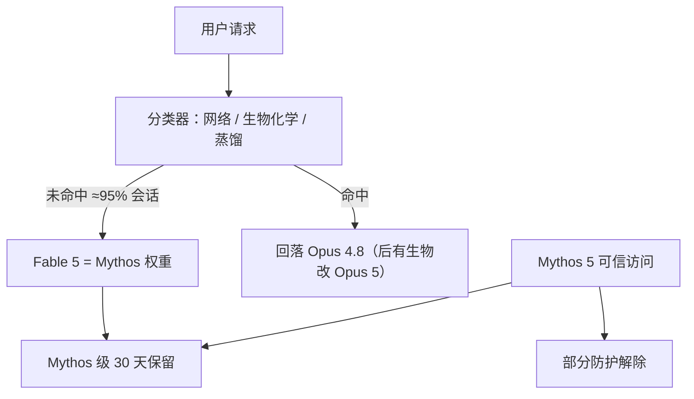

# Claude Fable 5

    
今天我们发布 Claude Fable 5：一个已做成可一般使用的 Mythos 级模型。能力超过我们以往任何一般可用模型；任务越长越复杂，领先越大。

    <footer>—— Anthropic，Claude Fable 5 and Claude Mythos 5（2026-06-09）</footer>

**Claude Fable 5** 是 Anthropic 5 代里面向一般可用的最高能力档，API `claude-fable-5`，价 **$10 / $50** 每百万 token。同一底层权重、在部分领域撤掉防护的版本叫 **Claude Mythos 5**，经 Project Glasswing 与后续可信访问发放，不面向全体开发者。命名脚注：Fable 来自拉丁语 fabula（被讲述的），与希腊语 mythos 相对——**区分二者的是防护，不是两套预训练**。本篇只写 2026-06-09 研究博文、产品页与 6 月中旬曾暂停、7 月 1 日恢复的公开状态，**不编参数量、不写攻击细节**。9 月的 Fable 5.1 是后续快照，另文处理。

## 问题

Mythos Preview 已在 2026 年 4 月只给网络防御与关键软件基础设施。Anthropic 当时说：希望在防护够强时把 Mythos 级能力给全体用户。Fable 5 就是这条路径的一般可用面：能力按官方说法在软件工程、知识工作、视觉、科研等几乎所有测试上 SOTA，但网络、生物/化学、蒸馏三类请求会被分类器改道到当时的次强公开模型 **Opus 4.8**（Opus 5 发布后，产品页把部分生物回落改到 Opus 5）。若没有系统层，官方判断存在严重滥用 uplift。

产品约束包括：分类器偏保守，早期数据称平均不到 5% 的会话触发，但会误伤良性请求；订阅计划曾分阶段限额（6 月 9–22 含在 Pro/Max/Team/Enterprise，6 月 23 日起改用量额度）。6 月 12 日公开暂停 Fable/Mythos 访问，7 月 1 日宣布恢复——写「一直 GA」与变更日志不符。

### Fable ≠ 另一个 Opus 尺寸

Opus 5 后来自称「半价接近 Fable」。那是 7 月的定价叙事。6 月文里 Fable 的比较对象是 Opus 4.8 与其他前沿模型。不要把 Fable 写成 Opus 4.6 的改名。Mythos-class 是 Opus 之上的能力层；Preview → Fable/Mythos 5 是该层的第一次一般可用拆分。

价目 $10/$50 低于 Mythos Preview（官方称不到一半）。Prompt cache 仍有 90% 输入折扣。30 天数据保留适用于 Mythos 级流量，用于安全、不用于训练——见博文「新保留政策」节。

## 方法

公开方法是评测故事 + 分类器回落。软件工程：Stripe 在约 5000 万行 Ruby 库上「一天完成原需团队两个月」的迁移，是客户存在性案例。Cognition FrontierCode：高生产标准下 Fable 即使 medium effort 也最高。视觉：从截图重建 web 应用；宝可梦 FireRed 只用原始画面、无地图辅助通关——官方用来对比早先 Claude 需要复杂 harness。记忆：Slay the Spire 上文件记忆带来的提升约是 Opus 4.8 的三倍，进终章频率约三倍。这些是演示协议，不是公开的百万 token 窗口规格表。

Mythos 5 侧（同一权重、防护更少）给出科研叙述：内部蛋白设计在工具加持、无人工协助时「匹配或超过熟练操作者」；14 个靶点中 9 个进入后续候选；分子生物假设盲测约 80% 偏好相对 Opus 档；基因组学上约一周偏自主工作，训练的小模型在跨物种细胞对齐上优于一篇 Science 近作且小 100 倍——官方称将另发文。这些是 Mythos 可信访问语境，**不能**当成 Fable 网页聊天的默认能力：Fable 会把多数生物请求回落。

### 分类器覆盖面（政策层）

1. 网络：发现与利用漏洞、更宽的进攻性代理任务；评测图在「拦下而非回落」模式下显示进攻任务无进展。外部红队与赏金：逾 1000 小时无通用越狱；UK AISI 在短窗口内朝通用越狱有进展。2. 生物与化学：不再只拦窄带生物武器问句；因 AAV 外壳组装预测等双用途任务上 Mythos 级可超过专用蛋白模型，初期对多数生物/化学请求回落。3. 蒸馏：大规模抽取能力去训竞争模型的流量回落。用户会看到回落通知。对齐审计：Mythos 5 失配率低、与 Opus 4.8 相似，故 Fable 同类。

## 机制

Fable 的机制是 **Mythos 级模型 + 外部分类器门面**。一般会话里两者分数应当接近（>95% 无回落）。一旦话题进入双用途，用户实际在打 Opus。评测若关掉分类器，测的是裸 Mythos 能力，与生产 Fable 不是同一系统。30 天保留被写成检测跨请求攻击与降误伤的数据面，不是训练语料。

宝可梦、Factorio、CAD、流体可视化是官方演示视频级证据，证明长程视觉与工具环，不是标准 LLM 榜。Finance / CursorBench / FrontierBench 的「最高」来自客户或合作评测，须标出处。

### 和 Opus 5、和 5.1

Opus 5（7 月）把日常旗舰拉近 Fable，并收窄网络拦截、承接部分生物回落。Fable 5.1 / Mythos 5.1（9 月博文）是同名线的后续，带更新的可信访问（CVP / LSVP）。本篇停在 5.0 发布文。不要把 5.1 的 AutomationBench 句抄进 5.0。

## 边界与工程取舍

### 暂停窗口属于公开状态的一部分

6 月 12 日官方宣布暂停 Fable 5 与 Mythos 5 访问，7 月 1 日恢复。产品页后来写「Access to Claude Fable 5 has been restored」。任何「2026 年 6 月起连续 GA」的时间线都少了这两周。原因页应指向当时状态博文，本篇不猜测内部事故。容量分期（先含在订阅、再改额度）说明即使恢复后，座位计划也不等于无限 Fable。

无参数、无架构。分类器误伤是明确代价。Mythos 5 的蛋白/基因组故事禁止写进「Fable 默认能做湿实验」。越狱「尚无通用」不是定理；官方自己写不可能完全消除。蒸馏拦截会误伤研究抽取。订阅是否含 Fable 以当时容量公告为准。

出处：Anthropic，*Claude Fable 5 and Claude Mythos 5*，2026-06-09（含 6/12 暂停、7/1 恢复更新）；产品页 anthropic.com/claude/fable。参数量未公开。

脚注定义通用越狱：能让用户像防护不存在一样交互的提示/脚本/harness。短任务上的内部红队图（含「远程加密文件」一类简单项）不代表真实进攻任务已突破。

## 小结

- Fable 5 是 2026-06-09 一般可用的 Mythos 级模型，$10/$50，id `claude-fable-5`。
- Mythos 5 是同权、部分防护解除的可信访问版本。
- 生产合同是分类器回落到 Opus；多数会话不触发。
- 演示强调超长程编码、视觉与（仅 Mythos）科研；无公开参数表。
- 出处：上述官方博文与产品页。不编架构、不写攻击方法。
