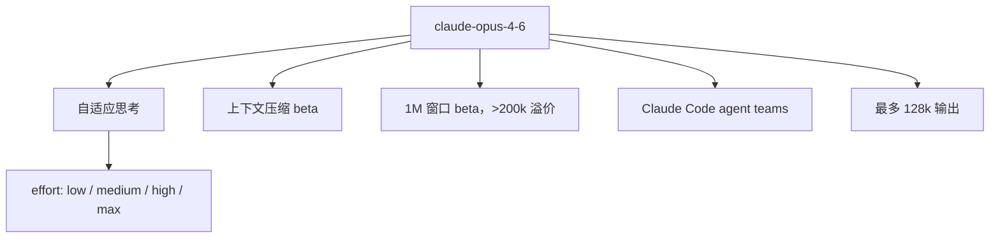

# Claude Opus 4.6

    
我们在升级最强的模型。Opus 4.6 把编码规划得更仔细、智能体任务撑得更久，能在更大代码库里更稳地工作，也更会做代码审查与调试；这也是 Opus 档首次在 beta 中提供 1M token 上下文。

    <footer>—— Anthropic，Introducing Claude Opus 4.6（2026-02-05）</footer>

2026 年 2 月 5 日 Anthropic 发布 **Claude Opus 4.6**，API id `claude-opus-4-6`，价目保持 **$5 / $25** 每百万 token。它仍是 Opus 4 代的点号升级，不是 5 代旗舰；后者是同年晚些时候的 [Opus 5](/llm/claude-opus-5) 与 [Fable 5](/llm/claude-fable-5)。本篇只写发布博文已写明的产品能力、API 开关与安全叙述，**不编参数量**。博文中的具体榜分数值大量在图里，正文可引用的是方向与若干脚注口径；未在文本里出现的百分数不补编。

## 问题

Opus 4.5 已经能做长程编码。4.6 要补的是：大库导航、自己查错、以及「上下文腐烂」——对话一长就丢针。第二个问题是智能体墙钟：任务跨过窗口就要人切分。Anthropic 用自适应思考、effort 档、上下文压缩（beta）和 1M 窗口（beta）来回答，而不是宣布新注意力公式。

安全叙事与能力并行：博文称 4.6 的行为审计失配率与 4.5 同档或更好，过度拒答是近期 Claude 里最低的一档，并因网络能力增强加了新的探测。具体分数以系统卡为准；本篇不把图轴上的未抄写数字写成精确值。

### 1M 不是默认账单

脚注写清：1M 上下文当时只在 Claude Developer Platform 以 **beta** 提供。超过 200k 的提示走溢价 **$10 / $37.50**，且仅该平台。128k 最大输出是另一条：单请求可吐更长，不必拆多次。US-only inference 为 1.1× 计价。把「Opus 4.6 = 人人 1M」写进容量规划会错。

GDPval-AA：博文写 4.6 相对 GPT-5.2 约高 144 Elo，相对 Opus 4.5 约高 190；独立方 Artificial Analysis。脚注换算成约 70% 的两两胜率（50% 为平）。不要把 Elo 差当成准确率百分点。

## 方法

公开方法是产品包装。自适应思考：不再只有开/关 extended thinking，模型按线索决定何时深想；默认 effort 为 **high**，另有 low / medium / max。过深思考会在简单题上烧钱，官方建议把 `/effort` 降到 medium。上下文压缩：接近阈值时摘要替换旧上下文，让长任务不撞墙。Claude Code 研究预览 **agent teams**：并行子代理，适合只读、可拆分的审查。办公侧：Excel 增强，PowerPoint 研究预览（Max / Team / Enterprise）。

博文点名的领先方向：Terminal-Bench 2.0（智能体编码）、Humanity’s Last Exam、BrowseComp（深搜）、以及长上下文 MRCR v2 **8-needle 1M**：Opus 4.6 **76%**，对照 Sonnet 4.5 **18.5%**。这是正文里少有的成对百分数，用来支撑「质变的可用上下文」而不是窗口规格本身。Vending-Bench 2 用美元差写长期连贯（比 4.5 多挣 $3,050.53），那是该基准的游戏分，不是收入 SLA。

### 评测脚注里的陷阱

HLE「带工具」：网页搜索与抓取、代码执行、程序化工具调用、50k 触发压缩直到总计 3M token、max effort、自适应思考，并有域黑名单去污；2 月 23 日因作弊检测把带工具 HLE 从 53.1% 改到 **53.0%**。BrowseComp：压缩直到 10M token、max effort、**无 thinking**；多代理 harness 可到 86.8%。SWE-bench Verified 平均 25 次试验，改提示可见 81.42%。这些设置换一条就不能横比。CyberGym 在「无 thinking、默认 effort」加 think 工具的多轮设置上跑。正文图表还有根因分析、多语编码、生命科学「几乎 2× 于 4.5」等，精确柱高以系统卡为准。

## 机制

4.6 仍是混合推理产品：effort 调节想多久，自适应决定想不想。机制上没有公开新的稀疏注意力或扩散解码。1M 窗口解决的是装得下；MRCR 76% 试图说明**用得上**。压缩则承认窗口仍会被长代理打满——摘要会丢细节，这是与「真 1M 注意力」不同的工程。Agent teams 是编排层：子代理并行读代码，主代理汇总，不是模型内部的新模块。

安全机制：因网络能力上升增加六类探测，博文同时强调用模型帮开源打补丁。过度拒答下降与失配率持平，是后训练与政策的曲面，不是 ASL 编号在本篇正文里的改写——部署档以当时系统卡与政策页为准，本篇不臆造 ASL。

参数、层数、训练 token、RL 算法名均未公开。客户引言（Notion、GitHub、Cursor、Harvey 的 BigLaw Bench 90.2% 等）是存在性反馈，Harvey 数字是该客户基准，不是 Anthropic 主表。

### 和 4.5、和 5 代

4.6 对 4.5：同一价目上的编码、长上下文与智能体持续性。对 [Sonnet 5](/llm/claude-sonnet-5)：4.6 仍是当时的 Opus 旗舰，Sonnet 5 后来才把中档拉近 Opus 4.8。对 Opus 5：4.6 没有 Fable 级分类器回落故事，也没有「半价追 Fable」的定价叙事。点号升级不要写成代际更换。Cowork 里「代你并行办公」是产品编排，依赖文件与多任务权限，不是 4.6 权重里多了一条公开的记忆网络。

## 边界与工程取舍

### 办公套件与 Code 编排不是模型架构

Excel 增强与 PowerPoint 研究预览改变的是工具环：先结构化表格再进幻灯片，读取母版与字体以跟品牌。这与 1M 窗口正交——没有文件工具时，「会做 PPT」不存在。Agent teams 适合只读、可拆的审查，不适合共享可变工作树的多写者任务；官方自己把场景收在研究预览。把这些写成「4.6 内部多代理注意力」没有文本依据。

无参数可写。1M 仅 beta + 溢价。默认 high effort 会让简单题变贵。压缩阈值与 3M/10M 评测预算不是生产默认。HLE 事后下调说明带工具榜会被污染检测移动。不要把 Vending-Bench 美元写成财务能力。不要把 2026-02 的「当时最强 Opus」沿用到 Fable 发布之后。客户「一天关闭 13 个 issue」是组织级演示，不是窗口数字。

出处：Anthropic，*Introducing Claude Opus 4.6*，2026-02-05；系统卡以官网当时 PDF 为准。参数量未公开。

Terminal-Bench 2.0 脚注：自报分数与他实验室公布分数并列，harness 多为 Terminus-2，OpenAI 侧用 Codex CLI。资源 1× 保证 / 3× 上限，5–15 sample。换 harness 即不可比。

## 小结

- Opus 4.6 是 2026-02-05 的 Opus 点号升级：$5/$25，API `claude-opus-4-6`。
- 新接口：自适应思考、四档 effort、压缩 beta、1M 窗口 beta、128k 输出、Code agent teams。
- 长上下文 MRCR v2 8-needle 1M 为 76%（对照 Sonnet 4.5 的 18.5%）；其余精确榜看系统卡与脚注里的工具预算。
- 不是 5 代，也不是 Sol/Fable 命名空间里的模型；1M 当时仅开发者平台 beta 且超 200k 溢价。
- 出处：上述博文。不编参数量。
