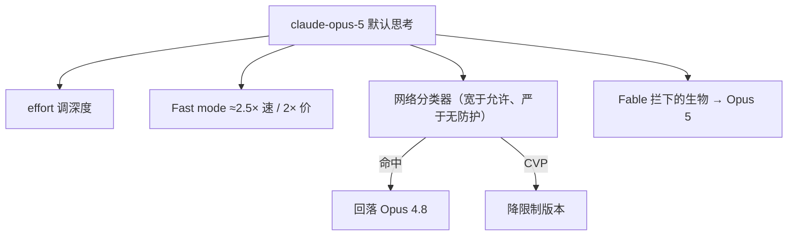

# Claude Opus 5

    
Claude Opus 5 今日可用。它是一个更审慎、更主动的模型，以一半价格接近 Claude Fable 5 的前沿智能。

    <footer>—— Anthropic，Introducing Claude Opus 5（2026-07-24）</footer>

2026 年 7 月 24 日 Anthropic 发布 **Claude Opus 5**，API `claude-opus-5`，价 **$5 / $25**（与 Opus 4.8 相同），并成为 Claude Max 默认、Pro 上最强档。相对 [Opus 4.6](/llm/claude-opus-4-6) 的点号升级，5 被写成 Opus 家族的代际跳变：深推理、长程智能体、测试时计算缩放。它被定位成每天使用的生产旗舰：同一价目上更强，也更强调先自检再交卷。平台文档补充：默认 **1M** 上下文（既是默认也是上限，没有更小窗口变体）、**128k** 最大输出、**默认开 thinking**——4.8 默认关思考，5 同一请求会想。本篇只引用发布博文与平台「what's new」已写明的合同，**不编参数量**。图中的精确柱高未进正文的，不补造。

## 问题

Fable 5 把能力天花板抬上去，但 $10/$50 加宽分类器，不适合当天所有生产流量。Opus 档要回答：能否在 **一半价格** 上接近 Fable 的编码与知识工作，同时把对齐做成「目前最乖的一档」，并把网络/生物风险保持在 Mythos 之下。第二个产品问题是效率：4.8 在高 effort 上贵；5 声称同一价目上更好，且 Fast mode 约 **2.5×** 速度、**2×** 价（与 4.8 Fast 同类）。

安全：预部署自动行为审计称 Opus 5 总体失配 **2.3**，低于 4.8、Sonnet 5、Fable 5；更遵守 Constitution、更少欺骗、更不易被骗去滥用、更少不可逆鲁莽。能力上**不**宣称双用途前沿：生物与进攻性网络仍落后 Mythos 5。OSS-Fuzz 一类评测被用来说明：找漏洞接近 Mythos，写利用则明显落后——本篇只转述这一差分，不写利用步骤。

### 思考默认开是破坏性变更

平台页：4.8 除非 `thinking: {"type": "adaptive"}` 否则不想；5 默认就想，effort 管深度。线格式仍接受 `adaptive`。关掉思考的时机变了。迁移只改模型 id、不改账单预期，会看到更多思维 token。

CursorBench 3.2：max effort 上距 Fable 5 峰值 0.5% 以内，且同成本上优于其他模型（博文定性 + 图）。Frontier-Bench v0.1：超过所有对比模型，且相对 4.8 在更低每任务成本上「超过一倍」——这是奖励均值语言，不是 SWE 百分数。

## 方法

公开方法是 effort 曲线与系统层回落。编码：Frontier-Bench、CursorBench、AA Coding Agent Index 以图展示。知识工作：ARC-AGI 3 称为次优模型的约 3×；Zapier AutomationBench 同成本约 1.5× 通过率，最低 effort 仍比别的模型过更多任务；OSWorld 2.0 任意成本点优于对照，并在约三分之一成本上超过 Fable 最佳。生命科学：相对 4.8 每项内部评测都更好，有机化学内部基准 +10.2 分，蛋白质变异效应 +7.7 分。这些内部基准没有公开题面，引用时标明 internal。

防护：网络分类器比 Fable 松——允许源码里找漏洞，拦二进制扫描、渗透测试、利用生成；官方预期干预次数比 Fable 少约 **85%**。Claude.ai / Code / Cowork 上命中则默认回落到 **Opus 4.8**；API 可开自动回落。CVP 客户立即得到限制更少的 Opus 5。生物：Fable 拦下的生物请求改走 Opus 5 而非 4.8，因为 5 成为「防护套件类似 4.8 时最强的公开科研档」。Mythos 仍是长程自主实验更强、也更受限的那条。

### 平台增量

同发 beta：对话中途改工具列表**不使提示缓存失效**；API 自动回落——分类器命中时转到「当时最好的可用模型」而不是硬拒。无 Fable 那条 Mythos 级 30 天保留要求的「一般访问数据保留」——博文写与先前 Opus 一致、一般访问无额外保留要求。具体以当时隐私页为准。

## 机制

Opus 5 的公开机制是 **Opus 价目 + 更强的测试时计算缩放 + 默认思考**，用分类器把双用途尖峰从 Fable 上削下来。对齐分数更好，不等于能力更弱：博文同时给 Frontier-Bench 与客户「接近 Fable、一半价格」。找漏洞与写利用的分叉，被用来论证「通用变强会抬网络项，但专项仍可落后 Mythos」。不要从 OSS-Fuzz 柱推断可复现的攻击教程——卡片与博文都只给相对位置。

Frontier-Bench 脚注：内部 mini-SWE-agent + GKE，每题 5 次均值；Opus 5 / Fable 的分类器拒答回落到 4.8。换 harness 则「超过一倍」作废。

### 和 Fable 5、和 4.8

Fable：$10/$50，分类器更宽，回落曾指向 4.8；Opus 5 发布后，部分生物回落改指向 5。4.8 仍是回落垫片与 CVP 对照。Sonnet 5 是更便宜的默认执行层。三者不是同一权重的三个名字。平台页还写 thinking 默认开、effort 控制深度；与 4.8「默认不想」相比，这是迁移时最容易漏的计费开关。

## 边界与工程取舍

### 回落改变「同一模型名」的评测

Frontier-Bench 脚注写明：分类器拒答时 Opus 5 与 Fable 回落到 4.8。线上若开自动回落，用户看到的「Opus 5 会话」可能是混合轨迹。关闭回落测裸模型、打开回落测产品系统，分数不可互换。CVP 降限制版本又是第三条曲线。写基准必须声明：是否 fallback、是否 Fast、effort 几档。把 Max 默认与 API 裸调用画在一起，会夸大或低估真实智能。

无参数。默认思考改变延迟与账单。Fast mode 买速度不买更高封顶。内部生命科学分不能当监管结论。网络「允许源码审计、禁止利用」是分类器政策，越狱面在 Fable 文里更长，Opus 5 只说更窄。客户引言（Devin、Cursor、Zapier 100% 等）是各自基准。视觉风洞与细胞图是博文插图级能力展示，没有公开的 MMMU 表在该文正文里，不要补编。

出处：Anthropic，*Introducing Claude Opus 5*，2026-07-24；Claude Platform *What's new in Opus 5*。参数量未公开。

博文称在 OSWorld 2.0、AutomationBench、ARC-AGI 3 等上成本—质量占优。复现必须对齐 effort 与是否回落。不要把「Max 默认」写成 Free 可用。

## 小结

- Opus 5 是 2026-07-24 的 Opus 代际：$5/$25，默认思考，1M 上下文 / 128k 输出。
- 公开定位：一半 Fable 价格接近其编码与知识工作；对齐审计优于 Fable / Sonnet 5 / 4.8。
- 网络防护宽于 Fable、仍拦利用生成；命中回落 4.8；CVP 可降限制。生物上承接部分原 Fable 回落流量。
- 双用途前沿仍写给 Mythos，不写给一般 Opus 5。Fast mode 约 2.5× 速度、2× 价格。
- 出处：上述博文与平台页。不编参数量、不编未出现在官方文本里的层宽。
