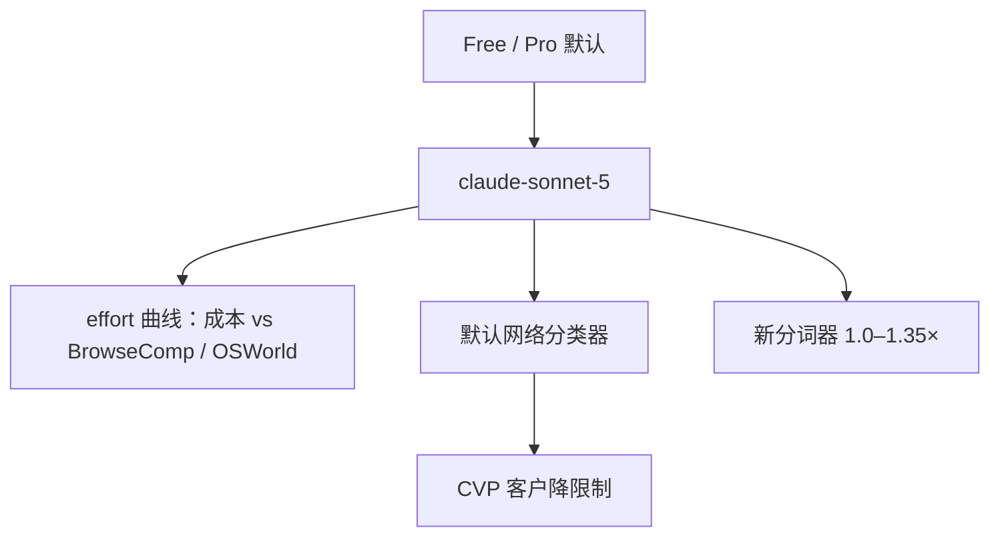

# Claude Sonnet 5

    
Sonnet 5 是迄今最智能体化的 Sonnet：能做计划、用浏览器与终端一类工具、以数月前还需要更大更贵模型才能达到的水准自主运行。

    <footer>—— Anthropic，Introducing Claude Sonnet 5（2026-06-30）</footer>

2026 年 6 月 30 日 Anthropic 发布 **Claude Sonnet 5**，API `claude-sonnet-5`。它是 5 代里的**中档默认**，不是 Fable，也不是 Opus 5。定价发布时为介绍价 **$2 / $10** 每百万 token；8 月 10 日勘误把该价改为**常驻**，原定 9 月 1 日恢复的 $3/$15 取消。Free / Pro 默认模型，Max / Team / Enterprise 可用。本篇只引用发布博文与其中指向的系统卡口径，**不编参数量**。主表在图中，正文可引用的是相对 Sonnet 4.6 与 Opus 4.8 的关系、安全与分词器脚注。4 代中档对照见 [Claude 4 Sonnet](/llm/claude-4-sonnet)。

从今天起，Claude Sonnet 5 在所有套餐可用：它是 Free 与 Pro 的默认模型，Max、Team 与 Enterprise 也可选用。定价为每百万 token 输入 2 美元、输出 10 美元。开发者通过 Claude API 使用 `claude-sonnet-5`。相对前代，官方强调的不是再刷一张多选总榜，而是智能体是否把活做完：计划、工具、编码与知识工作。安全评估认为总体不良行为低于 Sonnet 4.6，在智能体场景里更安全；网络任务能力则明显弱于当时的 Opus。这些句子足以定位中档，不必伪造层数。

## 问题

Sonnet 3.5–3.7 曾是智能体编码的大众档；之后明显的智能体增益集中在 Opus。中档若跟不上，默认用户会被迫升旗舰。Sonnet 5 要收窄与 **Opus 4.8** 的差距，并在价格曲线上给出比 4.8 更宽的 effort—成本选择。第二条是安全：总体不良行为低于 4.6，网络能力仍远弱于当时 Opus / Mythos，但仍默认打开网络防护——因为比 4.6 略强。

博文用 BrowseComp 与 OSWorld-Verified 的 effort 曲线说话：Sonnet 5 相对 4.6 严格更好，高 effort 上部分任务可追平 4.8。图曾误用 $3/$15 画成本轴；勘误后实际更便宜。6 月 30 日另一则勘误：BrowseComp 图曾用过简方法，已改成与系统卡一致的 10M token 预算 + 压缩 + 程序化工具调用。

### 分词器会改账单

脚注：Sonnet 5 相对 4.6 换了分词器（类似 Opus 4.7 那次），同一输入大约 **1.0–1.35×** token，视内容而定。单价下降与 token 变多要一起算。只比较「每百万美元」会低估真实请求成本。

HLE 对照把 Sonnet 4.6 改成新评分器下的 34.6%（无工具）与 46.8%（有工具）。OSWorld-Verified 把 4.6 改成 78.5%。与 4.6 发布博文旧分不可比。

## 方法

公开方法仍是评测 + 产品入口。智能体：计划、浏览器、终端、更长的跟进。客户引言强调：会自己补测试、自己验证、在脏代码里追根因，而不是只改症状。这些是早期用户报告，不是新损失名。Effort 档把同一模型拉成成本—质量曲线；与 Opus 4.8 的 $5/$25 相比，中档在中等 effort 上更省。Rate limit 随高 effort 的 token 用量上调。

安全：预部署显示相对 4.6，恶意请求拒答与提示注入抵抗更好，幻觉与迎合更低；自动行为审计总分更低（更安全），但失配率仍高于更强的 Opus 4.8 与 Mythos Preview。网络：未专门训网络任务；Firefox 147 漏洞利用评测上，两个 Sonnet 的完整利用成功率都是 **0.0%**，5 的部分成功略高于 4.6，官方归因于通用智能而非专项训练。默认网络防护与 Opus 4.7/4.8 同级，**严于**后来 Fable 5 那套更宽的拦截（Fable 拦的任务面更广）。Cyber Verification Program 已注册客户自动覆盖 Sonnet 5；官方仍建议需要降防护的网络工作走 Opus 4.8。

### 不要把 Sonnet 5 写成 Opus 5 的蒸馏声明

博文比较对象是 **Sonnet 4.6** 与 **Opus 4.8**。没有写「从 Fable 蒸馏」或参数比。智能体叙述是行为评测与客户案例。编码「接近 Opus 档」是定性句，精确柱在系统卡。本篇不编 SWE 百分数。

## 机制

5 代 Sonnet 的机制公开部分是：**同一产品名 + effort 调节测试时计算 + 系统层网络分类器**。相对 3.7 式「extended thinking 开关」，现在更强调智能体环里的计划与工具。分类器实时拦危险网络用途；误伤由 CVP 与「建议 Opus 4.8 做降防护网络工作」来分流。这与 Fable 5「拦下后回落到 Opus」是同一家族的系统层策略，但 Sonnet 5 的能力判断是低风险，所以防护带宽不同于 Fable。

对齐审计上 Sonnet 5 比 4.6 干净、比 Opus 4.8 / Mythos Preview 脏。不要用「最新所以最对齐」一句话概括——官方图就是这样交叉。

### 和 Opus 4.8、和 Fable

Opus 4.8 仍是当时更贵、部分任务封顶更高的参照。Sonnet 5 卖的是默认档的智能体密度。Fable 5 更强也更贵（$10/$50），并带更宽分类器。把三个都叫「5 代」可以，写路由时必须拆开：Free 默认不是 Fable。计算机使用（OSWorld）与浏览（BrowseComp）共用 effort 轴，但工具环不同：前者点桌面，后者搜网页。只拿一条曲线给所有智能体 SLA，会把保险进件与代码修补当成同一延迟分布。

## 边界与工程取舍

### 成本曲线上的 effort 不是免费午餐

博文把 Sonnet 5 画成比 4.6 更宽的 Pareto：中等 effort 更省，高 effort 可在部分任务上碰到 Opus 4.8。限额上调正是因为高 effort 更吃 token。生产若把所有流量锁在 max，中档定价优势消失，延迟回到旗舰。反之，默认过低则「接近 Opus」的客户引言不会出现。应按任务选档，而不是假定发布价 $2/$10 已经包含无限思考。

无参数。图轴勘误过两次（BrowseComp 方法、定价），转载必须用 8 月 10 日之后的页面。分词器使「降价」不等于「同文本更便宜」。网络 0% 完整利用不是安全证明，只是该 Firefox 评测的柱。不要把客户「端到端跑完 Salesforce 更新」写成通用 SLA。Lovable、Cursor、ClickHouse 等引言证明的是跟进与拒答，不是新的公开 SWE 主表。

出处：Anthropic，*Introducing Claude Sonnet 5*，2026-06-30（含 6/30 与 8/10 勘误）；系统卡见博文链接。参数量未公开。

2026-04-26 平台已把 Sonnet/Haiku 限额改成 Start/Build/Scale 三档。Sonnet 5 发布时又上调。限额以 Console 当时值为准。

## 小结

- Sonnet 5 是 2026-06-30 的中档 5 代，默认给 Free/Pro，常驻价 $2/$10。
- 公开定位：智能体接近 Opus 4.8 曲线的一部分，安全总体好于 Sonnet 4.6。
- 默认带网络防护；完整利用类评测上两个 Sonnet 均为 0%。
- 新分词器可增加 0–35% token；引用旧 4.6 分数须用勘误后的 HLE/OSWorld。
- 出处：上述博文。不编参数量。
