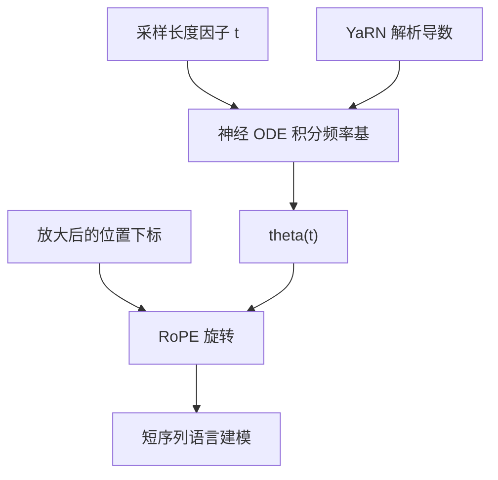

# CLEX

    
把位置缩放看成随长度因子演化的动力系统，用神经常微分方程去学频率基的连续过渡，就可以训短测长。

    <footer>—— Chen、Li、Meng、Liang、Bing，CLEX: Continuous Length Extrapolation for Large Language Models，ICLR 2024</footer>

位置插值与 YaRN 都对应一个固定的长度因子 $t=L'/L$：选定 $t$，改 $\theta$ 或改下标，在 $tL$ 上微调。因子选小了，再长就外推失败；选大了，原窗口内的频率被过度扭曲。阿里达摩院的 Guanzheng Chen、Xin Li、Zaiqiao Meng、Shangsong Liang 与 Lidong Bing 在 ICLR 2024 的 CLEX（Continuous Length EXtrapolation）里把这类离散缩放收成一条连续动力学：频率基的对数随 $t$ 的变化由一个小网络积分出来。训练时随机采样 $t$，并把短序列的位置下标放大到与 $t$ 一致，使模型在连续的尺度谱上对齐。原文报告：在训练长度的 4 倍甚至接近 8 倍上困惑度不恶化；4k 训练的模型在 LongBench 上可以和 32k 续训的开源长窗模型相比。本篇写这篇 ODE 原文。

## 问题

RoPE 的 PE scaling 有两条已有路。Chen 等的 PI 缩放下标 $m\leftarrow m/t$；YaRN 与 CodeLLaMA 一类方案缩放频率基 $\theta$。CLEX 先证明二者同构：对 $m$ 的线性变换等价于对 $\theta$ 的逐元变换，于是统一写成

$$
f_t(\mathbf{x},m,\boldsymbol{\theta})=f(\mathbf{x},m,\boldsymbol{\alpha}(t)\odot\boldsymbol{\theta}).
$$

PI 对应 $\alpha_i(t)=1/t$，YaRN 对应 $\alpha_i(t)=t^{-2i/(d-2)}$。已有方法在训练里只用一个或少数几个离散 $t$，网络过拟合到那一套 $\theta_t$。图 1 一类评测上的典型形状是：在训练用的 $t$ 上 PPL 好，更长则炸，更短也可能掉——「延窗」和「保住原窗」被绑在同一个标量上，顾此失彼。

另一条文献是 ALiBi 式长度外推：训短测长，靠偏置而不是改 RoPE。它们语言建模曲线可以看，但在需要真实长依赖的任务上往往弱。CLEX 要的是第三条：仍然走 RoPE 的频率基，但让 $\alpha(t)$ 成为连续可学的动力学，并且把动力学积分到超过训练长度的 $t$，使短序列训练也能覆盖长序列推理。

### 离散缩放忽略了「逐渐变长」

把 $t$ 当成整数台阶，每一步 $\boldsymbol{\theta}$ 跳一次，中间的频率从未作为训练分布出现。推理若请求一个没见过的中间长度，或远远大于训练 $t$ 的长度，就回到外推。连续化之后，$t$ 是实数，频率基沿一条轨迹滑动，模型被要求在整段轨迹上语言建模，而不是只在终点。

「连续」指长度因子上的动力学，不是把 token 变成连续时间序列。序列仍是离散的；变的是 RoPE 的 $\theta(t)$。不要和 Neural ODE 在残差流上做连续深度的那类工作混名。

## 方法

令 $\mathbf{z}(t)=\log\boldsymbol{\theta}_t$。统一观点下 PE scaling 是

$$
\frac{d\mathbf{z}}{dt}=\frac{d\log\boldsymbol{\alpha}(t)}{dt}.
$$

手工 $\alpha$ 给出常数或简单的维相关导数。CLEX 把右端换成网络

$$
\frac{d\mathbf{z}}{dt}=g_{\phi}(\mathbf{z}(t),t),
$$

并用神经 ODE 积分：

$$
\mathbf{z}(t')=\mathbf{z}(1)+\int_1^{t'} g_{\phi}(\mathbf{z}(\tau),\tau)\,d\tau,\qquad \boldsymbol{\theta}_{t'}=\exp(\mathbf{z}(t')).
$$

$g_{\phi}$ 是一层上投影、SiLU、下投影，宽度由放大系数 $\lambda$ 控制，参数相对 7B 可忽略。为加快收敛，残差里加上 YaRN 的解析导数作为 $\boldsymbol{\xi}_t$，让网络学的是「相对 YaRN 轨迹的修正」，而不是从零发明一条频率路径。

### 训短测长：随机 $t$ 与位置外推

若只在 $t=L^{\mathrm{Train}}/L$ 上积分，仍会过拟合终点。训练每一步从 $[1,t^{\mathrm{Train}}]$ 采样 $t'$，其中 $t^{\mathrm{Train}}$ 可以大于 $L^{\mathrm{Train}}/L$，即动力学故意积分到比当前序列更长的尺度。此时频率基对应长窗，位置下标若仍是 $1\ldots L^{\mathrm{Train}}$，二者不一致。论文的 position extrapolation 把短序列的下标放大到 $[1,t'L]$：均匀乘因子，或从该区间随机抽 $L^{\mathrm{Train}}$ 个有序下标。消融里随机抽样通常更好。这与 PI「缩小下标」方向相反：CLEX 在训练里**放大**位置，好让短上下文去对齐长尺度的 $\theta$。

推理时对每个长度都现场积分太贵。做法是缓存 $K$ 个离散 $t_k$ 对应的频率基，对当前长度取最近上界的那一张表。相对原 RoPE 前向，延迟可忽略。

## 机制

PI 与 YaRN 是这条 ODE 在特定 $\alpha$ 下的闭式解。CLEX 的机制主张是：过拟合离散 $t$ 才会在邻域长度上崩；沿连续 $t$ 训练等于对缩放路径做数据增强。位置外推则强迫「当前 token 内容」与「仿佛更长窗口的相位」一起出现，梯度同时更新投影与 $g_{\phi}$。因为 $g_{\phi}$ 很小且 RoPE 仍是旋转，已有核几乎不用改，只换 $\cos/\sin$ 表的生成方式。

LongBench 上的主张需要分开读。4k 序列上做指令微调之后，与「在 32k 上续训的开源模型」比的是任务分，不是无损 32k 全注意力。外推倍数来自语言建模：LLaMA-2-7B 在 16k 训练可在 64k 上维持相近 PPL；13B 可以把外推倍数从约 4 提到接近 8。这是容量帮动力学泛化，不是 ODE 本身随宽度自动变准。

积分器与 $K$ 张缓存表是推理实现的一部分。$K$ 太稀，长度落在两档中间会用错 $\theta$；太密则失去「可忽略延迟」的承诺。应在目标服务长度上标定分档，而不是每 token 解一次 ODE。

### 和固定 $t$ 微调的差别

固定 $t$ 的 PI/YaRN：一个检查点绑定一个目标窗。CLEX：一个检查点绑定一条 $t$ 的轨迹，推理长度在轨迹覆盖范围内时换表即可。轨迹覆盖不到的极长，仍会失败——连续外推不是无限外推。随机 $t$ 若总抽在 1 附近，长尺度学不到；总抽在 $t^{\mathrm{Train}}$，又退回单点过拟合。采样分布是一等超参。

## 边界与工程取舍

CLEX 要训练，不是纯推理补丁。数据用了 RedPajama Book 子集做长文档语言建模；指令场景另用 UltraChat 在 4k 上调。没有长文档梯度，ODE 学不到有用的 $g_{\phi}$，会退化成带噪声的 YaRN。上投影宽度 $\lambda$ 过大则失去「可忽略参数」；过小则拟合不动维相关动力学。

它对 ALiBi 模型无意义。与已经用 YaRN 续训到固定 32k 的权重叠用时，等于在已缩放的 $\theta$ 上再积分，容易双重压缩。应在原 RoPE 检查点上启用。KV 缓存必须与当前选用的 $t_k$ 一致，请求中途变长若跨档，要重算旋转。

论文对照含 ALiBi、RandomPos、PI、YaRN、CodeLLaMA 式缩放。读表时注意训练长度是否对齐：PE scaling 基线常在 16k 上训，长度外推基线在 4k 上训，CLEX 报了 4k/8k/16k 多档。混读「谁在 64k PPL 最低」会不公平。

### 评测

语言建模应画 4k→64k 的 PPL 与 next-token 准确率，看外推段是否平台。LongBench 证明「实用任务」而不是只证明 PPL。短窗任务仍要报，避免连续缩放把 4k 分布拧坏。不要把「4× 训练长度无掉点」写成产品 128k——那是原文在其训练设置下的曲线，换数据与模型要重测。

## 小结

- CLEX 把 PI/YaRN 等 PE scaling 统一为频率基随 $t$ 的连续动力学，用轻量神经 ODE 来学。
- 训练随机采样 $t$ 并放大位置下标，从而训短测长；推理用分档缓存的 $\theta$ 表。
- 7B 约 4 倍、13B 接近 8 倍训练长度上语言建模不恶化；4k 指令调优可在 LongBench 上接近更长续训模型。
- 不是无训练方法，也不是无限外推；跨档换表要与 KV 旋转一致。
- 出处：Chen、Li、Meng、Liang、Bing，*CLEX: Continuous Length Extrapolation for Large Language Models*，ICLR 2024，arXiv:2310.16450。对照 Chen 等 PI（2023）、Peng 等 YaRN（2023）、Chen 等 Neural ODE（2018）。
