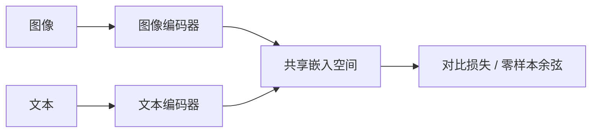

# CLIP 对齐

不必为每一个视觉概念手工标类；让图像与自然语言在同一空间里对比学习，零样本就能把任意文本当成分类器。

<footer>—— Alec Radford 等, CLIP, 2021</footer>

在视觉语言模型里，图和文要先能互相指认，后面的投影器、连接器、指令微调才有对齐的起点。Radford 等人 2021 年的 CLIP（Contrastive Language–Image Pre-training）把这件事写成大规模图文对比学习：图像编码器与文本编码器各出一条向量，批次内正确配对拉近、错误配对推远，得到一个共享的嵌入空间。LLaVA、Qwen-VL、InternVL 所用的视觉骨干，大量是 CLIP 或同类对比预训练的 ViT，而不是单纯的 ImageNet 分类器。本篇只讲这条对齐，[ViT 作为视觉编码器](/llm/vit-as-encoder) 讲骨干结构，接到 LLM 的方式见 [LLaVA 投影器](/llm/llava-projector)。

## 问题

ImageNet 分类把视觉语义钉死在一千个名词上，换到「红底白字的路牌」或「表三第三行的合计」就失效。检测与分割需要更重的框级标注，覆盖不了开放词汇。自然语言本身已经在描述图像，而且规模可以到数亿图文对。问题是：如何用弱对齐的标题监督，学到可迁移的视觉表示，并且让下游不必为每个新概念重新训练分类头。

CLIP 的答案不是生成式造句，而是判别式检索：给定一张图和 $N$ 句候选，认出哪一句是它的标题。这比自回归生成图像描述更稳、更好并行，也直接得到「图向量可与任意文本向量比余弦」的接口。失败模式也清楚：标题若只是关键词堆砌，空间会偏物体名词，弱于空间关系与细字。

## 方法

### 双塔与批次对比

图像编码器 $f$（ResNet 或 [ViT](/llm/vit-as-encoder)）输出 $z_i$，文本编码器 $g$（Transformer）输出 $w_j$，二者映射到同一维并做 L2 归一化。批次内 $N$ 对正样本，相似度矩阵是温度缩放的余弦：

$$
s_{ij}=\frac{z_i^\top w_j}{\tau},\qquad
\mathcal{L}=\tfrac12\Bigl(\mathrm{CE}(s)+\mathrm{CE}(s^\top)\Bigr)
$$

行方向是「图检索文」，列方向是「文检索图」，对称交叉熵迫使两边都可检索。$\tau$ 可学习。没有跨模态交叉注意力：图塔与文塔在对比损失出现之前互不看见对方的 token，这是双塔能把图文分别预计算、做大规模检索的原因。

双塔对齐的是全局向量，不是词与区域的细粒度对应。CLIP 空间里「图靠近这句话」成立，不蕴含「这句话里的某个词对准了图上某个框」。要框级对应，需要另加定位头或把 patch token 交给后续 VLM，而不是指望 CLIP 余弦本身。

### 用文本当零样本分类器

推理时把类名填进提示模板（如 a photo of a \{label\}），用 $g$ 编成权重矩阵，与 $z$ 做一次点积即分类。新类等于新句子，不必改 $f$ 的权重。这就是开放词汇的机制来源：类空间与语言空间重合。图像检索、图文检索是同一套余弦。Radford 等人用约四亿级图文对训练，表明规模可以把噪声标题里的监督信号堆到可迁移的程度；本篇不复述具体准确率表。

### 作为 VLM 的视觉前端

接到 LLM 时，通常丢掉 CLIP 的文本塔与分类用法，只保留图像编码器的 patch 特征（有时含 CLS）。这些特征已经活在一个与语言相近的空间里，于是一层 [MLP 投影](/llm/llava-projector) 就可能把视觉 token 映射进词嵌入空间。若视觉骨干只在 ImageNet 上训过，同一投影往往更难：空间里没有被句子拉过。后续连接器是在 CLIP 对齐之上再对齐一次，不是替代对比预训练。

## 机制

对比损失在批次内制造硬负例：同一 batch 里所有非配对文本都是负样本。$N$ 越大，分类越难，表示越要抓住能区分标题的特征。温度 $\tau$ 控制分布尖峰：过小，模型过度自信于易分样本；过大，正负差被抹平。归一化把比较限制在球面上，尺度不会被某一塔的范数偷走。

迁移之所以发生，是因为标题里出现的词覆盖了远超 ImageNet 的概念长尾，而双塔必须用视觉特征去预测这些词是否匹配。于是编码器学会的不是一千路 logit，而是「被语言点名过的视觉属性」。零样本分类只是把属性重新组合成类名句子。VLM 再往前走一步：不再把整图收成一个 $z$，而是把 patch 序列交给语言模型去做生成与定位。

CLIP 的监督是配对，不是像素级。图上很小的字、复杂表格、需要数数的物体，标题里经常没写，对比学习就不会为它们付损失。这直接解释了为何文档与 OCR 不能只靠 CLIP 全局向量，而要高分辨率 patch 和生成式解码。

## 边界与工程取舍

双塔没有交互，组图、空间关系、否定句（「没有狗的房间」）是弱项。批次负例若过于容易（图文来自截然不同的域），损失会饱和。英文为主的网页标题会把空间拉向英语视觉文化，零样本换到其他语言要另做对齐或多语言文本塔。

工程上，CLIP 视觉塔的输入分辨率是另一条边界：224 或 336 对自然照片够用，对文档细字不够，这把压力交给 [AnyRes](/llm/anyres) 与 [原生分辨率切块](/llm/qwen-vl-naive-dynamic-res)。不要把 CLIP 准确率当成 VLM 幻觉的下界：对比检索对了，生成式回答仍可能编造图中不存在的物体；那是语言模型侧的问题，不是余弦空间没对齐。

冻结 CLIP 再接 LLM 时，视觉塔看见的仍是对比任务的特征，不一定是「对语言模型最有用的特征」。LLaVA 一类选择冻骨干、只训投影，是在省算力；若文档 OCR 掉字，应考虑解冻 ViT 或换更高分辨率骨干，而不是只加宽 MLP。

取舍：需要开放词汇识别与检索，CLIP 空间几乎是默认起点；需要密集描述、OCR、多图推理，必须在对齐之上加生成目标与高分辨率，不能只堆更大的对比批次。

## 小结

- CLIP 用双塔图文对比学习共享嵌入空间，批次内对称交叉熵拉近配对、推开非配对。
- 零样本分类把类名写成句子，用同一套余弦；开放词汇来自语言与视觉重合。
- 对齐的是全局向量，不是词–区域细对应；VLM 还要用 patch token 做生成。
- 后续 LLaVA / Qwen-VL 的视觉前端大量建立在 CLIP 类骨干上。
- 文档细字、空间关系、否定与组合，是对比全局向量的弱项。
- 分辨率与是否解冻视觉塔，决定这条对齐能支撑多远的 VLM 任务。
- 出处：Radford et al., *Learning Transferable Visual Models From Natural Language Supervision*（CLIP）, 2021。后续用法见 Liu et al., LLaVA, 2023；Dosovitskiy et al., ViT, 2020。
