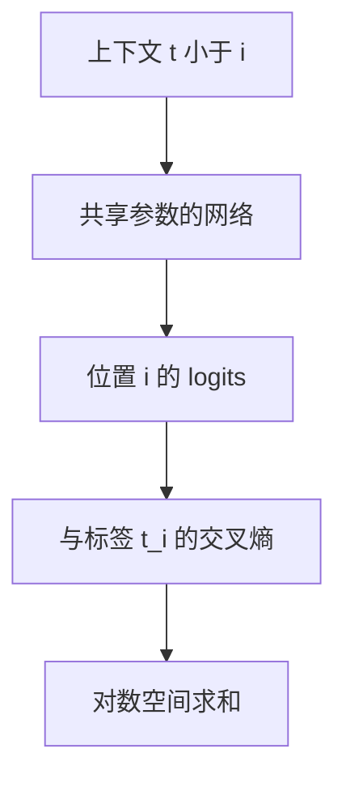

# 下一词分类

一段离散符号的联合概率可以因式分解成「每一次只猜下一个符号」；训练目标于是变成一串共享参数的分类。

<footer>—— 据 Shannon, Prediction and Entropy of Printed English, Bell System Technical Journal, 1951；Bengio et al., A Neural Probabilistic Language Model, JMLR 2003 整理</footer>

[对数空间与 underflow](/llm/logspace-underflow)规定似然只在对数里相加。本课不重写 logsumexp。缺口是：把这条原则用到符号序列上——每个位置一次对词表的分类，损失是各位置交叉熵之和。本课仍把符号当成已经编号的类别，不解释词表从哪来；那是深度学习基础结束之后，[离散符号与词表](/llm/token-as-discrete-unit)的第一课。也不把网络结构写成 Transformer。

## 问题

交叉熵课处理的是单次分类：一个 $z\in\mathbb{R}^{K}$，一个标签 $y$。语言是变长序列 $t_{1:n}$。若把整句当成一个类别，类别数随长度指数增长，无法参数化。若把各位置当成独立分类，又丢掉「前面决定后面」的条件结构。缺口是链式法则给出的因式分解

$$
P(t_{1:n})=\prod_{i=1}^{n}P(t_i\mid t_{<i}),
$$

每一项都是在大小为 $K$ 的词表上的一次分类，$K$ 与 $n$ 无关。对数似然是 $\sum_i\log P(t_i\mid t_{<i})$，恰好是上一课的求和。

「下一词」是训练时的监督接口，不是对人类阅读过程的断言。条件可以来自左侧上下文、来自双向编码器的其它位置，或来自编码器输出；本课取自回归默认：位置 $i$ 的标签是 $t_i$，输入是 $t_{<i}$（实现上常喂 $t_{1:n}$ 再把标签左移一位）。双向与掩码语言模型是后课变体，不在这里展开。

### 下一词不是整句回归

把句子嵌入成一个向量再回归到另一个向量，损失无法告诉模型「第 $i$ 个符号错了」。分类头必须在每个位置上给出 $|V|$ 维 logits。句向量可以作检索，不能代替本课的目标。同样，逐字符的均方误差把符号当成连续值，编号的算术没有意义——那是嵌入课才纠正的事，本课先要求损失定义在离散类别上。

实现里常见形状：logits $(B,n,|V|)$，标签 $(B,n)$，在最后一轴做交叉熵，再对非填充位置求平均。填充位置必须掩掉，否则 PAD 会主导平均损失。

## 方法

参数共享：同一个网络 $f$ 在每个位置产出 $z_i=f(t_{<i})\in\mathbb{R}^{|V|}$，再走稳定 softmax。训练损失

$$
L=-\frac{1}{\sum_i m_i}\sum_i m_i\log p_i[t_i],
$$

$m_i$ 是有效位置掩码。教师信号是语料里真实的 $t_i$，不是模型自己上一步的抽样——后课 seq2seq 会把这一点命名为 teacher forcing，本课只先用上「用真值当条件」。评估用平均负对数似然或 $\mathrm{e}^{L}$ 作为困惑度；比较模型时长度归一必须一致，按 token 还是按词、按字节要声明。

## 机制

因式分解把「生成整句」变成「重复使用同一分类头」。参数量不随 $n$ 增长，长度只增加计算次数。梯度是各位置 $p_i-e_{t_i}$ 沿共享参数求和：高频下一词模式贡献大，罕见续写贡献小。这与嵌入行按频次更新是同一现象，只是现在监督落在分类头上。

自回归接口还规定了推理方式：必须按时间一步一步取下一个符号，不能并行出整句（训练时因 teacher forcing 可以并行算所有位置的损失，那是实现巧合，不是条件独立）。本课不讲解码算法；只需承认训练目标与推理过程用的是同一因式分解。

## 边界

本课不定义词表、BPE、UNK，也不定义注意力。网络 $f$ 可以是稍后的 RNN 或 Transformer，这里只要求它输出 $|V|$ 维 logits。下一课起进入优化：[梯度下降与学习率](/llm/sgd-learning-rate)假定已经有了可对参数求导的标量 $L$。后课默认：语言模型的训练损失是掩码后的平均下一词交叉熵。

## 小结

- 序列联合概率因式分解为下一词分类；对数似然是各位置交叉熵之和。
- 分类头宽度等于词表大小；形状 $(B,n,|V|)$ 对 $(B,n)$。
- 填充位置必须从平均里去掉。
- 训练可用真值上下文并行算损失；推理仍按条件逐步展开。
- 出处：Shannon, 1951；Bengio et al., JMLR 2003。
