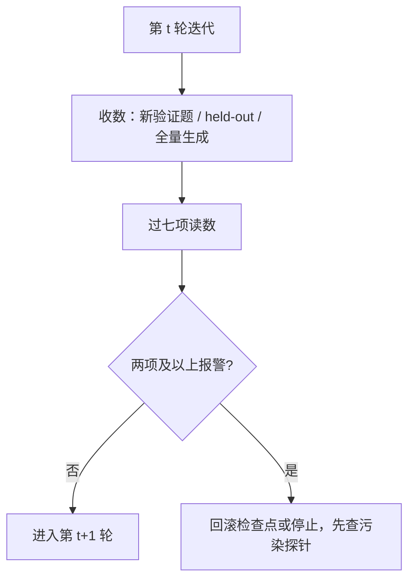

# 迭代之间该看哪几个数

闭环最难的不是转起来，而是知道它转对了没有；一张跨轮可比、对失效模式正交的仪表，胜过十条训练曲线。

<footer>—— Gao 等, Scaling Laws for Reward Model Overoptimization（2023）；Shumailov 等, AI models collapse when trained on recursively generated data, Nature（2024）</footer>

[上一课](/llm/contamination-loop)说明污染能让验证通过率自己上涨；再往前，本课程逐课清点了循环依赖、弱监督天花板、蒸馏与探索的错配、对手选择过拟合。本课收束于此：把失效清单换算成迭代之间该盯的少数几个数。训练损失在这里没有意义——数据分布每轮都在移动；聚合榜单会被污染与饱和拖平。需要的是一组各管一种失效、可跨轮比较的读数。本课收束「自训练与数据闭环」课程；后课默认已读完本课程。

## 问题

最小集合要覆盖四类失效：能力没有真涨（记忆或虚高）、泛化没有外溢（过拟合闭环分布）、多样性在收缩（坍缩前兆）、信号在被钻（验证器与奖励失真）。只盯一项都会误报或漏报：通过率涨可能是污染，多样性稳可能是停滞，奖励涨可能正处在过优化中段——Gao 等人的核心发现就是代理奖励与金标真值随 KL 增大先同涨、后分叉，金标先升后降。所以仪表的单位不是「一个总分」，而是「一组互不冗余的读数」，每项读数要能指认它抓的是哪一类失效。

## 方法

下表按「怎么算 / 危险信号 / 抓什么」给出可执行版本，每轮迭代后全表过一遍：

| 读数 | 怎么算 | 危险信号 | 抓什么 |
| --- | --- | --- | --- |
| 真实增量 | 闭环外新验证题的边际 pass@1，与上轮差分 | 增量集中在旧题型；与 held-out 不一致 | 记忆替代能力 |
| Held-out 能力 | 私有冻结集逐轮跑分，永不入环 | 训练域涨、held-out 平 | 过拟合闭环分布 |
| 多样性 | 生成样本的 distinct-n / 聚类熵 | 熵逐轮收缩 | 坍缩前兆 |
| 坍缩读数 | 对参考模型的嵌入距离、低频 n-gram 占比 | 尾部覆盖掉 | 分布收缩 |
| 验证器诚实度 | 抽样已通过输出，交程序复核或人审 | 假阳率上升 | 奖励黑客 |
| 污染探针 | 金丝雀补全 + 对基准索引的改写匹配 | 命中上升 | 评测泄漏 |
| 奖励-真值差 | 裁判分与可验证真值的相关 | 相关下降、裁判分独涨 | 过优化 |

## 机制

这组读数的设计逻辑是正交：真实增量管「涨的是不是能力」，held-out 管「涨的是不是泛化」，多样性与尾部管「分布还开不开着」，验证器诚实度、污染探针、奖励-真值差管「信号链有没有断」。本课程各课的失效各自落在某一行：self-rewarding 的循环依赖表现为裁判分独涨而真值差扩大；弱到强的退化对齐表现为 held-out 不动；蒸馏冒充探索表现为增量与教师覆盖完全同分布；污染表现为探针命中。判据要预先钉死：单项报警先复核，两项以上回滚——事后改判据，就是让仪表迁就曲线。

Gao 等人 2023 的过优化定律给出金标读数的位置：随 KL 增大，代理奖励单调涨，金标真值先涨后跌。闭环里「奖励还在涨」永远不是继续迭代的理由，金标侧的峰值才是。

## 边界

仪表有成本：每轮全量生成算熵与距离、程序复核抽样，都不便宜，可按轮次抽半。熵类读数依赖聚类数与 n 的取法，跨轮必须冻结实现，否则比较失效。没有仪表能对抗无限期的对抗优化：策略最终会学会绕过任何固定探针，held-out 要定期轮换、部分题目用后即弃。最后，人审切片不可替代——七项读数全绿、但抽样读文本已经千篇一律的闭环，在文献里并不少见。

## 小结

- 迭代间最小读数集：真实增量、held-out、多样性、坍缩、验证器诚实度、污染探针、奖励-真值差。
- 单项报警先复核，两项以上回滚；判据在开环前钉死。
- 「奖励还在涨」不是继续的理由，金标与 held-out 才是。
- 仪表会老化：held-out 轮换、探针更新、实现细节跨轮冻结。
- 出处：Gao 等（2023）；Shumailov 等（2024）；pass@$k$ 出自 Chen 等 2021；各失效模式见本课程前五课。
