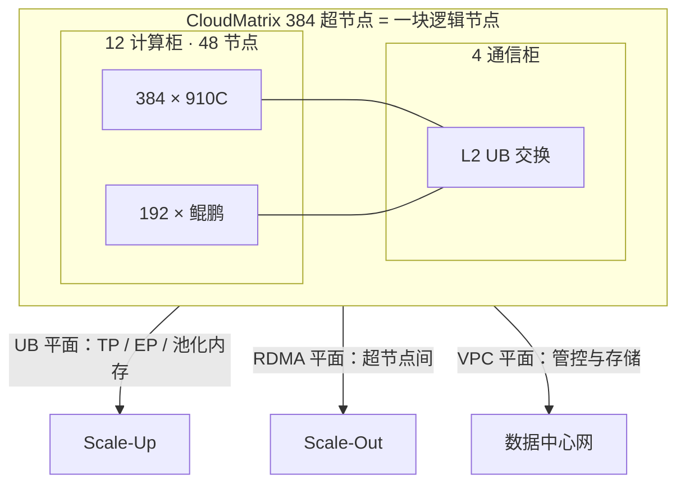

# CloudMatrix 384：384×910C + 192 鲲鹏一块超节点

    
384 颗昇腾 910C 与 192 颗鲲鹏经统一总线收成一个生产级超节点：计算、内存与网络可池化、可统一访问，而不是 48 台各管各的八卡服务器。

<footer>—— Huawei CloudMatrix384 公开论文：Serving Large Language Models on Huawei CloudMatrix384</footer>

CloudMatrix 384 是华为 CloudMatrix 架构的首个生产级实现。公开材料写明：它集成 **384 个昇腾 910C NPU** 与 **192 个鲲鹏 CPU**，用超高带宽、低时延的统一总线（UB，灵衢）互连，使超节点在逻辑上像一块紧耦合的加速器。物理上覆盖 16 个机柜——12 个计算柜承载 48 个计算节点（48×8=384 颗 910C），4 个通信柜放 L2 UB 交换。本篇钉这组**树标题里的数字与形态**，带宽与封装规格只引用论文已写明的数字，不把 CloudMatrix-Infer 在 DeepSeek-R1 上的 tokens/s 外推成一般定律。对照物是 NVIDIA 把整柜 NVLink 域当成一块 GPU 的讲法，见 [机柜作为一块逻辑加速器](/llm/rack-as-accelerator)；两者托盘数、交换与编程栈不可互换。

## 问题

传统 Atlas 服务器是节点内 8 卡，卡间 HCCS，节点间 RDMA。张量并行、宽专家并行、分布式 KV 一旦跨出节点，就掉到以太网档的延迟与带宽。MoE 的 token dispatch 和长上下文 KV 复用正是这类通信。只加机器台数（Scale-Out）填不满这一档；只加单卡算力，又受封装与供电限制。CloudMatrix 要回答的是：能否把 Scale-Up 域从「一盒 8 卡」拉到「数百 NPU + 配套 CPU」，并且 CPU 内存也能被 NPU 直接用，而不是每条 KV 都先绕主机 PCIe。

软件若仍按 48 个独立 hostname 调度，UB 买了等于没买。问题与 NVL72 相同：域在硬件上已经是一块，编排必须把域当一份模型并行组。异构之处在于这份组里还有 192 颗鲲鹏，职责不是「再 192 张假 NPU」，而是主机、预处理与可池化的 DRAM。

### 384 与 192 从哪来

每个计算节点公开配置为 8 个 910C、4 个鲲鹏、7 个板载 L1 UB 交换芯片。48 个计算节点给出 $48\times 8=384$ 颗 NPU、$48\times 4=192$ 颗 CPU。不要把 384 理解成 384 个机柜，也不要理解成 384 个 Die 就停——910C 是双 Die 共封装，论文按**封装（NPU 设备）**计数 384；专家并行若「每 Die 一个专家」，Die 数是封装数的两倍，那是另一篇切分账，见后续 CloudMatrix-Infer 树节点，本篇不把 EP320 写进超节点规格。

论文还给出 910C 封装级公开规格：双芯片共封装，每 Die 约 376 TFLOPS 稠密 BF16/FP16，封装合计约 752 TFLOPS；8 个 16 GB 栈共 128 GB 封装内存储，封装级内存带宽约 3.2 TB/s。这些是厂商论文数字，用来理解单卡量级，不是本博客的测量，也不把 384 路相加后的营销 PFLOPS 当成自己测的系统峰值。

## 方法

把一个 CloudMatrix 384 编成一份 Scale-Up 域。域内：TP、延迟敏感的 EP All-to-All、NPU 与 CPU 内存池上的 KV 访问，走 [UB 平面](/llm/ub-lingqu)。域间：多个超节点之间的 KV 传递、分布式训练的 DP/PP，走 RDMA 平面（当前为 RoCE）；管控、对象存储、CPU 侧业务走 VPC 平面（擎天网卡，论文写每节点最高约 400 Gbps 单向）。三平面同时存在，是为了和传统数据中心兼容；论文也写了未来把 RDMA 与 VPC 融合的方向，那是规划，不是 384 这代必须已经合一。

计算节点内，12 个处理器（8 NPU + 4 CPU）经 UB 接到 7 个板载交换，形成单层 UB 平面。论文写：每颗 910C 配置最高约 392 GB/s 单向 UB；每个鲲鹏插槽约 160 GB/s 单向 UB；单颗板载 UB 交换芯片向上一层提供 448 GB/s 上行。只有 NPU 参加 RDMA 平面：每设备额外一条最高 400 Gbps 单向 RDMA，节点合计 3.2 Tbps。四个鲲鹏之间是全网状 NUMA，连接的 DRAM 可统一访问；其中一颗 CPU 挂擎天 DPU，作为南北向出口和节点级资源管理。

### 当作一块加速器来切模型

并行组应落在该 UB 域内：宽 TP、宽 EP 不要在超节点边界上「再拼一台」。论文强调 UB 上点对点全互连，节点间通信性能接近节点内——定量见 [带宽衰减与微秒时延](/llm/ub-near-local-perf)。KV 与权重可以按池化内存来设计：NPU HBM 仍是近端最快，CPU DRAM 经 UB 作为第二层，而不是每条请求都打到对象存储。调度上，MatrixResource / MatrixCompute / MatrixContainer 把超节点抽象成可编排实例；业务侧仍应暴露「本作业需要一个 UB 域」，交给 [异构集群调度](/llm/hetero-cluster) 去绑，而不是让 Kubernetes 随机抽 8 张卡。

与 [Scale-Up 对 Scale-Out](/llm/scale-up-vs-scale-out) 的对号：384 卡的集合通信属于超节点内；副本、检查点、跨可用区属于超节点外。不要用训练的 3D 切分直接当推理拓扑，decode 更怕跨域 TP。

## 机制

逻辑节点成立，靠的是 L1 板载交换加 L2 通信柜的无阻塞结构，以及 UB 同时提供内存语义与消息语义，见 [L1/L2 七子平面](/llm/ub-l1-l2-planes) 与 [UB 灵衢](/llm/ub-lingqu)。跨柜距离用光模块收口，见 [跨柜光模块](/llm/ub-optical-cabinets)。没有这套交换，384 张卡只是 16 柜以太网集群。

910C 双 Die 通过封装内互连协同（论文给出封装内总带宽约 540 GB/s、单向 270 GB/s 量级）。对软件，一张 910C 仍是一颗 NPU 设备，但有的并行策略按 Die 切专家。不要在容量规划里把 384 与 768 混用而不声明计数单位。

三平面里，UB 连全部 384 NPU 与 192 CPU；RDMA 只有 NPU 参加，把横向流量与管控/存储分开。规划「CPU 是否走 RDMA」时不要默认与 NPU 同一平面。

### 故障域是超节点

通信柜或一条 L2 子平面影响的是整块逻辑节点的带宽或连通性，不是「少一台 8 卡机」。维护窗口按 16 柜设计：液冷、供电、光模块、交换固件都是域级。集群应能把该超节点从副本集摘掉。论文讨论过更大超节点与 CPU 物理分解，那是后续方向；384 这一代仍是节点内 8+4 的固定配比，逻辑上池化，物理上尚未拆成纯 NPU 柜加纯 CPU 柜。

## 边界与工程取舍

不要把 NVL72 的 18+9 托盘抄成 CloudMatrix 的 12+4 柜。不要在没有 UB 的普通 8 卡集群上用 64 路 TP「模拟 384」。不要把论文里 DeepSeek-R1 的 prefill 6688 tokens/s/NPU、decode 1943 tokens/s/NPU（TPOT 低于 50 ms）写成任意模型的 SLA——那是指定模型、精度与 CloudMatrix-Infer 软件的测量。不要填写未在论文出现的光模块只数、单通道眼图或未发布的 UB 协议字段。

超节点增大了爆炸半径与功耗密度，设施规划按柜级功率走厂商交付，不在本文填未核对的千瓦数。软件生态是 CANN / HCCL / MindIE 或 [vLLM-Ascend](/llm/vllm-ascend)，迁移成本独立于硬件是否已经是一块逻辑节点。

出处：arXiv:2506.12708 *Serving Large Language Models on Huawei CloudMatrix384* 中的超节点组成、三平面与节点规格。UB-Mesh 拓扑见 arXiv:2503.20377，本篇只声明 384 的 UB 是其递归落地，不把论文里 4D-Pod 的 1024 NPU 设计与 384 这一 SKU 画等号。

## 小结

- CloudMatrix 384 = **384×910C + 192 鲲鹏**，48 计算节点，16 柜（12 计算 + 4 通信），一块 UB 超节点。
- 每节点 8 NPU + 4 CPU + 7 L1 交换；NPU 走 UB 与 RDMA，CPU 走 UB 与 VPC 出口。
- 域内做 TP/EP 与池化 KV；域间 RoCE；管控存储走 VPC。
- 910C 封装规格用论文数字；系统峰值不要用自行连乘的营销口径冒充实测。
- 运维按超节点故障域，而不是 48 台独立服务器。
- 出处：Huawei CloudMatrix384 公开论文；形态对照 [Scale-Up](/llm/scale-up-vs-scale-out)。
