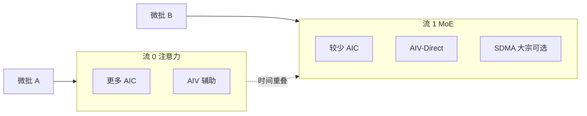

# CloudMatrix-Infer：算子融合与 AIC/AIV/SDMA 重叠

    
Cube 算矩阵，Vector 做逐元素与直接远端写，SDMA 做大宗搬运；融合算子的目标是让这三类引擎同时转，而不是排成一条同步流水线。

    <footer>—— 对照 Zuo et al. 对 CloudMatrix-Infer 中 FusedDispatch/FusedCombine、AIV-Direct 与 AIC/AIV 非对称流水的描述</footer>

[资源池](/llm/cloudmatrix-resource-pool) 与 [宽 EP](/llm/cloudmatrix-moe-kv) 给出拓扑；真正吃满 910C，要在核里把异构引擎叠起来。每颗 910C Die 有 24 个 AIC（Cube，矩阵/卷积）和 48 个 AIV（Vector，逐元素），另有系统 DMA（SDMA）承担常规集合通信搬运。CloudMatrix-Infer 的硬件相关优化是：把 MoE 的通信与计算融进 FusedDispatch / FusedCombine；用 AIV-Direct 让 Vector 核经 UB 直写远端 NPU 内存，躲开 SDMA 的启动延迟；再把注意力路径与 MoE 路径拆成两条微批流水，按负载给不同数量的 AIC/AIV。本篇写这套重叠，不把论文里某一档 tokens/s 写成机房 KPI。

## 问题

Decode 一步的工作集很小：几个 token 的 dispatch、一次 grouped GEMM、一次 combine、一次 MLA。若每段都是独立算子，启动开销、格式转换、动态 shape 会压过有效 FLOPs。常规 All-to-All 走 SDMA 时，论文指出启动延迟约 10–20 µs 量级，在超低延迟 decode 里会变成主项。AIC 还偏好 NZ 布局的 L1，KV 却常以 ND 存在 HBM，算前转格式再吃一截带宽。

只融合成一个大核也不够。910C 是异构的：Cube 吃不满逐元素，Vector 吃不满大矩阵，SDMA 不会做 SwiGLU。必须让它们**时间上重叠**，否则融合只是少了几次 launch，引擎仍在互相等。

### SDMA 路径与 AIV-Direct 路径

SDMA 适合大块、可预告的搬运，固件通道稳定，但每次提交有启动税。AIV-Direct 让 AIV 经 UB 把数据写进对端预分配缓冲，绕开这条固件通道，换来更短的发起延迟。Decode 的 token 向量短，启动税占比高，所以 fusion 里的发送走 AIV-Direct；预填阶段或跨超节点大宗 KV 仍可让 SDMA/RoCE 去做。不是「SDMA 过时了」，是延迟区与带宽区用不同引擎。

AIV-Direct 依赖对端缓冲预先分配、静态图、以及 UB 的对等写。动态 shape 会迫使回到同步分配，融合收益立刻消失。这与 [NPU 友好算子](/llm/npu-friendly-ops) 的静态形状约束是同一类契约，只是对象从端侧换成了超节点 decode。

## 方法

融合分两路。MoE 路：FusedDispatch 在发送前做量化以缩小消息，用 send/receive 语义替换通用 All-to-All，内部把「拷入本地 UBuffer → 算远端偏移并量化 → AIV-Direct 写出」收成按 token 微批的三级流水，使下一批的拷贝与上一批的远端写重叠。FusedCombine 对称地收专家输出。注意力路：MLAProlog 把 RMSNorm、QKV 投影、RoPE 收成一个复合算子，内部再切成 AIC/AIV 可流水的子任务；FusedAttention 把 Flash 式注意力与前后的拼接/切片收在一起，减少 ND/NZ 往返。

流水则在层间把 batch 切成两个微批。论文给出的 decode 非对称切分示例：注意力流（MLAProlog、FusedAttention、O_PROJ）分到更多 AIC/AIV，因为更吃矩阵与带宽；MoE 流（Gate、Dispatch、MLP、Combine）分到较少 Cube、相对更多通信，使两流墙钟接近，从而一批做注意力时另一批做专家。这是 DeepSeek 双微批思路在 910C 异构核上的改写，不是把 H800 的时间表贴过来。

### 量化与采样也要留在设备上

INT8 在 dispatch 前做，既减 UB 载荷，也让 Cube 走 INT8 吞吐。采样若回到 CPU，MTP 校验图会在每步与主机同步，前面的融合全被打断。CloudMatrix-Infer 把排序、累积、过滤做成 NPU 算子并融进图，使 MTP 与校验图可以背靠背。融合的边界是：任何「看起来很小」的主机往返，在 decode 频率下都不是小的。

论文把 prefill 的 6688 tokens/s/NPU 与 decode 的 1943 tokens/s/NPU（4K、TPOT&lt;50 ms）以及更紧 15 ms 下的 538 tokens/s/NPU 作为该系统在 DeepSeek-R1 上的工作点。本篇只用来说明融合与重叠改变的是效率，不把数字当跨硬件对照表。

## 机制

重叠能成立，因为三类引擎不共享同一条流水线停顿点。AIC 在 Cube 阵列上做 GMM 时，AIV 可以算下一 token 的偏移并发起远端写；SDMA 若同时拉下一层 KV，只要不与 AIV-Direct 抢同一块缓冲与同一条 UB 虚拟通道。软件用跨核 flag 与硬件事件（如搬运与 Vector 之间的同步点）做握手，而不是全局 `device synchronize`。预分配双缓冲让静态图成立：一边写远端，一边本地填下一槽。

MLA 路径上，融合减少的是 launch 与格式转换；AIC-AIV 微并行减少的是 Prolog 内部的串行空洞。NZ 布局是 Cube 的约束，不是数学约束：能在写入 KV 时就按后续 AIC 的偏好摆，就不必在 FA 前再扫一遍。MTP 下 batch 与序列维都在变，论文改用 BSND 与沿 $B,S$ 的动态切块，让各 AIC 的任务更均匀，避免尾核决定一步时间。

### 非对称切分是负载匹配，不是固定比例

16 AIC vs 8 AIC 的例子钉在「4K、batch 96、开 MTP」这一档，两流都约 600 µs。换模型、换长度、关 MTP，比例要重搜。切错了，长的那条流暴露出来，重叠退化成串行。机制上应把两流时延当成可观测指标，而不是编译期常数。

## 边界与工程取舍

融合算子绑定硬件与图形状，移植到另一代 Die 或动态 EP 度时要重写，而不是调一个开关。AIV-Direct 解决的是域内小消息；跨超节点仍走 [RoCE](/llm/cloudmatrix-roce-scaleout)，不要把 Direct 写套到柜间。SDMA 仍应保留给大块、对齐、可预取的路径，强行全程 Direct 可能把 AIV 算力从逐元素抢走。

评测必须写清：是否融合、是否 INT8、微批数、EP 度、序列长度。只报相对「未融合基线」的加速，而不报基线是否已经用了 HCCL All-to-All，无法复现。精度方面，INT8 需在论文给出的基准集上对照官方 API，不能默认「融合不改数值」——量化改数值，融合原则上不改。MLA 的 NZ/ND 往返若仍留在融合外，profile 上会看到「注意力很慢」其实是转格式在吃带宽，应先把它收进 FA，再谈再加一张卡。

910C 无原生 FP8 时，用 INT8 逼近 8bit 吞吐是论文的选择。不要把「INT8 等于 FP8」写进公式；那是效率对照，不是算术等价。

## 小结

- CloudMatrix-Infer 用融合算子减少 decode 的 launch、动态 shape 与多余 All-to-All。
- AIV-Direct 让 Vector 核直写远端内存，避开 SDMA 启动税；SDMA 留给大宗搬运。
- AIC 与 AIV 在 Prolog、GMM 与发送流水里时间重叠；双微批再按负载非对称切核。
- 静态预分配与设备内采样是融合得以保持的契约。
- 工作点随长度、batch、MTP 变；跨超节点与跨代芯片不能直接复用同一张流水表。
- 出处：Zuo et al., *Serving Large Language Models on Huawei CloudMatrix384*, arXiv:2506.12708。
