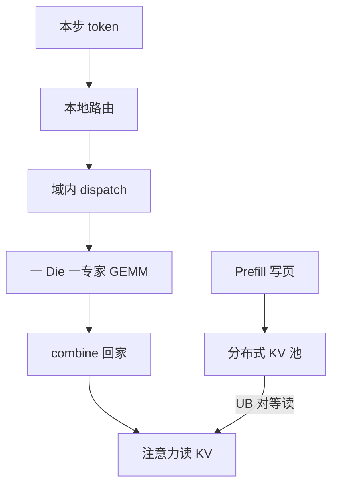

# 超节点内 MoE 专家并行与分布式 KV

    
超节点的带宽若够把 All-to-All 留在域内，专家就可以一 Die 一份地铺开，KV 也可以从「跟请求绑在某张卡上」变成池里可对等读取的页。

    <footer>—— 对照 CloudMatrix-Infer 在 CloudMatrix384 上对大规模专家并行（如 EP320）与分离式缓存池的设计</footer>

MoE 推理有两笔跨设备账单：token 去找专家的 dispatch/combine，以及注意力要读的历史 KV。[专家并行推理](/llm/infer-ep) 在普通以太网集群里常被 decode 的小 payload 打死，KV 则习惯跟 decode 卡绑死，调度变成「请求必须去有它缓存的那台」。CloudMatrix384 的 UB 域把这两笔账单收进同一超节点：论文中的大规模专家并行可以把 DeepSeek-R1 铺到 EP320——每张 910C 双 Die，一 Die 一个路由专家——同时把 KV 放进经 UB 均匀可达的分布式缓存池。本篇只写超节点**内部**这两件事如何咬合，跨超节点走 RoCE 见 [下一篇](/llm/cloudmatrix-roce-scaleout)。

## 问题

671B 级 MoE 的专家权重放不进单卡，decode 又每步只产几个 token。EP 度小，则每 rank 串行跑多个专家，延迟叠在同一 Die 上；EP 度大，则 All-to-All 的对端数膨胀，普通 RoCE 集群的启动延迟会盖过 grouped GEMM。另一侧，长上下文与多会话把 KV 容量推到单卡 HBM 之外。若 KV 必须本地，调度就退化成缓存亲和：prefill 写在哪，decode 就只能在哪，弹性与装箱都僵。

超节点要同时解这两件事，前提是域内任意 NPU 对之间的通信不再经过数据中心叶子。否则「超节点」只是把 8 卡箱堆密了，编程模型仍是跨机 EP 加本地 KV。

### 专家并行与 KV 不是同一条通信

Dispatch/combine 是消息语义：按路由表把 token 向量送到持有该专家的 Die，再把输出送回家，语义是置换不是求和。KV 访问更接近内存语义：注意力核要的是逻辑位置 $t$ 上的 $k_t,v_t$，它们可以住在本卡分页池，也可以住在 UB 另一端的 DRAM/HBM 页。把 KV 误做成每步 All-to-All 会把带宽打爆；把专家输出误做成远程 load 又会失去集合通信的流控。两者共享互连，不共享原语。

DeepSeek-R1 公开结构是每层 256 个路由专家加共享专家。EP320 一类配置用冗余专家做负载均衡，使「一 Die 一专家」在有热专家时仍可调度，而不是把 256 与 320 当成同一数字。

## 方法

域内 EP 的目标是让 decode 的 MoE 段不再在同一 rank 上串行堆专家。CloudMatrix-Infer 的做法是宽 EP：decode 实例可以把专家铺到数百 Die，每 Die 常驻一份专家权重与对应 grouped GEMM。路由仍在本地完成，dispatch/combine 走 UB。因为节点间带宽相对节点内衰减不到 3%，EP 组不必裁在 8 卡边界上——这正是 [机柜作为逻辑加速器](/llm/rack-as-accelerator) 在昇腾侧的对应物。

Prefill 与 decode 可以选不同 EP 度。论文里 prefill 实例示例为 16 张 910C（32 Die）上 EP32，每 rank 多个专家以喂饱算力；decode 追求低 TPOT 时把 EP 拉宽。两阶段之间的 KV 不跟某一张生成卡死绑，而是写入第三池：缓存子系统。P 侧写完页，D 侧按全局句柄读，带宽由 UB 提供均匀访问，从而调度不必先问「这块 KV 现在在哪张物理卡」。

### 分布式 KV 是池，不是副本附属物

方法上把缓存做成独立可伸缩的子系统：CPU DRAM 聚合进内存池，NPU 经 UB 直接访问，命中不必把整段 KV 先搬回「主 decode 卡」再算。这与 KV-centric 架构相反——后者调度围着块所在 GPU 转。对等池把局部性从正确性条件降级为性能提示：近端更快，远端仍正确。前缀复用、多轮对话、抢占后恢复，都可以按页句柄在池里完成，而不强制会话粘在同一 Pod。

均匀可达不等于零代价。页仍应尽量放在即将做 decode 的 Die 近处；池解决的是「能不能读」，不是「该不该每步远程扫整层」。带宽不等式与 [卸载](/llm/kv-offload) 相同，只是 $B_{\mathrm{io}}$ 换成 UB。

## 机制

宽 EP 能降 decode 延迟，是因为专家计算从「一卡串行 $n$ 个专家」变成「$n$ 个 Die 并行各一个」。通信体积仍随 token 数与隐藏维走，但超节点把这笔通信的屋顶线抬到接近节点内。负载不均时热专家 Die 仍决定迭代时间，所以需要冗余专家与 [负载均衡](/llm/moe-load-balance)；硬件带宽不能消除路由倾斜。

分布式 KV 能成立，是因为注意力只关心逻辑位置上的键值，不关心页在哪张卡的物理地址，这与 [PagedAttention](/llm/paged-attention) 一致。超节点多的是一层：页表的后端可以是本卡 HBM，也可以是池里另一节点的 DRAM。译址在运行时完成。PD 分离时，P 实例不必与 D 实例共享 PCIe 域，只要共享池的句柄空间；这比跨机拷贝整段连续 KV 更接近「一块加速器上的两个队列」，见 [PD 分离](/llm/pd-disaggregation)。

### 两套并行不要抢同一条队列

MoE All-to-All 与 KV 远程读若挤在同一无区分队列，decode 的 TPOT 会被大块 KV 预取戳出尖刺。工程上应对 UB 上的集合通信与内存语义流量做优先级或平面划分。专家权重常驻近端 HBM，KV 冷页才下沉 DRAM 池；不要把专家也「分布式」到每步远程取，那会把 MoE 变成带宽灾难。

## 边界与工程取舍

超节点内的宽 EP 有爆炸半径：数百 Die 构成一份 decode 副本，单 Die 故障或一条 UB 链路降级，影响的是整份 MoE，而不是少一个副本。维护窗口按超节点设计。EP320 是 DeepSeek-R1 在该硬件上的一种工作点，不是所有 MoE 的默认；Mixtral 8 专家通常复制比宽 EP 更划算。

KV 池不能替代量化与淘汰。池扩大的是容量，每 token 字节仍由 GQA/MLA/INT8 决定。跨超节点的会话迁移、多机房副本，必须落到 RoCE 平面，不能假装 UB 域无限大。评测要分开报：域内 EP 的 decode TPOT、池命中时的远程读延迟、以及故意打冷页时的下界，混在一个「tokens/s」里无法复现。

出处中的 6688 tokens/s/NPU prefill、1943 tokens/s/NPU decode（TPOT&lt;50 ms）是论文在 DeepSeek-R1、指定长度与量化下的测量，不是本博客的复现，也不应抄成机房承诺。

## 小结

- 超节点内用 UB 做宽 EP，使 decode 可以接近一 Die 一专家，避免单 rank 串行堆专家。
- KV 做成对等可达的分布式池，调度与数据局部性解耦；P/D/缓存三池独立伸缩。
- Dispatch/combine 走消息语义，KV 走内存语义，两者共享互连但不共用原语。
- 热专家倾斜、远程扫层、故障域变大，都是宽 EP + 池化的真实边界。
- 跨超节点仍走 Scale-Out，不能把 UB 故事写到机房之间。
- 出处：Zuo et al., *Serving Large Language Models on Huawei CloudMatrix384*, arXiv:2506.12708；并行语义对照 GShard / DeepSeek 开源部署。
