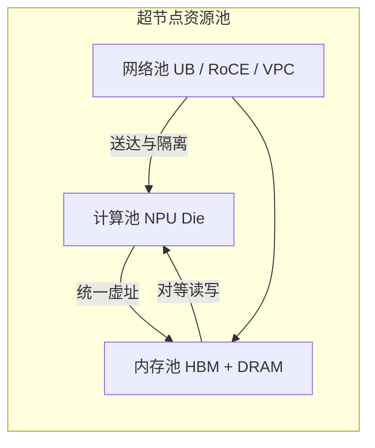

# 计算/内存/网络池化与统一编址

    
超节点要把计算、内存、网络从固定配比的服务器里拆出来，编进同一套可寻址的池；否则所谓「一块逻辑节点」只是机柜密度更高的捆绑销售。

    <footer>—— 对照 Zuo et al., Serving Large Language Models on Huawei CloudMatrix384, arXiv:2506.12708 对 peer-to-peer 池化与统一访问的表述</footer>

传统机柜按「一台服务器 = 若干 CPU + 若干加速器 + 本地 DRAM + 一块网卡」出厂。调度器只能整机分配，内存多算力闲、算力满内存空，都无法拆开重组。[CloudMatrix 384](/llm/cloudmatrix-384) 把这条捆绑拆掉：384 张昇腾 910C 与 192 颗鲲鹏经统一总线（UB）全互连，论文写明原则是「everything can be pooled, treated equally, and combined freely」。池化要落地，必须有**统一编址**：远端 HBM 与远端 DRAM 不是另一台机器上的文件，而是同一地址空间里可直接访问的对象。本篇写三池如何拆、地址如何编，不把未公开的单通道眼图抄成规格。

## 问题

固定配比的第一伤害是异构负载。Prefill 要算力，decode 要带宽与 KV 容量，缓存服务要 DRAM，预处理要 CPU。若每台机器的 NPU/CPU/内存比例写死，缓存节点也得带着闲置 Cube，decode 节点又可能 DRAM 不够。第二伤害是并行边界：TP 与 EP 若不能跨过服务器，专家铺不开，见 [Scale-Up 与 Scale-Out](/llm/scale-up-vs-scale-out)。第三伤害是控制面仍按主机中心：CPU 做中介拷贝，加速器之间不能对等读写，池化只存在于幻灯片。

统一编址要回答的不是「内存加总有多少 TB」，而是：一次 load/store 或一次 DMA 描述符，能否指名另一块 Die 上的缓冲，而不经过本机内核的两次拷贝。若答案是否定的，所谓内存池只是一套更快的对象存储 API。

### 三池不是三张独立的表

计算池是 NPU Die / AIC·AIV 的可调度份额；内存池是片上 HBM 与鲲鹏 DRAM 的可映射区间；网络池是 UB 链路、RoCE 口与 VPC 口的带宽与队列。三者必须可独立伸缩，又必须在编址上可互指：计算单元要能指向远端 KV 页，内存页要能被指定链路送达。拆开却不能互指，只是三个孤立集群。

论文把 CloudMatrix384 写成「紧耦合的大规模逻辑节点，计算与内存全局可寻址」。全局可寻址不等于单指针扫完所有 HBM：每张 910C 仍是 128 GB 封装、每 Die 64 GB。池化改的是访问语义与调度粒度，不是把 384 张卡融进一个 `cudaMalloc`。

## 方法

池化的控制面把物理资源收成可切分的份额。计算侧按 Die 或按卡组成实例，实例不必等于「整台 8 卡服务器」：拓扑感知调度可以切出内存型缓存组、算力型 prefill 组、带宽型 decode 组，见后文 [CloudMatrix-Infer](/llm/cloudmatrix-infer) 的 PDC 三池。内存侧把 CPU DRAM 与 NPU HBM 映射进同一套内存语义接口——昇腾栈里 MemFabric 一类组件的公开目标，就是跨节点、跨介质的全局虚拟地址，北向接近 `xcopy`，南向可走 Device UB 或 RoCE。网络侧把 UB 平面当作超节点内的默认数据面，RoCE 留给超节点之间，VPC 留给控制与存储，三平面不要混用同一套拥塞假设。

统一编址的最小契约是：调用方持有一个全局虚地址或等价句柄，底层完成 `{节点, 地址空间标识, 虚址}` 到物理页的翻译，权限在硬件或固件里校验。这样 KV 块、权重分片、专家缓冲都可以按页登记进池，而不先问「页现在住在哪台主机的 `/dev`」。

### 对等访问代替主机中介

方法上的关键一步是去掉 CPU 作为数据面中枢。UB 平面让 NPU 与 NPU、NPU 与远端 DRAM 做 peer-to-peer。论文给出的对照是：节点间相对节点内，单向带宽衰减不到 3%，512 字节读写的时延增加不到 1 µs 量级。对带宽型负载，这足以把「远端」当成「略慢的本地」，从而允许缓存池与计算池物理分离。若每次 KV 命中都要鲲鹏拷一次，池化会被 PCIe 或主机带宽钉死。

网络池化不是把所有流量倒进一张大网。UB 承担 Scale-Up 的内存语义与集合通信；RoCE 承担超节点间 Scale-Out；青田卡上的 VPC 口承担部署、监控与对象存储。编址可以统一，路径必须分流。

## 机制

统一编址能工作，靠的是互连把远程访问做成硬件路径，而不是软件 RPC。UB 提供内存语义（远端读写作完成）与消息语义（集合通信、发送接收）两条。内存语义让 KV 池看起来像一块很大的、有 NUMA 的地址空间：近端 HBM 最快，经 UB 读另一柜的 DRAM 次之，但两者都是 load/store 或 DMA，而不是「先发 RPC 再 memcpy」。消息语义让 TP/EP 的 All-to-All 仍走集合原语，不必把每一次 token dispatch 都假装成随意指针解引用。

翻译与隔离是机制的另一半。多租户若共享同一超节点，全局地址必须带地址空间标识，越权访问应在 UMMU 一类硬件上失败，而不是靠进程约定。计算池切分时，带宽与队列也要跟着切，否则「算力隔离了、网络还在抢」。这与后文 [多租户 GPU](/llm/multi-tenant-gpu) 的隔离层次衔接：超节点上的隔离单位可以细到 UB 分区，而不是整机。

### 调度单位从服务器变成份额

一旦三池可独立编址，调度器就不该再以「8 卡服务器」为原子。一份 DeepSeek 级 MoE 的 decode 副本可能要上百 Die 做宽 EP，一份缓存服务可能只要 DRAM 与少量 NPU 做命中；两者可以住在同一超节点的不同份额里。弹性则变成「改份额」而不是「加减整机」。代价是故障域变大：一块 UB 交换或一条光链路影响的是池的连通性，而不是少一台刀片。

## 边界与工程取舍

池化有屋顶线。统一编址不取消局部性：注意力核仍应优先打本地 HBM，远程页是容量扩展，不是免费带宽。论文表格里节点间读写已经很接近节点内，但那是互连规格下的微基准，不是任意 kernel 都能以该速率扫完全局池。KV 若每步远程扫整层，decode 会被传输钉住，这与 [KV 卸载](/llm/kv-offload) 的带宽不等式是同一件事，只是总线从 PCIe 换成了 UB。

不要把池化写成可以忽略拓扑。UB-Mesh 仍有柜内电直连与跨柜光模块的差别，见系列中灵衢各篇。软件若把 384 卡当成全同构交叉开关乱排 TP 组，仍可能踩到非均匀。也不要把 VPC 上的对象存储当成内存池：OBS/EVS 的延迟不是内存级的，EMS 一类弹性内存服务才是把 DRAM 池暴露给 KV 与检查点的那一层。

出处以 CloudMatrix384 论文为准：384×910C + 192 鲲鹏、UB 全互连、计算与内存全局可寻址。MemFabric / UMMU 的实现细节以昇腾公开文档为准，本篇不发明一种机柜级 `malloc` 的 ABI。

## 小结

- CloudMatrix 把计算、内存、网络从固定服务器配比里拆成可独立伸缩、可互指的三池。
- 统一编址让远端 HBM/DRAM 成为带翻译与权限的全局虚址，而不是主机中介的拷贝 API。
- UB 平面承载池内对等访问；RoCE 与 VPC 是另外两条平面，不能混用拥塞模型。
- 调度单位变成份额（Die、内存区间、链路），不再默认整机。
- 局部性仍在：远程页扩展容量，不替代近端带宽。
- 出处：Zuo et al., *Serving Large Language Models on Huawei CloudMatrix384*, arXiv:2506.12708。
