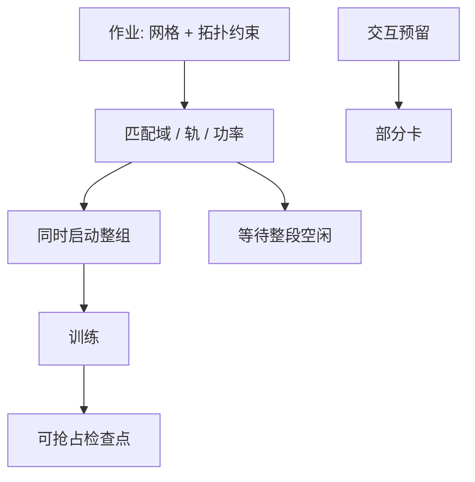

# 机群公平调度

训练作业要一整组同时到齐才开始，推理作业要低延迟插队。公平若按单卡秒计算，会系统性地饿死 gang，或让交互队列永远排在千卡作业后面。

<footer>—— 对照 Dominant Resource Fairness 与 Kubernetes / Slurm 上的 gang scheduling 实践</footer>

[上一课](/llm/gpu-failure-modes) 让作业会重启、会占着坏槽位。本课写多作业如何分集群。缺口是 LLM 训练的 **gang 约束**（TP / [NVLink](/llm/nvlink) 域必须同时分配）与公平指标（CPU、GPU、功率、轨）不是一维的。集合通信课序在此收束集群运行；下一单元才离开 NVIDIA 主线看其他加速器。

## 问题

经典公平：每用户一份 GPU 时间。训练作业要 $N$ 卡同时、且最好在同一轨 / 同一超节点，否则 [带宽模型](/llm/collective-bandwidth-model) 作废。若调度器先填满碎片空位，大作业永远凑不齐，小作业享受「公平」，集群 FLOPS 碎片化。反过来，若永远让最大作业占满超节点，研究队列与在线推理被饿死。

DRF（Ghodsi 等）在多维资源上按主导份额切蛋糕，仍不够：还要拓扑（同轨、同域）、时间（抢占检查点）、以及功率预算。问题是调度目标函数必须包含 **拓扑可行的 gang**，而不是先分配再抱怨 NCCL 慢。

Kubernetes 默认不理解 NVLink 域。需要设备插件、拓扑标签、与 gang 插件（或 Volcano / 专用训练调度）。Slurm 有拓扑与 gang 传统，但要把 GPU 轨写成节点特征。名字不重要，约束要在。

## 方法

资源模型至少包括：GPU 型号、NVLink 域 id、rail id、功率余量、是否液冷维护窗。训练作业提交时声明并行网格，调度器要么整组放进兼容域，要么拒绝，而不是拆开。推理 / 交互队列用预留或抢占：抢占必须落在检查点边界，否则公平的代价是几天的 step。

配额按团队的主导资源（通常是 GPU·小时，但高密度柜要用 kW·小时校正，避免有人占满电）。故障重启计入该团队配额，否则坏作业靠重试侵占集群——这是故障课与公平的交接。

多租户轨隔离：尽量不要让两个大 DP 作业共享同一轨的剩余带宽，除非有 QoS。共享会让双方的 $\beta$ 模型同时失效，表现为「公平的慢」。

## 机制

Gang 启动的尾延迟来自最慢那张卡的准备（加载权重、数据预热）。弹性缩放中途改 $N$ 要换进程组，集体拓扑重建，$\alpha$ 会抖一段时间。公平策略若频繁抢占大作业，集群会把时间花在检查点与重启上，有效公平为负。

DRF 的主导份额在「GPU 很满、功率已尽」时会把功率当主导维，拒绝再塞训练作业——这是正确的，尽管 GPU 计数还显示空闲。调度 UI 必须暴露这一维，否则用户以为系统空转。

抢占推理来填满训练间隙，会伤害尾延迟 SLA。反过来用推理填训练碎片，要保证碎片落在域外或独立副本，不要插入 TP 组。

## 边界与工程取舍

不要在以太网碎片上拼 64 路 TP 还称为「已调度」。不要把公平写成纯等待时间而不计拓扑质量。不要让无限重试的崩溃作业绕过配额。集合通信与集群运行到此结束；下一课从 TPU 开始，对照「不是 NCCL + NVLink」的加速器如何做集体与调度。

## 小结

- 训练是拓扑约束下的 gang；按单卡填充会碎片化或饿死大作业。
- 公平是多维的：GPU、功率、轨、域，可用 DRF 思想加拓扑匹配。
- 抢占必须落在检查点；故障重试计入配额。
- 空闲 GPU 计数在功率或冷却见顶时是假象。
- 出处：Ghodsi 等 DRF；K8s / Slurm 上的 gang 与拓扑调度实践。
