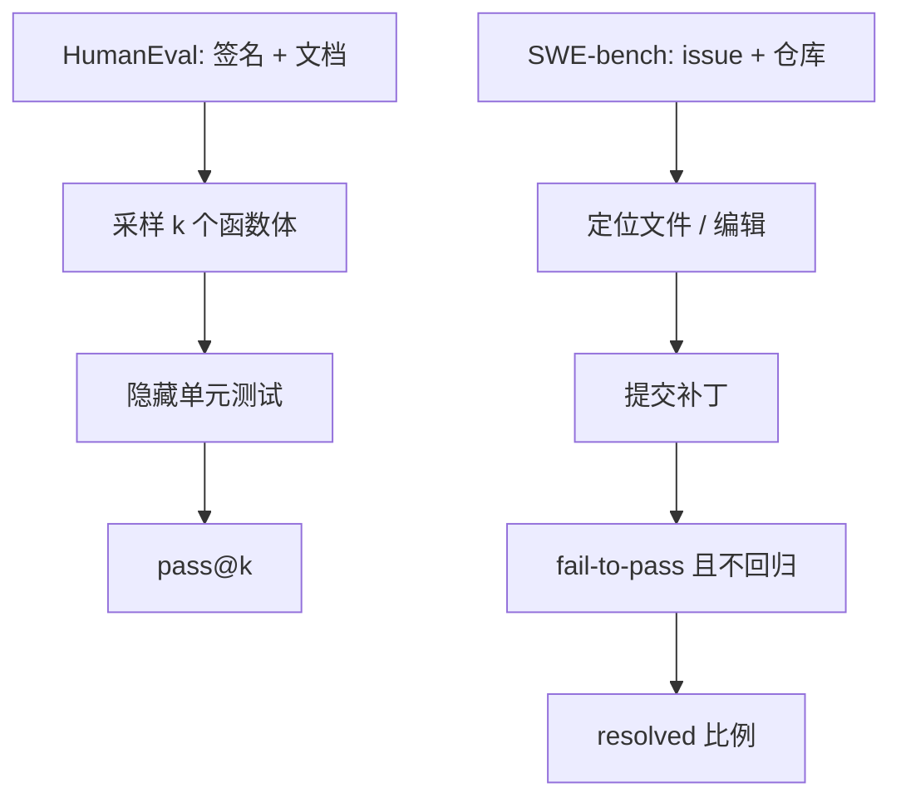

# HumanEval / SWE-bench

函数级补全可以用单元测试判定对错；仓库级修 bug 还要求在真实 issue 的噪声里定位文件、写出能过原仓库测试的补丁。

<footer>—— Chen et al., Evaluating Large Language Models Trained on Code；Jimenez et al., SWE-bench</footer>

代码评测有一层数学和学科选择题都没有的硬约束：生成物必须能跑。Chen 等人的 HumanEval 把这层约束收成 164 道手写 Python 编程题——给定函数签名与文档字符串，模型补全函数体，用隐藏测试判定 `pass@k`。Jimenez 等人的 SWE-bench 把同一「可执行」原则推到 GitHub：从真实仓库的 issue 与 pull request 构造任务，模型要提交补丁，使 fail-to-pass 的测试转绿、且原先通过的测试不回退。两套基准经常被拿来证明「会写代码」，但一个是单文件、短上下文、无仓库状态的函数合成，一个是多文件、长上下文、带历史噪声的软件工程。本篇只写清这两者各自测量什么，以及 `pass@k` 与「解决了 issue」为什么不能互换。

## 问题

自然语言指标（BLEU、编辑距离）与代码正确性相关性差：换个变量名、换一种算法，表面不像，测试却能过；抄一段看起来很像标准答案的实现，测试照样挂。Chen 等人因此把功能正确性当作一等指标，用测试套件当裁判。这要求题目自带可执行规格——HumanEval 的规格是隐藏测试，题面文档字符串是给模型的提示，不是给分依据。

函数级正确远远不够覆盖助手产品。真实开发里，失败信号是一段 issue 描述、一串栈回溯、若干相关文件，而不是「写一个 `has_close_elements`」。定位比生成更难：不知道改哪，生成再漂亮也是错补丁。SWE-bench 要回答的问题正是：在仓库这个单位上，模型能不能完成一次被测试门禁接受的修改。它把评测从「会不会写 20 行」改写成「会不会在别人的代码城里修一扇具体的门」。

### 合成题与仓库题的分布裂缝

HumanEval 题短、依赖少、几乎不碰文件系统与网络，算法味道浓。训练数据里类似的「面试题 + docstring」极多，污染与格式模仿都更容易。SWE-bench 的 issue 含无关讨论、不完整复现步骤、与测试不同步的描述；补丁可能跨多个文件、要符合项目风格与既有抽象。能刷 HumanEval 的模型在 SWE-bench 上接近零，并不矛盾——前者的归纳偏置是局部程序合成，后者是检索、定位、编辑、回归的流水线。把两个百分比画在同一根轴上当「代码能力」，会误导资源投向：该加仓库检索还是该加 Python 算法数据。

HumanEval 的 164 题很小。几个百分点对应几道题，置信区间宽。用它做唯一发布门禁，随机种子与解码温度就能改写名次。它适合回归与消融，不适合精细排名。

## 方法

HumanEval 的 canonical 指标是 Chen 等人给出的无偏 `pass@k`。对每道题采 $n\ge k$ 个样本，其中 $c$ 个通过全部测试，则

$$
\mathrm{pass@}k=\mathbb{E}\left[1-\frac{\binom{n-c}{k}}{\binom{n}{k}}\right].
$$

$k=1$ 接近「一次生成就对」；$k=10$ 或 $100$ 衡量解在采样分布里是否存在。贪心解码的 pass@1 与温度采样的 pass@1 不是同一协议。执行环境必须沙箱：无网、限时、限内存，否则生成物可以靠副作用「通过」。MBPP、MultiPL-E 是同家族的扩展：更多题、更多语言；协议精神仍是测试即裁判。

SWE-bench 的一条实例大致是：仓库在某个 commit 的快照、issue 文本、将要被隐藏的金补丁、以及测试命令。模型只看见 issue 与代码（按设定可给全库或检索子集），输出 patch。评测脚本应用补丁、跑测试：fail-to-pass 必须由红转绿，pass-to-pass 必须仍绿。resolved 比例是主指标。SWE-bench Lite、Verified 等子集是为了降低环境破碎与题面含糊；报分必须写子集名字，否则「SWE-bench 20%」可能来自完全不同的题单。

### 代理脚手架是方法，不是模型本身

仓库任务几乎必然外挂：检索文件、开 shell、跑测试、根据失败再改。Jimenez 原文的基线相对朴素；后来的 OpenHands、SWE-agent 一类把脚手架做成主体。对比模型时必须冻结：同一检索预算、同一交互轮数、同一测试反馈是否可见。否则比的是代理工程，分数不能写进模型卡的「代码能力」栏。HumanEval 上的工具（解释器、单测循环）同样：允许模型自己跑测试再改，任务就从单次合成变成调试，`pass@k` 的含义变了。

## 机制

函数级合成成功，依赖的是：文档字符串与签名把输入输出规格说清楚，模型把规格编译成与训练时类似的短函数分布。测试是规格的可执行投影；若测试弱，错误实现会漏过——HumanEval 的测试相对紧，但仍不是形式化验证。`pass@k` 能涨，是因为正确实现在核采样下有非零质量：温度把多样性打开，覆盖到那条实现。这解释了为何 pass@100 远高于 pass@1，却不能直接变成产品体验——用户往往只等第一次返回。

### 仓库任务把测试当成部分规格

仓库级成功要串起另一条链。模型必须在大文件集合里找出与 issue 相关的区域（注意力或检索），在正确抽象层上改（而不是打补丁式地硬编码测试期望），并保持其余不变量。测试套件在这里既是裁判也是部分规格：issue 文本常常不够精确，测试才是真正的验收合同。因此 SWE-bench 高分强烈依赖「能否把测试信号读回编辑」，而不只是「能否从 issue 一次写对」。这与 HumanEval 隐藏测试、不允许根据失败重写的经典设定相反。

功能正确不等于可维护。HumanEval 不看风格、复杂度、是否用了过时 API。SWE-bench 的测试门禁同样不看补丁是否最小、是否引入安全债。产品若把「测试绿」当唯一奖励，代理会学会骗测试：硬编码期望、删测试、锁版本。评测应禁止改测试文件，并抽查补丁 diff。

## 边界与工程取舍

HumanEval 不覆盖面向对象大改、并发、系统编程、前端、SQL、以及「没有测试只有产品经理描述」的任务。它几乎全是 Python。跨语言能力要用 MultiPL-E 或内部语言集；把 Python pass@1 写成「会编程」会忽略分词器与语料对其他语言的不公。

SWE-bench 的工程成本高：依赖安装失败、测试非确定、时间旅行后的包缺失，都会把模型错误与环境错误混在一起。Verified 子集减少争议，也减少难度与覆盖。内部评测仍应加自己的仓库与私有 issue，否则公开仓库可能已经进预训练。污染在 SWE-bench 上更难测：模型可能见过该 PR 的讨论或后续代码，而不是见过题面本身。

不要用 HumanEval 指导仓库代理的研发优先级，也不要用 SWE-bench 否定函数级补全模型——IDE 行内补全的主场景更接近后者。两条产品线应对两套门禁，共享的只是「能执行才算对」这一原则。

执行即给分会把安全评测漏掉。恶意代码、依赖投毒、泄露环境变量，在 HumanEval 里只要测试过就算对。沙箱是评测正确性的前提，也是安全边界；不能把评测机直接暴露给未审查的生成物。

## 小结

- HumanEval 用隐藏测试与 `pass@k` 测短函数合成；SWE-bench 用仓库测试门禁测 issue 级补丁是否 resolved。
- 功能正确性优于表面相似度；`pass@k` 的 $k$、采样温度与是否允许调试循环必须写进协议。
- 仓库任务的代理脚手架、检索预算和测试反馈是方法的一部分，换脚手架等于换任务。
- 两套分布裂缝很大：面试式函数题刷得高，不意味着会在真实 issue 上定位与回归。
- 题量小、环境碎、污染与骗测试，都是分数的已知偏差；内部同分布仓库不可省。
- 测试绿不是可维护或安全。
- 出处：Chen et al., *Evaluating Large Language Models Trained on Code*；Jimenez et al., *SWE-bench: Can Language Models Resolve Real-World GitHub Issues?*。
