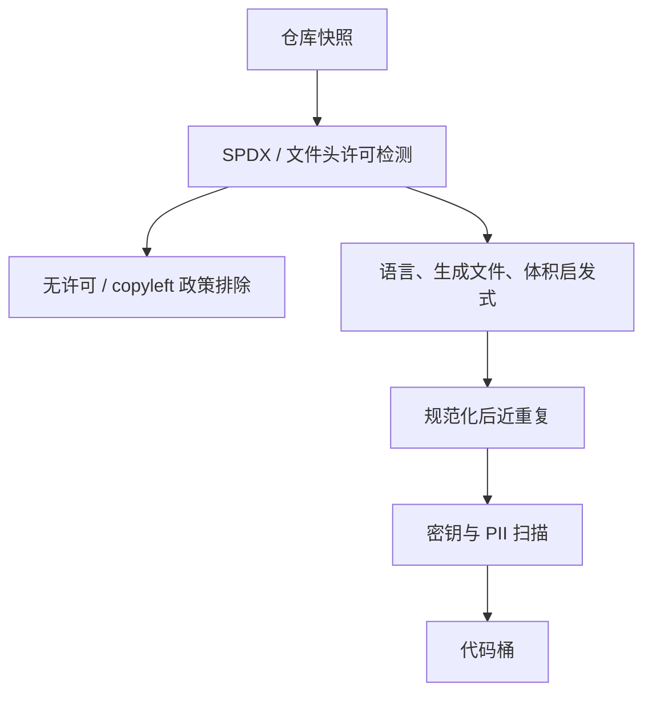

# 代码许可与质量门

    
能编译的文件不一定能进训练集：许可决定你有没有权用，质量门决定它值不值得占 token；两道门缺一，要么是法律风险，要么是海量克隆与生成文件。

    <footer>—— 综合 BigCode The Stack 的许可过滤与仓库质量实践</footer>

代码桶不是 GitHub 解压。仓库里有许可证冲突的 fork、自动生成的 protobuf、压缩后的 min.js、密钥、以及复制了上百遍的教程片段。Soldaini 的 Dolma 引入 The Stack 一类来源时，默认已经过许可与近重复处理；把网页里的代码块未经许可扫描就并进混合物，等于绕开这套治理。许可门回答「能不能用」，质量门回答「该不该用」。二者都不可被 DCLM 网页分类器替代：fastText 看不出 GPL 与 MIT 的差别，也看不出文件是否由机器生成。

## 问题

源代码的版权默认存在。宽松许可（MIT、Apache-2.0、BSD）通常允许再分发与训练用途的争议较小；强 copyleft（GPL、AGPL）会把衍生义务绑到分发物上，许多商业与开放权重模型选择直接排除。无许可文件在 GitHub 上极多，法律默认不是「公共领域」。The Stack 的公开立场是：只保留检测为宽松许可的文件，并提供退出机制。这不是唯一合法策略，但是可复现的策略。没有 SPDX 检测就把仓库当网页，是把风险从数据卡片里抹掉，不是风险不存在。

质量问题同样尖锐。fork 使流行库在 token 计数上爆炸；IDE 模板、lockfile、数据 JSON、编译产物会污染句法监督。网页启发式（句子终结标点、维基困惑度）会把合法代码当垃圾，或把 README 当高质量英语留下而丢掉 `.c`。代码必须用代码自己的特征：语言检测（enry）、生成文件模式、字母数字比例、平均行长、是否含许可证头、星标与是否是镜像——星标是弱代理，不能单独当质量。

### 许可检测是启发式，不是法律意见

工具（go-license-detector、ScanCode、REUSE）读 LICENSE 文件、文件头与 SPDX 标识，给出最可能的 SPDX 标识符。它们会错：多许可仓库、子目录例外、文档与代码不同许可、供应商目录拷贝了第三方源。门控只能做到「工具认为宽松则过」，并记录检测置信度。文件级与仓库级不一致时，应从严：仓库是 GPL、单文件声明 MIT，仍可能是整体 copyleft 约束。训练配方应写明粒度。The Stack 以文件为主并辅以仓库许可，是工程折中，不是法院判决。

密钥与个人数据是第三道门。代码里出现 AWS 密钥、私钥、邮箱，过了 MIT 也不能留。这与 PII 红acted 是同一类治理，必须在许可通过之后仍跑。质量分类器不会专门找密钥；密钥扫描是独立规则表。

## 方法

推荐顺序：克隆或使用 Software Heritage / GHArchive 一类快照 → 仓库与文件级许可检测 → 丢掉无许可与非宽松（按你的风险政策）→ 语言识别与生成文件黑名单 → 启发式质量（大小、行长、字母数字比、重复行）→ 仓库内与全局近重复（MinHash on 规范化 token）→ 密钥扫描。Dolma 的代码桶应被视为「已经过类似管道的输入」，而不是再对原始 Git 做一遍网页规则。

质量启发式要按语言分档。Python 与 Verilog 的行长、注释率、二进制混入率不同。压缩 JS、vendor、`node_modules`、`package-lock` 默认排除。测试数据里的巨大 JSON 夹具应设体积上限。近重复：代码 Jaccard 对重命名不稳，规范化（去注释、标识符匿名化再哈希）能抓 clone；过强匿名化会把所有链表实现收成一簇。阈值按语言扫探针（补全、HumanEval 一类），不要用网页 MinHash 的 $k$。

### 网页中的代码块走另一条合法路径

Crawl 里的 Stack Overflow 片段、博客里的 gist、文档站的示例，往往没有 SPDX。许可依赖站点条款与作者声明。不能因为 The Stack 过了宽松门，就认为网页代码块同样干净。做法是：网页代码要么不进代码桶、只当自然语言上下文，要么只收明确 CC-BY / MIT 的站点，并与 The Stack 做跨源去重，以免同一函数留下「仓库干净版」和「博客缺许可证版」两份。Penedo FineWeb 不负责这件事；这是混合物治理，是 Dolma 要把来源分桶的原因。

星标过滤会伤害新语言与新库，也会放过古老但高星的废弃项目。可用星标作弱先验，但最终质量应看：能否被解析器接受、是否生成文件、是否重复。解析门与数学的 KaTeX 门同构——合法句法是训练代码模型的支撑约束。

## 机制

许可门改变的是可发布支撑：某些字符串永远不应进入 $p_{\mathrm{train}}$，与困惑度无关。质量门改变频率与句法合法性。生成文件（protobuf、minified）对 NTP 极容易，损失很低，会占用梯度；去掉它们等于去掉虚假简单样本。近重复去掉 fork 上采样，使「被 fork 多次」不再等于「更重要的 API」。这与 Xie 式配比一致：意外上采样应先关掉，再谈代码占混合物的百分之几。

解析门（tree-sitter 能否产出树）把支撑限制在近似合法程序。与数学校对一样：可解析不等于可运行，更不等于无漏洞。预训练目标是句法与惯用法，不是证明安全。过严的「必须编译」会丢掉头文件、片段、配置 DSL，而这些对补全有用。应按文件角色分：完整项目文件走解析，文档中的片段走更宽的规则。

### 与语义去重的边界

Abbas 的 SemDeDup 用自然语言或 CLIP 嵌入，对代码会把不同算法收成「都像代码」的一团。代码语义去重应基于规范化 AST 或专用代码嵌入，并与许可簇解耦——许可不同的近重复仍可能都要丢掉一份，但保留哪一份由许可政策决定，不是由余弦决定。跨语言去重不要把 Python 与伪代码讲解当平行文件乱删。

## 边界与工程取舍

许可政策会过时。SPDX 列表、GitHub 默认许可、各国判例都在变。配方应冻结检测器版本，并提供退出与再过滤路径——The Stack 的 opt-out 是治理的一部分，不是客服。宽松许可仍可能要求署名；训练是否满足署名，法律与社区有争议，数据卡片至少应列出许可直方图。

质量门对低资源编程语言过严会导致该语言从桶里消失。应设语言下限，而不是全球同一行长阈值。网页质量头（Li DCLM、维基 KenLM）禁止直接打分代码文件。二进制与数据文件不要靠「字母数字比例」误收成代码。安全扫描假阳性会删掉示例密钥（全零、明显 fake）；可用熵与已知测试密钥白名单，但假阴性的代价更高，应偏严。

「公开在 GitHub 上」不是许可。爬虫遵守 robots 与 API 条款，与 SPDX 是两层约束。Dolma 式开放配方把来源与规则写出来，是为了让这两层可审计；内部偷偷混入无许可 fork，会把开放模型的数据叙事作废。

## 小结

- 代码桶先过许可检测，再过生成文件 / 解析 / 近重复 / 密钥门。
- 宽松 SPDX 是可复现策略，不是法律意见；粒度从严，记录置信度。
- 网页代码块不能借用 The Stack 的许可结论，且要跨源去重。
- 勿用维基困惑度或 DCLM 网页头过滤代码。
- 去掉 fork 与生成文件，是为了关掉意外上采样，再谈配比。
- 解析门限制合法句法，不证明可运行或安全。
- 出处：BigCode The Stack 的许可与质量实践；混合物治理见 Soldaini Dolma；勿与 Penedo FineWeb / Li DCLM 的网页过滤混用。
