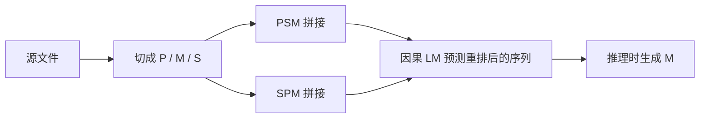

# Code Llama

    
我们发布 Code Llama：基于 Llama 2 的代码基础模型，提供开源模型中的强性能、填充能力、长输入上下文，以及对编程任务的零样本指令跟随。

    <footer>—— Rozière 等，Code Llama: Open Foundation Models for Code，arXiv:2308.12950</footer>

通用语言模型会写代码，但 IDE 要的不是「从文件头续到文件尾」。光标在函数中间，左边是前缀、右边是已经写好的测试或类型标注，模型必须填这段空洞。Rozière 等人 2023 年的 Code Llama 从 Llama 2 出发，在代码语料上继续训练，并把**自回归续写**与 **fill-in-the-middle（FIM）填充**做成同一套权重上的多任务。尺寸覆盖 7B、13B、34B、70B；变体分成通用 Code Llama、Python 专化、Instruct。本篇写续写与填充如何共用因果解码器，以及长上下文微调如何把 Llama 2 的 4K 拉到可外推的十万级。

## 问题

标准 LM 估计 $p(x_t\mid x_{<t})$。代码补全若只喂光标左侧，右侧的约束（闭括号、后置类型、已存在的调用点）进不了条件。填充要把文档切成前缀 $P$、中段 $M$、后缀 $S$，训练模型在看见 $P$ 与 $S$ 之后生成 $M$。Bavarian 等人（2022）表明：很高比例的 FIM 目标可以几乎不伤害从左到右的损失。Code Llama 要在 Llama 2 的因果 Transformer 上验证这件事，并决定哪些尺寸训练填充、哪些只做续写。

仓库级补全还要求上下文远长于 Llama 2 的 4096。若把整个预训练改成 16K，成本按注意力二次涨。需要一档**专门的长上下文微调（LCFT）**：只在后期看长序列，并改 RoPE 频率，使推理能外推到约 100K。

### 续写、填充、指令是三条产品线

续写：注释或函数签名在左，右边生成实现。填充：编辑器中间插入。指令：自然语言「写一个解析器」。Python 专化则在通用代码模型上再灌 Python。不是每个检查点三条全开——论文写明 **34B 通用模型未训填充**；7B、13B、70B 的 Code Llama 与 Instruct 支持按周围内容填充。选错检查点，IDE 中间补全会退化成忽略后缀的续写。

Instruct 权重不是为 FIM 评测准备的。复现 HumanEval infilling 要用预训练填充模型，并用贪心解码；单行任务在第一个换行切断。官方曾明确：不要拿 Instruct 去对填充表。

## 方法

### 从 Llama 2 继续训，而不是从零

7B/13B/34B 在 Llama 2 上再训约 **500B** token，70B 约 **1T**。数据以近去重的公开代码为主，约 8% 来自与代码相关的自然语言（问答里的片段），并混入少量通自然语言以保住 MBPP 一类需要读题面的基准。分词仍是 Llama 2 的 BPE。消融表明：从 Llama 2 初始化优于从零训代码模型，语言先验对注释与题面有用。

Python 变体再追加约 100B、Python 约占 75% 的数据。Instruct（7/13/34B）约 5B token，含自指令：用模型生成题解与单测，再过滤。70B 的 Instruct 从 Python 70B 接着训，因为在 MultiPL-E 含 Python 的均值上 Python 变体更好。

### 因果掩码式填充

训练时以 0.9 的概率、在未被切到多个上下文的文档上，按字符均匀抽样切出 $P,M,S$。一半做成 **PSM**（prefix–suffix–middle），一半做成兼容的 **SPM**（suffix–prefix–middle）。词表加四个特殊符号，标记前缀、中段、后缀与填充结束。为减小与自回归的分布差，编码中段和后缀时抑制 SentencePiece 的隐式前导空格。SPM 下把前缀与中段拼起来再编码，避免子词被切碎。

推理时编辑器把光标左右填进对应槽，模型自回归生成中段，遇结束符或任务规定的截断（单行遇换行）停止。格式必须与训练一致：PSM 与 SPM 在随机跨度任务上并不对称，SPM 在字符级随机挖空上更差，论文将其部分归因为未做 token healing。

### 长上下文：改基数而不是线性插值

LCFT 把序列从 4096 提到 **16384**，并把 RoPE 基数从 $10^4$ 提到 $10^6$，而不是 Chen 等人那样把位置除以 $s$。论文认为提高 $\theta$ 更利于更长序列、并减轻短距注意力偏见。微调步数默认约 1 万（34B 约 1.1 万，7B 约 3 千，因下游不稳而缩短）。结果是：在 16K 训练长度内有效，并在最长约 **100K** 的输入上表现稳定——这是外推，不是 100K 预训练。

70B 只对基础 Code Llama 做了 LCFT；更晚发布的 70B 用 FIM，正是因为社区向 34B 要过中间填充。同一家族里，「会不会填」以论文表格为准，不能按尺寸单调外推。

## 机制

填充能成立，是因为因果 Transformer 不在乎物理顺序，只在乎条件前缀里有没有 $P$ 和 $S$。把 $M$ 挪到末尾，损失仍是 next-token，梯度设备与续写相同。90% FIM 时，从左到右的 HumanEval/MBPP 只掉约 0.6–1.1 个百分点（7B/13B、500B token 消融），换来 IDE 中间补全。这是 Bavarian 等人结论在代码、十亿参数级上的复现。

续写与填充共享表示，也会共享失败：模型仍会编造不存在的 API。后缀若与前缀矛盾，填充可能选「看起来局部合法」的 $M$ 而破坏全局不变量——评测用原题测试用例，测的是可运行，不是风格一致。Python 专化提高 HumanEval，是把概率质量集中到一种语言，换的是其他语言上的容量；通用 Code Llama 在 MultiPL-E 上更均衡。

LCFT 改 $\theta$ 属于 [NTK 式](/llm/ntk-aware-interpolation) 提高基数、而不是位置插值。16K 微调加上 100K 外推，说明代码的局部语法对高频仍敏感，长程括号匹配则更多靠已经放慢的低频与注意力。超过训练长度后没有「完美针检索」承诺，论文给的是困惑度与长文件补全的稳定，不是 100K 仓库推理保证。

## 边界与工程取舍

34B 无 FIM，不能当中间补全主力。Instruct 会在对话模板里加入无关的「下面是解释」，把填充槽位弄脏。许可与训练数据来自公开代码，二次开发要读 Llama 2 / Code Llama 许可，不能假设可以闭源商用任意规模。

自指令生成的单测会把模型锁进自己会写的简单题，APPS 竞赛难度仍低。100K 外推在 KV 上与任何 16K 模型一样贵。填充的停止条件是产品 bug 的高发区：多行任务只靠结束符，单行靠换行，随机跨度更难——实现必须按任务选截断，不能只设 `max_new_tokens`。

Unnatural Code Llama 等后续变体用了更多指令数据，分数更高，但不在最初开源的三条产品线上。写系统时以你实际下载的检查点能力矩阵为准。

## 小结

- Code Llama 从 Llama 2 继续训代码：7/13/34B 约 500B token，70B 约 1T；并分出 Python 与 Instruct。
- 续写是标准因果 LM；填充用 PSM/SPM 重排，使中段在后缀条件下降序生成。
- 7B、13B、70B 通用与 Instruct 支持填充；34B 通用未训 FIM。
- LCFT 在 16K 上把 RoPE 基数提到 $10^6$，推理可外推到约 100K。
- 出处：Rozière 等，*Code Llama: Open Foundation Models for Code*，arXiv:2308.12950（2023）。FIM 方法对照 Bavarian 等 *Efficient Training of Language Models to Fill in the Middle*，arXiv:2207.14255。
