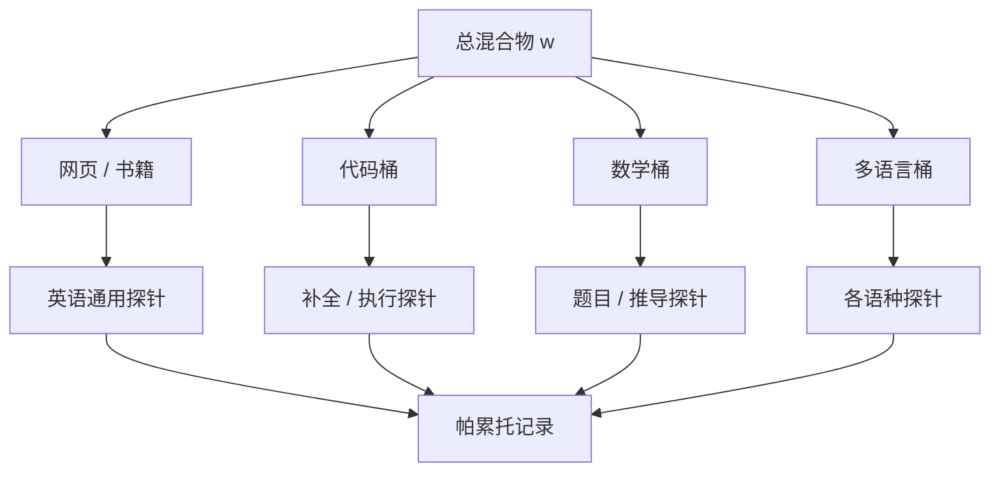

# 代码、数学、多语言配比

通用网页提供覆盖面；代码、数学与非英语文本必须在混合物里拥有不可被网页吞掉的份额，否则对应能力不会「顺便」出现。

<footer>—— 综合 Gopher、Llama 的来源配比与 Xie 等人的配比优化视角</footer>

领域配比的下一层分辨率，是把「非普通网页」单独记账。代码有严格句法与长程符号约束，数学有符号密度与证明结构，多语言有脚本、词序与资源不均衡。三者若只作为 Common Crawl 里的偶然子集存在，过滤与去重之后份额往往偏低：代码仓会被启发式当成非自然语言，公式在 HTML 抽取中破碎，低资源语言被英语分类器压分。Gopher 的 MassiveText 与 Llama 的公开混合物都把代码（以及部分非网页源）写成独立桶；后续模型进一步加数学与多语言。本篇写这三桶为什么不能并进「网页高质量」，以及配比时有哪些独特陷阱。

## 问题

网页桶的最优权重，是按英语通顺文档的下游定义的。代码的验证信号是能否补全与通过测试，数学是推导与计算，多语言是该语种的理解与生成。用英语阅读理解去调总配比，会系统性地少采样这三桶。Xie 等人的 DoReMi 若领域标签里没有代码/数学/语言轴，DRO 也不会保护它们。

数据形态也不同。代码重复极高（fork、样板、许可证），MinHash 阈值若与网页共用，会要么删光流行库、要么留下海量克隆。数学网页抽取差，需要专门源（教材、论文 LaTeX、题库）。多语言网页的语言识别有误，代码注释与字符串会污染语种桶。把三桶当成网页过滤的边角料，等于没有配比。

### 能力不能从共现里白嫖

代码与自然语言在网页里共现（教程、问答），模型能学到一些 API 名字，但学不到仓库级依赖与缩进结构。数学口语化描述同样不能替代符号序列。多语言对齐句对有助于迁移，但不能替代该语种的足量单语 token。配比要保证的是「足够的原生序列」，不是「足够的提到该主题的英语网页」。Llama 早期以英语为中心仍能做简单多语言，常被误读成「不必配比」。那是高资源语言在 CC 里本就有长尾，加上 tokenizer 碰巧覆盖。对低资源语种与竞赛级数学，长尾不够，必须显式加桶。

## 方法

工程上先物理分桶，再定 $w$。代码桶来自许可清晰的仓库与网页中的代码块（需单独抽取）。数学桶来自论文、教材、题库与过滤后的数学网页，尽量保留 LaTeX 而非渲染后的乱码。多语言桶按语言识别切分，高资源与低资源不要共用一个权重——后者 token 少，应有下限而不是按自然频率。Gopher 与 Llama 都把代码写成可见比例；多语言在不同代际上从「顺便覆盖」走到「按语种配额」。

配比可以用人工网格：固定总 token，扫代码 5%–20%、数学 1%–10%、非英语 10%–50%，看探针帕累托。也可以把这三桶纳入 DoReMi 的领域集合，但要给低资源语种设权重下限，以免 DRO 为了平均损失把它们推到零。质量过滤必须分头：代码用语法/编译启发式或仓库星级，不要用英语维基分类器；数学用符号密度与公式检测；多语言用该语种的参照文档。

### 去重与许可

代码去重应按仓库或文件指纹，并尊重许可证：不能训练的许可应在进桶前剔除，这与网页版权问题同构但工具不同。重复的第三方库会让模型记住许可证全文和样板函数，对「写新代码」帮助有限。数学题库要防评测泄漏：竞赛题一旦进预训练，benchmark 作废。多语言去重不要用英语单词 shingle；字符 $k$-gram 或该语种分词后再 MinHash。Lee 等人的教训在这里同样适用：重复抬高记忆，对代码意味着背答案，对多语言意味着高估该语种泛化。

代码与数学的「高质量」往往更短、更密。按文档数配比会低估它们；必须按 token。反之，把注释极少的压缩代码堆满混合物，自然语言能力会掉。代码桶内部也要有自然语言注释与文档字符串的比例，而不是纯符号。

## 机制

三桶改变的是符号系统的先验。代码提高括号、缩进、标识符一致性的梯度；数学提高数字、运算符与长公式的条件概率；多语言提高非英语脚本在 tokenizer 与表示里的地位。若词表是英语 BPE 主导，多语言与代码会被切得很碎，同样的 token 预算换到的「语言内容」更少——配比与词表耦合，下一篇压缩率会展开。提高多语言 $w$ 而不改词表，部分预算会浪费在过长序列上。

与通用网页的负迁移真实存在：过多代码会让模型在普通散文里输出反引号和函数签名；过多低质量多语言会污染英语句法。这是帕累托，不是越多专项越好。Gopher、Llama 的公开数字应看成某一产品点，而不是常数定律。Xie 等人的方法可以在这三轴上重跑，但探针必须换成专项任务，否则 DRO 仍由英语网页损失主导。

### 课程与后期加料

常见做法是主体训练以网页为主，后期上调代码与数学，或在退火阶段混入题解。这对「先学语言再学形式系统」的直觉友好，但会让前期 token 与后期 token 不可互换，缩放曲线更难解释。若采用课程，应报告各阶段消费量。对多语言，后期只加平行句对，往往不够改写生成分布，需要贯穿全程的单语配额。

## 边界与工程取舍

执行反馈与形式验证不在预训练配比范围内：那是后期强化学习或工具调用。预训练只能提高句法与模式的先验。不要指望把数学网页加到 20% 就出现可靠证明。同理，多语言配额不能替代该语种的指令数据。

合成题解与翻译可以补数学与多语言，但风险与合成预训练篇相同：分布变窄、错误被放大。应用人工或高阈值过滤的真题、真仓库打底，合成只作填充。Penedo 式网页过滤对数学公式页往往过严，需要白名单域或专用抽取，不能把 FineWeb 阈值套到 arXiv 镜像上。

语言识别把代码页标成英语，是多语言桶被污染的主要方式。应按文件扩展名与 HTML 代码标签先切代码，剩余再跑语种。否则「英语桶」里塞满 GitHub 镜像，「代码桶」反而偏空，配比数字全部失真。

评测必须分语种、分语言版本的数学题、分编程语言。一条混合 benchmark 会把英语代码优势当成通用能力。泄漏审计对竞赛数学与著名仓库尤其关键。Grok 与 Llama 类生产模型的对外评测数字，若未说明这三桶的份额与去污，不能直接用来反推你该用的 $w$。

## 小结

- 代码、数学、多语言应物理分桶并按 token 设下限，不能指望从过滤后的英语网页里「顺便」长出能力。
- 质量过滤、MinHash 粒度与词表切分都要按桶定制，不能与 C4 英语启发式共用。
- 配比是帕累托：专项权重过高会负迁移到散文；过低则专项探针饱和。
- DoReMi 只有在领域轴包含这三桶、并用专项探针约束时才保护它们。
- 课程加料可以，但要记账；评测去污对题库与仓库是硬要求。
- 合成数据可补缺口，不能替代真仓库、真题与真单语文本。
- 出处：Gopher / Llama 的来源配比实践；Xie et al.，DoReMi；数据质量与去重对照 Raffel、Lee、Penedo。
