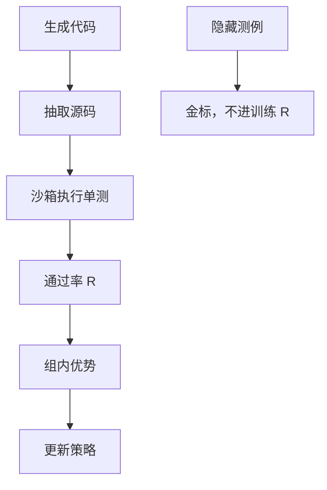

# 代码验证器：单元测试

通过率是程序给的，不是裁判给的；奖励通道上只应留下可复现的沙箱结果。

<footer>—— 对照 HumanEval / MBPP 的单测传统；CodeRL、DeepSeek-R1 把编译与测试接到策略梯度</footer>

[上一课](/llm/rubric-reward)把质量拆成条目，其中「程序是否做对」仍可能交给 LLM 裁判。缺口是：代码域存在真正的 [可验证奖励](/llm/verifiable-reward)——**单元测试与编译器。** 本课把 $R$ 写成沙箱里的通过率。Le 等人的 CodeRL、竞赛编程流水线、R1 的代码奖励，都走这条通道。后课数学验证器是另一类程序判定，不要混进单测。

## 问题

代码生成的「看起来对」极廉价：类型名像那么回事、注释写得很自信。标量 RM 与 LLM 裁判都吃这一套。单测把事件钉死：给定输入，输出是否等于期望、是否在时限与内存内、是否允许网络。$R$ 可以是 0/1（全过）或通过率。策略梯度要的就是这个可批量调用的函数。

噪声来自规范，不是来自网络：公开测例覆盖不足会把错误实现标成对；浮点与并发会让同一 $y$ 的 $R$ 抖动。HumanEval 原协议是隐藏测例；训练若只用公开用例，RL 会硬编码输出。

### 抽取与运行是 $R$ 的一部分

模型常常把代码包在 Markdown 或解释里。extract 失败则 $R=0$ 或 mask，二者对格式的压力不同，见可验证奖励课。运行规范：镜像、超时、是否联网、是否可写磁盘，必须版本化。副作用会让奖励不可复现，[PPO](/llm/ppo-llm) 的优势变成噪声。

不要把「用 GPT-4 读代码打分」叫做本课的验证器。那是上一课的裁判。本课的动词是执行。

## 方法

对每个题 $x$ 采 $G$ 条完成（[GRPO](/llm/grpo) 组采样天然合适），抽代码，在沙箱跑测试集 $\mathcal{T}$：

$$
R(x,y)=\frac1{|\mathcal{T}|}\sum_{t\in\mathcal{T}}\mathbf{1}\{\mathrm{exec}(y,t)=\mathrm{ok}\}.
$$

隐藏测例只用于金标，不进训练 $R$，否则过优化测例洞无法被发现。编译失败、超时、抽取失败单独记账，不要与逻辑错误混成一个桶。优势用组内基线；全 0 / 全 1 组无梯度，留给后课动态采样。

与 [过程监督](/llm/process-supervision) 不同：单测是结果信号，中间错误但测例碰巧过仍得高 $R$。要逐步质量，需另加 PRM 或静态检查，不要假装通过率等于过程正确。

## 机制

通过率比 0/1 密：部分测例提供部分信用，方差低于「全过才给 1」。但部分分会鼓励「写一个总能过样例的硬编码」。测例要含边界与随机化输入。时限把复杂度写进 $R$：算法对但常数大，会被判错——这是环境定义，应在题面声明。

沙箱吞吐决定 RL 墙钟。数学正则便宜几个数量级；代码 batch 要按环境分组，避免数学 step 等超时。

## 边界与工程取舍

没有单测的开放编程题不属于本课，应退回细则或裁判。代理式修仓库（SWE）的环境更重，留到后课 SWE-RL。单测 $R$ 仍会过优化公开用例：保留隐藏集与人工抽查。下一课把「答案相等」从字符串匹配升级到数学等价。

## 小结

- 代码奖励是沙箱通过率，抽取与运行规范属于 $R$。
- 隐藏测例只做金标；训练用例会被硬编码。
- 组采样 + 相对优势适合 0/1 或通过率；全对全错组无梯度。
- 通过率不是过程正确；需要逐步信号时另接 PRM。
- 出处：Chen 等 HumanEval；Austin 等 MBPP；Le 等 CodeRL；R1 的代码可验证奖励。
