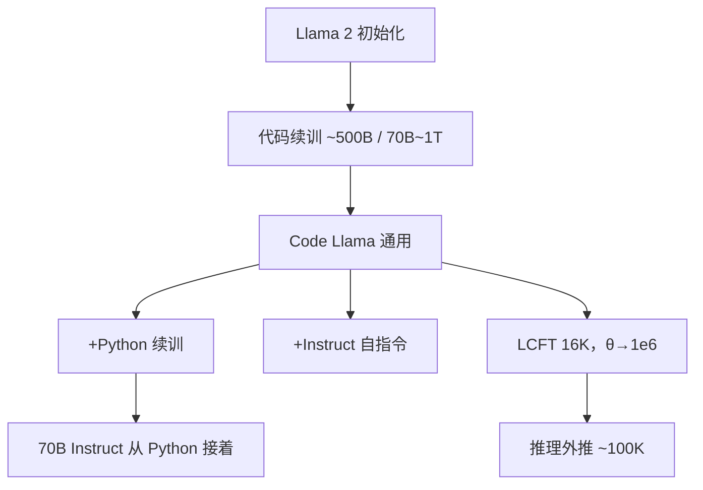

# CodeLlama 论文

    
我们发布 Code Llama：基于 Llama 2 的代码基础模型，在开源档提供强性能、填充能力、长输入上下文，以及对编程任务的零样本指令跟随。

    <footer>—— Rozière 等，Code Llama: Open Foundation Models for Code，arXiv:2308.12950</footer>

算法与产品形态见 [Code Llama](/llm/code-llama)。本篇钉 Baptiste Rozière、Jonas Gehring、Fabian Gloeckle 等人 2023 年这篇（Meta，arXiv:2308.12950）：他们把「从 Llama 2 继续训代码」写成一套可复述的家族合同——尺寸、变体、填充是否入训、长上下文微调怎么改 RoPE——以及实验表实际支持什么。不要把后来补发的 70B 检查点、社区 Unnatural 变体或下游 IDE 插件倒写进 2023 年 8 月的主文。落地配方仍以前一篇为准；这里写论文交了什么主张、量了什么、明确没量什么。

## 问题

2023 年中，开源代码模型已有 Codex 路线的闭源上限、StarCoder 一类从零训的开源线，以及大量「通用 Llama 会写一点 Python」的零样本。缺口有三。第一，IDE 要的是**中间填充**，不是只从文件头续写；Bavarian 等人的 FIM 已在解码器上成立，但尚未作为 Llama 2 规模家族的默认能力矩阵写清楚。第二，仓库补全要的窗口远长于 Llama 2 的 4K，把全部预训练改成 16K 按二次注意力不可承受。第三，社区需要**同一套权重上的产品线**：通用代码、Python 专化、指令跟随，而不是三篇互不兼容的模型卡。

论文要回答的不是「会不会写 HumanEval」，而是：从 [Llama 2](/llm/llama-2) 初始化、再灌公开代码，能否同时交出续写、填充、长上下文与零样本指令，并且把哪些尺寸**故意不训填充**写进正文，以免用户按参数量单调外推。

### 论文的单位是家族，不是单检查点

主文把 7B、13B、34B 写成一次发布的矩阵（70B 是后续加档，训练 token 从约 500B 升到约 1T）。每一格还要标：是否 Python 专化、是否 Instruct、是否 FIM、是否做过长上下文微调（LCFT）。评测合同因此必须按格读表：拿 34B 通用去对 infilling 表，或拿 Instruct 去对贪心填充，都直接违反作者自己的脚注。这是论文贡献里常被引用漏掉的一条——能力矩阵本身是合同。

引用写 Rozière et al.，*Code Llama: Open Foundation Models for Code*，arXiv:2308.12950。作者列表很长，习惯取第一作者 Rozière；不要写成「Touvron 的 Code Llama」——Touvron 是 Llama 2 通讯作者，这篇代码续训的通讯与执笔是另一组。

## 方法

数据与工序在落地篇展开。原文方法节要记住的决策是：**不从零**、**高比例 FIM**、**后期改 RoPE 基数做 LCFT**、**Python 与 Instruct 是续训而不是另起词表**。7B/13B/34B 约 500B token 代码向数据；混入少量与代码相关的自然语言和通自然语言，以免 MBPP 一类「先读题面再写函数」掉回纯补全模型。分词沿用 Llama 2 BPE，不另训代码词表——这是继续训相对从零的显式代价：词表对空白与算符不一定最优，但换词表就无法继承 Llama 2 的语言先验。

填充：在完整文档上以高概率切 $P,M,S$，PSM 与 SPM 各半，四个特殊符。原文强调编码细节（抑制隐式前导空格、SPM 下前缀与中段联合编码），因为 SentencePiece 切碎会让训练分布与推理光标对不齐。LCFT：序列提到 16K，$\theta:10^4\to 10^6$，而不是 Chen 式位置线性插值；作者认为提高基数更利于外推、并减轻短距偏见。微调步数按尺寸不同，7B 因下游不稳缩短——原文把「不是所有尺寸同一超参」写进正文，而不是藏在附录一句。

### 原文量过的表，以及表外的句子

量过：HumanEval / MBPP 的 pass@1（贪心与采样要分开读）、MultiPL-E 多语言、HumanEval infilling、长文件困惑度与补全稳定性。叙事是 34B 通用进入当时开源第一档，Python 专化在 HumanEval 上再抬一截，通用在 MultiPL-E 更均衡。量过但容易被误读：GSM8K 一类数学——混入自然语言是为了保住读题，不是把 Code Llama 宣称成数学模型。

量不出（留给产品与后续检查点）：真实 IDE 延迟、仓库级检索脚手架、34B 为何不训 FIM 的完整消融（正文给的是训练成本与稳定性，不是「FIM 对 34B 有害」的定理）。70B 带 FIM 是社区压力后的加档，不能回溯成 2023-08 主文的默认矩阵。

## 机制

从 Llama 2 继续训，等于把「注释、题面、API 文档」的语言先验当成代码损失的免费初始化。原文消融写：从零训代码模型在同等 token 下更差，尤其是需要读自然语言规格的题。这解释了为何他们不走 StarCoder 的从零路线，也解释了词表不换的取舍。FIM 能成立，是因为因果掩码只看见重排后的前缀；90% 量级的 FIM 率下，从左到右基准只掉约一个百分点——这是对 Bavarian 等人结论在十亿至三百亿参数、代码域上的复现，不是新核。

### 改基数的 LCFT 是论文里的第二条算法句

作者拒绝把位置索引除以缩放因子，改把 RoPE 的 $\theta$ 拉大。直观：高频仍服务局部语法，低频被放慢后才能覆盖 16K 训练窗，并给 100K 外推留余量。论文给的证据是窗内有效、窗外困惑度相对稳定，**不是** 100K 针检索或整仓推理。把「支持 100K」写进系统卡而不写「16K 训练 + 外推」，是引用错误。机制对照见 [NTK 感知插值](/llm/ntk-aware-interpolation) 与 [RoPE](/llm/rope)；本篇只钉原文选了哪条、为什么不选线性插值。

34B 通用未训填充，是家族矩阵里最常被忽略的格子。论文把它写进能力表，不是脚注彩蛋。做中间补全应用 7B/13B/70B 或后来补的带 FIM 检查点，不要按「更大一定更会填」选型。

Instruct 段用自指令：模型写题、写解、写单测再过滤。原文承认这会抬 HumanEval 一类自洽题，对竞赛难度（APPS）帮助有限——这是方法诚实，不是谦辞。评 Instruct 应用对话协议，评填充应用预训练填充协议；混用模板会把两条分布一起弄脏。

## 边界与工程取舍

### 许可、污染、外推都不在 HumanEval 一行里

权重继承 Llama 2 许可，不是 Apache。训练数据来自公开代码，输出可能复述受版权保护的片段；论文不提供许可证扫描器。HumanEval 污染风险存在，原文用标准去污染讨论，但不能保证 2026 年的 Live 基准。100K 外推的 KV 成本与任何长上下文模型相同，LCFT 不减 decode 显存。自指令单测把模型锁进「自己会出的题」，真实仓库的构建系统、私有 API、多文件不变量不在合同内。

不要把 ChatGPT 对照句从 2023 年表里抄到今天的产品对比。对手是当时的 gpt-3.5 与开源线；GPT-4 级仓库代理、SWE-bench 脚手架都不在这篇的评测图里。需要刷仓库 issue，应读 [HumanEval / SWE-bench](/llm/code-bench)，不要用这篇的 pass@1 代替 resolved 率。

出处钉 Rozière et al.，Meta AI，arXiv:2308.12950，2023。FIM 方法引用 Bavarian et al.，*Efficient Training of Language Models to Fill in the Middle*。70B 与 infilling 补档以当时模型卡为准，引用主文时写清检查点日期。

## 小结

- Code Llama 原文主张：从 Llama 2 继续训，交出续写、填充、长上下文与指令四条能力，并以家族矩阵标明每格开了什么。
- 7B/13B/34B 约 500B token，70B 约 1T；Python 与 Instruct 是续训分支。
- 填充用 PSM/SPM；34B 通用未训 FIM。LCFT 把 $\theta$ 提到 $10^6$，16K 训练、约 100K 外推。
- 表支持开源档 HumanEval/MultiPL-E/infilling；不支持仓库级代理或 100K 针检索保证。
- 出处：Rozière et al.，*Code Llama: Open Foundation Models for Code*，arXiv:2308.12950；落地对照见 [Code Llama](/llm/code-llama)。
