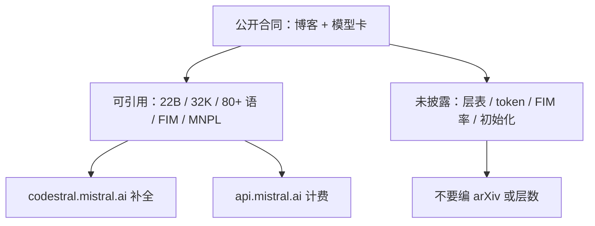

# Codestral 公开信息

    
Codestral 是 Mistral 的第一个代码模型：22B 开放权重，训练覆盖 80 余种编程语言，并用 fill-in-the-middle 补全任意中间空隙；上下文 32K，面向仓库级补全。

    <footer>—— Mistral AI，Codestral 发布博客，2024 年 5 月 29 日</footer>

产品定位、FIM 与 MNPL 许可见 [Codestral](/llm/codestral)。本篇只处理**公开信息能承诺到哪一步**：2024 年 5 月 29 日博客、随后的 Hugging Face 模型卡、API 端点说明。Mistral 没有为 22B Codestral 放出与 Rozière / Guo / Hui 同级的技术报告，层表、token 量、数据过滤、FIM 率、是否从 Mistral 7B/8x7B 初始化，均未在可引用文档里写死。写系统或写引用时，应以博客与模型卡为上限，不要编造 arXiv、不要把 Codestral Mamba 或 25.01 倒填进 v0.1。

## 问题

闭源代码模型用基准图说话，开源线用论文附录说话。Codestral 走第三条：开放权重 + 产品博客。读者容易把博客里的 HumanEval 条形图当成「论文表 2」，再去追层数与训练 token——那些字段**不在公开合同里**。公开信息笔记要解决的问题是：哪些句子可以引用、哪些必须标「未披露」、哪些数字来自第三方（JetBrains Kotlin-HumanEval、Continue.dev 接入）而不能写进「官方主表」。

另一问题是许可与端点被口口相传成「又一个 Apache 7B」。博客写明 **Mistral AI Non-Production License（MNPL）**：研究与测试可用，生产商用另授权。API 分成 `codestral.mistral.ai`（IDE / 自带 Key 的补全与 FIM）与 `api.mistral.ai`（按 token 计费）。把两条端点、两种许可混成「开放即可上生产」，是读漏公开文本，不是模型能力问题。

### 没有 arXiv 时，博客就是方法节的天花板

可引用：22B、开放权重、80+ 编程语言（举例 Python、Java、C/C++、JavaScript、Bash、Swift、Fortran）、32K 上下文、原生 FIM、指令与补全共用 API 思路、发布日期、HF 上的 `Codestral-22B-v0.1`。不可引用除非另有来源：隐藏层数、中间维、是否 GQA、预训练 token、FIM 概率、PSM/SPM 比例、数据截止日期、是否仓库级组包。缺这些不等于模型弱；等于**论文式复现做不到**。需要架构细节时应换有报告的对照（Code Llama、DeepSeek-Coder、Qwen2.5-Coder），而不是用猜的层表补齐 Codestral。

不要伪造 arXiv 编号。社区转载若写「Mistral Codestral paper」，多半是把博客 PDF 化或把评测图截进幻灯片。引用格式用：Mistral AI，*Codestral*，2024-05-29，官方博客 URL；权重用模型卡版本。

## 方法

按公开文本能复述的方法只有产品层。训练数据「覆盖 80 余种语言」是数据主张，不是 80 个专家。评测图由 Mistral 流水线画出：Python HumanEval，另报 C++、Bash、Java、PHP、TypeScript、C# 的 HumanEval pass@1 再平均；SQL 用 Spider；长程补全用 RepoBench（卖点是 32K 相对当时 4K–16K 代码模型）；FIM 用 HumanEval 在 Python / JavaScript / Java 上的中间填空，对照「开箱即用 FIM」的 DeepSeek Coder 33B。第三方 Kotlin 数字是 JetBrains 的基准，温度与对照模型以对方博文为准，不应并进官方主表同一行。

API：补全与 FIM 走 IDE 端点；聊天写测试、解释走指令接口。公开说明强调 shared instruction and completion，意味着同一 22B 权重见过两种条件，但**训练混合比例未给**。自托管权重可下；平台 fine-tune 当时承诺与 Large / NeMo 一起开放，是否对你所在分区开放要以当时文档为准，不能从 2024-05-29 一句「后续」推断 2026 年的 SLA。

### 生态接入是公开信息的第二类证据

博客点名 Continue.dev、Tabnine、LlamaIndex、LangChain、Sourcegraph Cody 等，用来说明延迟与补全在编辑器里可感知。这类句子的认识论地位是**产品存在性**，不是独立复现的 pass@1。LangChain 社区用 Instruct 做自修复循环，属于工具调用，不是 FIM；公开信息里没有「官方 agent 协议」。引用生态时写「发布时已接入」，不要写成 Mistral 官方维护的集成测试矩阵。

## 机制

能从公开信息推断、且不越权的机制只有几条。22B 稠密、32K 窗：文件内类定义与远端调用点可以同时进注意力，这与 RepoBench 叙事相容，但仍远小于整库。FIM 必须用模型卡里的前缀 / 后缀 / 中间特殊 token；公开卡若列出符号，推理就应对齐；若某版卡写得含糊，应以 tokenizer 文件为准，而不是用聊天模板冒充。MNPL 把「能下权重」与「能进生产」切开，机制是法律的，不是数值的——选 Codestral 是选代码专用分布，不是选最宽松许可证。

### 版本边界必须写进引用

Codestral Mamba（约 7B 状态空间）与 Transformer 22B 同名不同架构，公开博客是另一篇。Codestral 25.01 等后续权重、许可是否仍 MNPL，以新卡为准，不能自动继承 2024-05-29。Mistral Large 2 写自己吸收了 Codestral 的代码数据经验——那是旗舰通用模型的数据迁移句，Large 不是 22B 代码专用、也不因此获得 FIM 合同。公开信息笔记的职责就是挡住这些同名污染。

端点配额模型不同：IDE 端点发布时有 beta 免费与排队，组织级 API 按 token。缓存键必须含 FIM 后缀，多打一个字符就会改变中间段。这些写在文档里，属于公开工程约束，不是逆向。

## 边界与工程取舍

### 把博客当论文用时，错在哪

第三方 HumanEval 复制会与官方图有差，无附录可查随机种子与后处理。32K 满窗 prefill 对 IDE 仍贵，生产要用前缀缓存与检索，博客的 RepoBench 不是「整库塞进 32K」保证。安全与许可证扫描：公开文本提醒代码模型会补出漏洞或授权不当片段，但没有给出训练数据许可证表。无层表则无法做与 FlashAttention 头维相关的核优化承诺，只能按 22B 通用解码器估计显存。

需要可复现数据工序时，换 [Qwen2.5-Coder 报告](/llm/qwen25-coder-report) 或 [DeepSeek-Coder 论文](/llm/deepseek-coder-paper)。Codestral 的公开信息足够做选型和许可判断，不够做预训练复现。不要在综述里把它和有完整附录的模型画成同一引用等级而不加「blog / model card」标注。

出处：Mistral AI，*Introducing Codestral*（标题以当时页面为准），2024 年 5 月 29 日；Hugging Face `mistralai/Codestral-22B-v0.1` 模型卡。落地对照见 [Codestral](/llm/codestral)。

## 小结

- Codestral 22B 没有对等技术报告；可引用上限是 2024-05-29 博客与模型卡。
- 公开承诺：80+ 语言、32K、原生 FIM、MNPL、双端点。
- 未披露层表、token、FIM 率与初始化；不要编造 arXiv。
- 同名的 Mamba、后续版本、Large 的代码经验迁移都不是 v0.1 合同。
- 出处：Mistral AI 博客 2024-05-29；产品展开见 [Codestral](/llm/codestral)。
