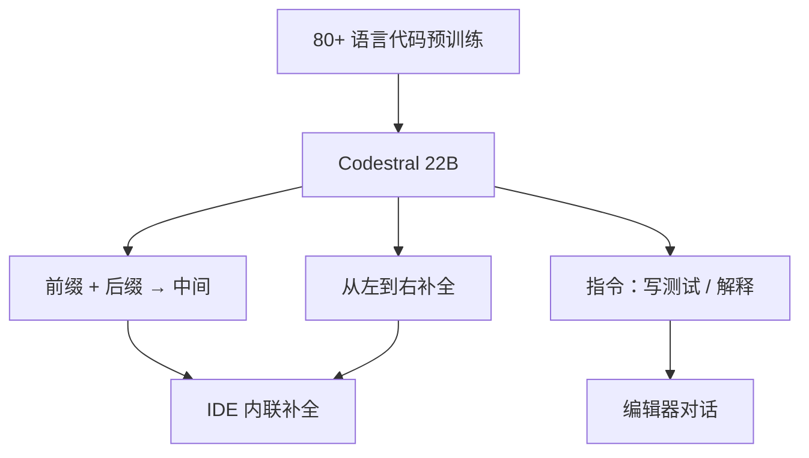

# Codestral

Codestral 是 Mistral 的第一个代码模型：22B 开放权重，训练覆盖 80 余种编程语言，并用 fill-in-the-middle 补全任意中间空隙；上下文 32K，面向仓库级补全。

<footer>—— Mistral AI，Codestral 发布博客，2024 年 5 月 29 日</footer>

2024 年 5 月 29 日 Mistral 发布 **Codestral**：专门为代码生成与补全训练的 22B 模型，开放权重，许可是当时新写的 **Mistral AI Non-Production License（MNPL）**——研究与测试可用，商用要另谈。它不是通用聊天模型上再 SFT 一点 Python，而是从数据到 API 都按 IDE 设计：补全、写测试、中间填空（FIM），指令与补全走同一套端点思路。本篇按该博客写，不把同年 7 月的 Codestral Mamba 或后续 Codestral 25.01 倒填进 22B 的架构表，也不编造 arXiv。

## 问题

通用 7B 聊天模型能写函数，但在仓库级补全上短窗、慢、且对 Swift / Fortran 一类长尾语言不稳。更大的代码模型（博客对照「硬件需求更高」的既有代码模型）又难进 IDE 的延迟预算。Codestral 要占的位置是：**22B，延迟可进编辑器，窗口 32K 以覆盖当时 4K–16K 的代码对照，并原生支持 FIM。**

FIM 不是聊天。光标在函数中间时，模型要同时条件于前缀与后缀，而不是只从左到右把文件写完。[FIM 解码](/llm/fim-decode) 需要训练时见过「前缀–后缀–中间」的排列，推理时也要同一套特殊符号。只做因果 LM 的通用模型，靠提示词模拟 FIM，中间段会与后缀打架。

### 80+ 语言是数据主张，不是 80 份专家

博客写训练数据覆盖 80 余种编程语言，举例 Python、Java、C、C++、JavaScript、Bash，以及 Swift、Fortran。这意味着词表与数据混合见过这些语法，不是 MoE 里每个语言一个专家。HumanEval 类评测仍以 Python 为主，另报 C++、Bash、Java、PHP、TypeScript、C# 的 HumanEval pass@1 再平均。SQL 用 Spider。长程补全用 RepoBench。FIM 用 HumanEval 在 Python / JavaScript / Java 上的中间填空，并对照「开箱即用 FIM」的 DeepSeek Coder 33B。

32K 相对当时许多代码模型的 4K/8K/16K 是博客自己画在 RepoBench 上的卖点。它仍远小于后来 128K 通用模型；仓库级「整库进上下文」做不到，要对文件做检索或挑相关片段。

## 方法

22B 开放权重，Hugging Face 可下。API 分成两条路径：`codestral.mistral.ai` 面向 IDE / 自带 Key 的补全与 FIM，发布时有 beta 免费与排队；`api.mistral.ai` 按 token 计费，面向应用与批处理。自托管与平台 fine-tune 后续与 Large / NeMo 一起开放。生态上当时接入 Continue.dev、Tabnine、LlamaIndex、LangChain、Sourcegraph Cody 等，用来说明延迟与补全质量在编辑器里可感知，而不是只刷 HumanEval。

### Fill-in-the-middle 与指令共用

产品上「shared instruction and completion API」：同一模型既聊天写函数，又按 FIM 填空。训练因此必须混合因果补全与中间填空目标。推理时若走 FIM，应使用模型卡里的前缀 / 后缀 / 中间特殊 token，而不是把后缀粘在 system 里。JetBrains 在 Kotlin-HumanEval 上给出的社区反馈数字（例如 T=0.2 时 pass 率对照 GPT-4-Turbo）是引用方自己的基准，不是 Mistral 主表；可以当生态证据，不要写进「官方 HumanEval」一行。

## 机制

22B 稠密容量用来记 API 与中等仓库模式；32K 让「文件上方的类定义」与「文件下方的调用点」同时进入注意力，这是 RepoBench 一类长程评测涨分的物理原因。FIM 把后缀当作条件，减少「补全了一段却和下面已有代码冲突」——冲突仍会发生，只是训练目标与之对齐。多语言 HumanEval 平均掩盖方差：Python 强不等于 Fortran 强；长尾语言应自建回归。

许可 MNPL 把「开放权重」与「可商用」切开：可以研究、可以在非生产环境测 IDE 插件，一旦进生产路径就要商业许可。这与同期 Apache 的 Mistral 7B、后来 Apache 的 [NeMo](/llm/mistral-nemo) 不同。选 Codestral 是选代码专用分布，不是选最宽松的许可证。

Instruct 版若支持工具调用（LangChain 社区反馈曾用于自修复代码循环），那是指令接口，不是 FIM 接口。内联补全应走 completion/FIM，不要用聊天模板包一层再截第一行，延迟和停止符都会错。

### 和后续 Codestral Mamba、通用 Large 的边界

Codestral Mamba 是 7B 级状态空间代码模型，架构不是 22B Transformer，不要混名。Large 2 博客写自己在 Codestral 经验上提高了通用旗舰的代码比例——那是数据经验迁移，Large 仍是通用模型，FIM 与 80 语言代码专用混合仍以 Codestral 为准。不要把 22B 写成 32B，也不要写成 MoE。

## 边界与工程取舍

无官方层表与 token 量附录。评测图是 Mistral 流水线；第三方 HumanEval 复制可能有差。32K 满窗 prefill 对 IDE 仍太贵，生产补全要用前缀缓存、单文件或检索片段。安全：代码模型会补出有漏洞或授权不当的片段，许可证扫描与 SAST 不能省。MNPL 与后来 Codestral 版本的许可可能改，以当时卡片为准。

不要伪造 arXiv。可引用 2024-05-29 博客与 Hugging Face 上的 Codestral-22B-v0.1 模型卡。

补全产品要把停止符、温度与多候选当成一等配置。FIM 常用接近贪心的低温度，聊天写函数则要略高的多样性；两套采样不能共用。仓库级任务应先用检索抽出相关文件，再把 32K 留给「当前文件 + 签名 + 测试」，而不是把 monorepo 硬塞进去。版权与许可证：训练数据含 80+ 语言开源树，输出可能复述受版权保护的片段，企业接入需要扫描与隔离。Kotlin、Swift 等社区基准说明长尾语言有需求，但官方主表仍偏 Python；上线前用自己的语言与框架做回归，不要只看 HumanEval pass@1。

端点 `codestral.mistral.ai` 的配额模型与组织级 `api.mistral.ai` 不同，发布博客写得很清楚。集成 IDE 时应读当时文档，不要假设两个端点同一计费与同一速率限制。补全场景里多打一个字符就会改变 FIM 后缀，缓存键必须含前缀与后缀，否则会复用错误的中间段。

## 小结

- Codestral（2024-05-29）是 22B 代码专用开放权重，80+ 编程语言，32K 上下文，原生 FIM。
- 定位 IDE 补全与指令写代码；许可 MNPL，生产商用需另授权。
- FIM 必须用训练时的中间填空格式，不能靠聊天提示词冒充。
- 与 Codestral Mamba、Mistral Large 的代码能力不是同一张模型卡。
- 出处：Mistral AI，*Codestral* 博客，2024 年 5 月 29 日。
