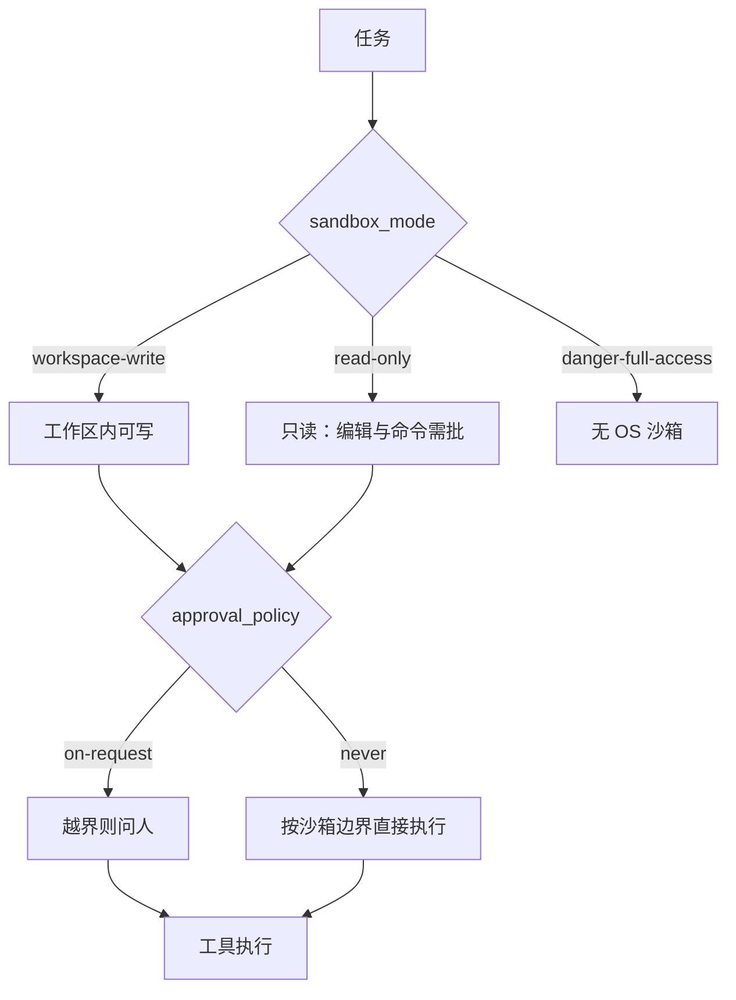

# Codex CLI

    
沙箱决定命令碰得到哪些文件与网络；审批策略决定越出边界时要不要停下来问人——两者正交，不要合成一个「自动」开关。

    <footer>—— OpenAI，Codex 官方文档中的 Sandbox / approvals 说明与 openai/codex 仓库</footer>

Codex CLI 是 OpenAI 的本机编程代理：在终端或 IDE 里针对当前仓库计划、编辑与跑命令。官方把它与编辑器扩展、桌面应用、以及 chatgpt.com 上的云端 Codex Web 分开——CLI 跑在你的电脑上，Web 是另一条产品线。配置集中在 `~/.codex/config.toml`，项目说明书是 `AGENTS.md`。本篇按官方文档写沙箱、审批与无头执行，默认场景是受信任的自有仓库。不写关闭沙箱去扫主机、也不写绕过审批的利用步骤。

## 问题

把前沿模型接到本地 shell，能力与破坏半径一起到来。只禁止「危险字符串」会被换一种写法绕开；只靠模型「自己小心」则没有强制边界。OpenAI 的拆法是两层策略：**sandbox_mode**（操作系统强制：能读什么、能写哪、能否上网）与 **approval_policy**（策略层：何时暂停等人）。未声明信任的工作区默认偏保守：可以查看与问答，编辑与命令要批准。

第二个问题是同一代理要服务交互开发与 CI。交互 TUI 需要审批气泡；流水线需要 `codex exec` 一类非交互入口、稳定的退出码与可解析输出。官方用同一套 config 层叠用户级与项目级，并允许组织在托管机器上用 `requirements.toml` 禁止 `approval_policy = "never"` 或 `danger-full-access`。这把安全默认从「个人偏好」提升为可执行的管理合同。

### 本机、IDE、云端不要写混

仓库 README 写三条分叉：要在 VS Code / Cursor / Windsurf 里用，装 IDE 扩展；要桌面体验，走 Codex App；要云端代理，去 ChatGPT 的 Codex Web。CLI 是「轻量、跑在你电脑上的编程代理」。模型选择、计费与上下文长度以 developers.openai.com/codex 当时文档为准，本篇不锁某一个快照型号。

安装：macOS/Linux 可用官方 `curl` 脚本（chatgpt.com/codex/install.sh），也可用 `npm i -g @openai/codex` 或 Homebrew cask；Windows 有对应 PowerShell 脚本。发布物默认从 `releases.openai.com/codex` 取，GitHub Releases 作回退。版本与通道以官方文档与仓库发行说明为准。

## 方法

启动 `codex` 进入交互；用 `/approvals` 一类命令改预设。文档给出若干正交组合，而不是单一「自动档」：

- 只读浏览：`--sandbox read-only` 配 `--ask-for-approval on-request`——可读、答疑；编辑、命令、网络要批。
- CI 只读：只读且 `--ask-for-approval never`，永不升级权限。
- 仓库内编辑：`--sandbox workspace-write` 配 `on-request`——工作区内读写与常规命令可自动，出区或上网要批。
- `--full-auto` 预设约等于 workspace-write + on-request。
- `danger-full-access` / `--yolo` 关掉沙箱与审批，官方标明不推荐，仅当你已在容器或其他隔离里再考虑。

审批策略还有 `untrusted`（不在可信集合里的命令先问）与 `never`（不问）。`never` 仍可与只读沙箱联用：不问不等于能写全盘。Windows 另有 native sandbox 的 elevated / unelevated 设置。网络默认常关，需要时按审批或配置打开，而不是全局放行。

### AGENTS.md 与配置层叠

项目根或子目录放 `AGENTS.md`，与 `~/.codex/AGENTS.md` 全局说明层叠，告诉代理构建、测试与风格约定。这与 Claude 的 `CLAUDE.md`、Gemini 的 `GEMINI.md` 同构，只是文件名与发现规则以 Codex 文档为准。用户级 `~/.codex/config.toml` 设默认模型、沙箱、审批、MCP；项目级 `.codex/config.toml` 仅在项目被信任时加载，且不能覆盖机器本地的提供方、认证、通知与遥测等键——那些必须放在用户级，以免仓库里的配置把代理指到不可信端点。MCP 服务器写在 `[mcp_servers]`；会话内可用斜杠命令查看状态。

非交互执行走 `codex exec`（或文档中的无头入口），用于脚本与 CI。官方文档站点（developers.openai.com/codex）覆盖安装、CLI 开关、模型、config 样例与 Agents.md。本篇以该站点与 GitHub `openai/codex` 为规范，不把第三方长篇指南当作 API 合同。

## 机制

沙箱是内核/OS 强制的权能集合：即使模型发出「写工作区以外的路径」，执行层也应失败或升级为审批，而不是靠提示词拦。审批是人机接口：把「这一次 / 本会话 / 改执行策略 / 允许某主机 / 拒绝 / 取消整轮」收成显式决定。两者正交，才能表达「可以自动改仓库，但上网必须问」这种日常需求。`workspace-write` 通常还保护 `.git` 与 `.codex` 一类路径，避免代理改自己的策略文件或历史来逃逸——这是完整性，不是功能彩蛋。

AGENTS.md 把团队知识放进文件系统，使模型不必在每一轮对话里重新发现「测试怎么跑」。config 层叠则把组织红线（禁止 never + full access）从个人点点鼠标里抽出来。机制上，Codex CLI 是「模型 + 工具循环 + OS 沙箱 + 审批状态机」；去掉后两段，它就退化成任意命令执行器。

Auto-review 可以把合格的审批请求交给自动评审而不是弹给用户。这是把人从回路里挪走一截，不是缩小沙箱。组织若启用，应单独写进安全评审，不要与 workspace-write 默认混为一谈。

### 与 Claude Code、Gemini CLI 的合同差异

三者都是终端编程代理，都支持 MCP 与项目说明书。Codex 把沙箱模式与审批策略拆成官方一等开关，并在托管配置里允许禁用危险组合。Claude Code 的权限与计划模式写在另一套设置与 Hooks 里。Gemini CLI 开源（Apache 2.0），沙箱与政策引擎有自己的参考页。评测某个模型「在 CLI 里写代码有多好」必须冻结：**哪一个脚手架、哪一档沙箱、是否允许网络**。把 Web 版 Codex 的演示分数写回本机 CLI，会越过产品边界。

## 边界与工程取舍

`danger-full-access` 与 `--yolo` 存在，是因为有人已经在隔离虚拟机里跑代理；在日常笔记本上打开等于把本地用户权限交给模型。本篇不讨论如何「尽量自动又尽量广」的组合拳。项目级 config 不能覆盖认证与 `openai_base_url`，正是为了降低供应链式劫持：恶意仓库不该把流量指到假服务器。

CLI、IDE 与 Web 的数据路径、保留政策与网络出口不同。官方文档会演进；开关名以当前 docs 为准。开源仓库含 `docs/sandbox.md` 与平台实现说明，和网站文档应交叉核对版本。不要用 Codex CLI 对未授权系统做探测；默认信任边界是当前工作区。

出处：OpenAI Codex 文档 https://developers.openai.com/codex ；GitHub `openai/codex` README 与 sandbox 文档；ChatGPT Learn 中的 agent approvals / config 说明。引用写 sandbox_mode 与 approval_policy 两个值，不要只写「自动」。

## 小结

- Codex CLI 是本机编程代理，与 IDE 扩展和 Codex Web 分产品线。
- 能力边界由沙箱模式与审批策略正交相乘；未信任仓库默认偏只读。
- `AGENTS.md` + `config.toml` 层叠项目说明与组织红线；项目配置不能改认证与提供方。
- `--full-auto` 仍在 workspace 沙箱内；关掉沙箱属于明确危险预设。
- 与其他终端代理比较时必须冻结脚手架与权限档。
- 出处：developers.openai.com/codex 与 openai/codex。
