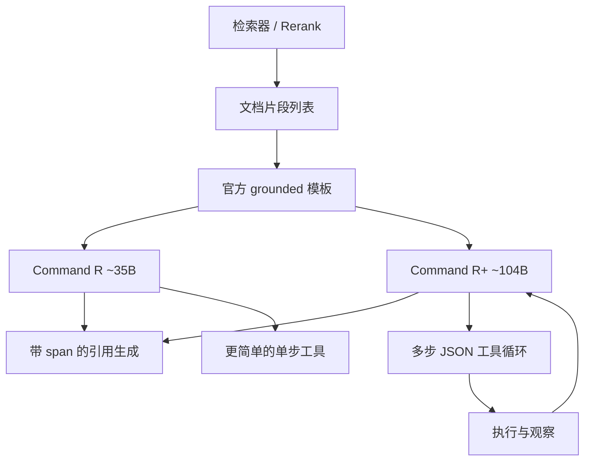

# Command R / R+

    
Command R 系列为生产级 RAG 与工具调用而训：能根据给定文档片段做带引用的生成，并能把多步工具串成工作流。

    <footer>—— Cohere，Command R / R+ 模型卡与文档，2024</footer>

2024 年 3–4 月，Cohere 放出可下载的 **Command R（约 35B）** 与 **Command R+（约 104B）**，上下文 **128k**，许可 **CC-BY-NC** 加可接受使用政策。相对通用聊天模型，它们的公开卖点不是 MMLU 全面第一，而是**带 grounding span 的引用生成**与**JSON 工具循环**。多语底座与 Aya 23 的深度实验写在 [Aya / Command-R+](/llm/command-r)；本篇只把 R 与 R+ 当作生产对象：模板即模型的一部分、单步对多步、08-2024 更新改了什么。Cohere 没有为 R / R+ 发与 Aya 23 同等级的 arXiv，**不要伪造论文号**。

## 问题

把检索片段糊进上下文，通用模型不一定会引用，也不一定在工具失败后改参数再试。企业 RAG 需要三件同时成立：窗口装得下多段结果、答句里能标出来源片段、工具协议稳定到可以进工作流。Command R 要把这三件写进后训练，而不是只靠系统提示「请列出资料来源」。R+ 的问题更进一步：单次 JSON 动作不够时，能否规划—调用—观察—再调用。

第二条约束是许可与部署。开放权重面向研究与非商用；商用走 Cohere API、Bedrock 等授权渠道。把 R+ 与 Apache 的 7B 写在同一句「开源可商用」里，会在法务上翻车。

### R 与 R+ 的分工不是「同一个 35B 放大」

模型卡把 R 定位为可扩展生产档：延迟与吞吐优先的 RAG、较简单的工具。R+ 定位为复杂 RAG 与**多步工具**（一次生成动作列表，执行后再进入下一步）。二者都是优化过的解码器 Transformer、都训 23 种语言、都在约 10 种语言上评测——评测集小于训练集，未列入的语种不能当成同等产品覆盖。08-2024 权重在同样硬件上宣称更高吞吐、更低延迟，并加入可调安全模式；能力叙事仍是 RAG + 工具，不是换骨干。Command R 08-2024 的参数量是否仍精确为 35B，应以该快照模型卡为准，不要把 v01 的 35B 未经核对就写到所有别名上。

偏离官方 RAG / 工具提示模板，引用率与工具选择会掉。迁移到自建网关时，应先复现模板，再换检索器。这是后训练把格式写进条件分布，不是解码器里多了一层指针网络。

## 方法

Grounded generation：模型吃一份文档片段列表，生成时插入指向片段的引用。该行为由监督微调与偏好微调、加上**必须遵守的提示模板**训出。08-2024 起，文档写明模型可以在某些 RAG 流程里**不强制引用**、并对不可回答的问题拒绝，同时对系统消息与空白类非语义扰动更稳。工具使用：对话 + 可选 preamble + 工具列表 → 输出 JSON 动作。R 档官方材料强调对话式工具；R+ 明确 multi-step / agentic。检索器仍在模型外——引用保证溯源格式，不保证片段相关。

### 128k 是装文档的预算，不是免检索

128k 用来容纳多文档与长对话。注意力仍按实现二次增长；把整库塞进窗口会先打爆显存与预填充账单。企业侧仍应切块、重排，再把 top 片段交给 grounded 模板。Command 系列常与 Cohere Embed / Rerank 组管道，那是产品组合，不是 R+ 权重内部自带向量库。

词表、层数、是否 [GQA](/llm/gqa) 的精确头数，R / R+ 模型卡没有全部写成定理；Aya 23 报告给过同族 8B/35B 的表，但把那张表原样当成 R+ 104B 的规格属于越级。实现以开源配置与 `transformers` 配置为准。上下文 128k 是模型卡写明的。

仓库组织名从 `CohereForAI` 迁到 `CohereLabs` 一类。下载时核对 `v01` 与 `08-2024` 后缀。API 别名 `command-r` 可能随退役改指向，自托管应钉检查点哈希。

## 机制

引用的机制是格式学习：高频训练「先读片段、再在答句里打 span」。检索错了，模型仍会礼貌地引用错 PDF——grounding ≠ 事实验证。多步工具的机制是对话状态机，与 [function calling](/llm/function-calling) 相同：约束解码提高 JSON 合法率，环境超时与空结果仍会导致循环。R+ 为之做了专门后训练，所以比通用 70B 更愿意按协议走，不是 104B 自带沙箱。

多语机制是容量分配：23 语种预训练混合意味着这些语种上的切词与指令覆盖更密。10 语评测是验收子集。长尾语种能生成，不等于能上生产安全门槛。与 Aya 23 的关系：35B 的 Aya 23 由 Command R 继续微调而来，深度实验见专文；本篇不把 101 语种的 Aya 101 写成 R+ 的词表。

### 08-2024 改的是服务曲线与鲁棒性

官方数字：Command R 08-2024 相对前代约 **50% 吞吐**、约 **20% 更低延迟**，服务所需硬件大约减半。同时改进「是否该调用工具」的决策、系统消息遵循、结构化数据分析。这些是推理栈与后训练的增量，没有伴随新的公开架构论文。回归测试必须用同一版本号：3 月权重与 8 月权重的延迟、拒答、无引用 RAG 行为都不同。

## 边界与工程取舍

Command 不是参数量冠军：对照同期 Llama 3 70B，选型理由是引用与工具，不是全面知识支配。知识截止与幻觉仍在。CC-BY-NC 禁止把权重放进商用 SaaS（除非另行授权）。不要给 Command R / R+ 伪造 arXiv；可引用模型卡、官方文档，以及 Aya 23（arXiv:2405.15032）作为同族多语证据。

后续 Command A 等旗舰是新后训练，不写进本篇规格表。JSON 模式在网关里若改 schema，等于离开训练域。128k 在 GQA 下 KV 仍随长度线性涨，生产上要设硬上限。

「可执行无引用 RAG」是 08-2024 的能力，不是「可以不要检索」。没有片段时拒绝，比胡编更符合企业合规；把拒答当失败用例，会逼模型退回幻觉。

## 小结

- Command R（~35B，2024-03）与 Command R+（~104B，2024-04）是 128k 开放权重，针对带引用 RAG 与工具；许可 CC-BY-NC。
- R 侧重可扩展 RAG 与较简单工具；R+ 侧重多步工具。08-2024 提升吞吐/延迟并加强系统消息与可拒绝。
- 引用与工具依赖官方模板；长窗口不替代检索质量。多语与 Aya 见 [Aya / Command-R+](/llm/command-r)。
- 出处：Cohere Command R / R+ 模型卡与文档（含 08-2024）。无官方 R/R+ 技术报告编号；勿伪造。
