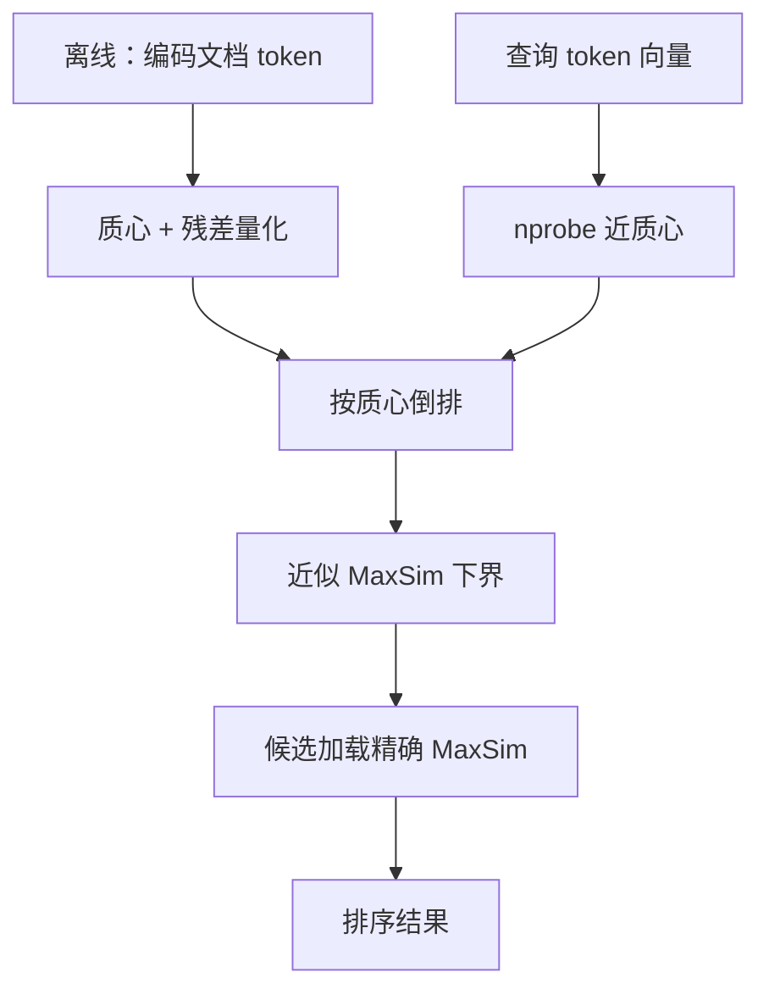

# ColBERTv2

    
延迟交互把相关性拆成 token 级 MaxSim，本来就准；再用残差压缩把空间降 6–10 倍，并用交叉编码器蒸馏把监督去噪，使多向量检索在质量与体积上同时站得住。

    <footer>—— Santhanam 等，ColBERTv2: Effective and Efficient Retrieval via Lightweight Late Interaction，NAACL 2022（arXiv:2112.01488）</footer>

Keshav Santhanam、Omar Khattab、Jon Saad-Falcon、Christopher Potts、Matei Zaharia 在 ColBERT（Khattab & Zaharia，SIGIR 2020）的延迟交互之上提出 **ColBERTv2**：架构仍是「每边一套 token 向量 + 查询侧 MaxSim 求和」，改的是监督与存储。单向量双塔必须把复杂匹配压进一次点积；多向量把负担交给交互，但 Web 规模下要存数十亿小向量，空间比双塔高一个数量级。v2 用质心 + 量化残差把每向量从 256 字节量级压到约 20 或 36 字节（1 或 2 bit/维），MS MARCO 索引从约 154 GiB 降到 16 或 25 GiB。同时用 MiniLM 交叉编码器蒸馏与难负例，使 MS MARCO 开发集 MRR@10 到 39.7。本篇写 MaxSim、残差编码与 LoTTE。

## 问题

ColBERT 已证明 token 分解对域内检索有效，但未压缩索引难上生产。另一条路是把单向量做狠：难负例、预训练、蒸馏——有时能追上「原版」ColBERT，于是有人怀疑延迟交互的归纳偏置是否还值得。v2 的主张是：多向量同样吃蒸馏与难负例，而且 token 向量天然成簇，**可以在不改训练架构的情况下做残差压缩**。质量与空间应一起报，只报 MRR 或只报 GiB 都是半句话。

域外更苛刻。BEIR 混了引用关系、事实验证等「语义相关」而不都是搜索；维基 OpenQA 偏热门实体。作者另建 **LoTTE**（Long-Tail Topic-stratified Evaluation）：StackExchange 主题语料 + GooAQ 搜索问与论坛标题问，12 个测试集，关注长尾、自然查询。Success@5 以目标帖中被接受或点赞的回答是否进入前 5 为准。这是资源贡献，不只是又一个英文 dev 集。

### MaxSim 在算什么

查询编码为 $N$ 个向量 $Q_i$，文档 $M$ 个 $D_j$（BERT 后投影到较低维，常用 128）。分数

$$
S_{q,d}=\sum_{i=1}^{N}\max_{j=1}^{M} Q_i\cdot D_j^{\top}.
$$

每个查询 token 对齐到最相似的文档 token，再求和。编码器不必把整段关系塞进 CLS；交互层做对齐。代价是索引存所有文档 token 向量，检索要近似最近邻再精排。

论文默认评测用 $b=2$ bit/维的残差。报 39.7 MRR@10 时不要偷偷换成未压缩索引。Local Eval（5k 查询）上为 40.8，那是 Khattab 等用过的额外验证切片，不是官方 MARCO DL 测试集。

## 方法

监督：先用 triples 训一版 ColBERT，建压缩索引，检索 top-$k$，用 22M MiniLM 交叉编码器（MS MARCO 蒸馏版）打分，构造每查询 64 路元组，KL 把交叉编码器分蒸馏进 ColBERT 分数，并加 GPU 内 in-batch 交叉熵；再刷新索引与负例一轮。压缩：对 token 向量 $k$-means 质心（个数随嵌入数平方根量级，并取 2 的幂），每向量存最近质心 ID + 逐维 1 或 2 bit 残差。质心在采样段落上聚类，以免先存全量未压缩向量。倒排：按质心聚向量 ID。检索：每个查询向量取 $n_{\text{probe}}$ 个近质心，解压倒排中的残差，算近似 MaxSim 下界，取 $n_{\text{candidate}}$ 篇再加载全文向量做精确 MaxSim。

域内表（MARCO Passage 官方 7k dev）：ColBERTv2 MRR@10 39.7、R@50 86.8、R@1k 98.4；RocketQAv2 38.8；SPLADEv2 36.8；原版 ColBERT 36.0。域外：BEIR 多数任务、NQ/TriviaQA/SQuAD 检索 Success@5、LoTTE 各主题上，论文称 28 个域外测试中 22 个最高，相对次优可达约 8% 相对提升。空间：154 GiB → 16/25 GiB，含约 4.5 GiB 倒排。25 GiB 与「每篇一个 768 维 float32」的单向量朴素存储同量级。代码与 LoTTE 在 `stanford-futuredata/ColBERT`。

### LoTTE 不是 BEIR 的子集

Search 查询来自 Google 自动补全且答案框链到 StackExchange，标注偏搜索引擎综合信号；Forum 查询是社区标题，更开放。语料是回答帖正文，不含超链与点击。热门维基实体少，专有名词与步骤多，奖励词级分解（SPLADEv2 与 ColBERT 族）。RocketQAv2 在 search 问上相对更强、forum 上较弱的现象，论文解释为 search 更像 MARCO。引用 LoTTE 必须写主题（写作 / 科学 / 技术等）与 Search vs Forum，禁止只报 pooled 一个数。

## 机制

残差压缩成立，是因为附录显示同一 token 的上下文化向量成簇，质心抓住「义项」，残差只补小偏移。这与把整篇单向量量化不同：单向量一错全错；token 级量化误差被 MaxSim 的 max 部分吸收。蒸馏去噪：MARCO 官方负例含假阴性，交叉编码器提供软标签，KL 避免尺度不对齐。候选生成用倒排近似，精排用全向量，是召回—精排在同一分数族内的两段，不是换成交叉编码器（交叉编码器仍可当第三段，见 [BGE Reranker v2](/llm/bge-reranker-v2)）。

与 BGE-M3 多向量：M3 把 MaxSim 做成多语多功能头之一，压缩方案不是 v2 这篇的质心残差。与 SPLADEv2：稀疏词表向量，存储是倒排标量，交互限制在词面；ColBERT 是稠密 token 向量，能对齐同义改写。两者都是词级分解，LoTTE forum 上往往都强于纯单向量。

几乎所有 IR 集都有未标注相关段落。作者故意用 BEIR 池化、LoTTE 搜索引擎/社区、OpenQA 答案重叠三种不同偏见交叉验证。单点 nDCG 仍应谨慎外推。

## 边界与工程取舍

### 英文 MARCO 训练不自动等于多语

论文明确：基准皆英文，域外是 MARCO 训练后的零样本。多语要用 mBERT/XLM-R 重训或直接考虑 M3。更新编码器（如后续 PLAID、ColBERTer 变体）时，质心要重聚。查询端延迟含 BERT 编码 + 多探针倒排；短查询友好，超长查询 $N$ 增大则 MaxSim 与探针都贵。法律、医疗等需要可解释对齐时，MaxSim 的 token 对可可视化；不要把它当成事实验证。

索引构建的 $k$-means 与 $n_{\text{probe}}$、$n_{\text{candidate}}$ 都是质量—延迟旋钮。压缩到 1 bit 更省，论文主表用 2 bit。单向量也可 PQ，但作者认为那会加大与延迟交互的质量差距。需要双塔 + 交叉两段式时读 [重排序](/llm/rerank)；需要多语三路时读 [BGE-M3](/llm/bge-m3)。

PLAID 等后续引擎改的是检索实现与剪枝，不是更换 MaxSim 定义；引用延迟数字要钉引擎版本。训练负例若长期不刷新，蒸馏教师会把过时排序教给学生。Web 规模还要考虑增量索引：新文档至少要编码、归质心、写倒排，质心是否重训是另一笔成本，论文主实验是静态全库。

出处：Santhanam, Khattab, Saad-Falcon, Potts, Zaharia，*ColBERTv2: Effective and Efficient Retrieval via Lightweight Late Interaction*，NAACL 2022，arXiv:2112.01488。前作 Khattab & Zaharia，SIGIR 2020。BEIR：Thakur 等。LoTTE 随论文发布。

## 小结

- ColBERTv2 保持延迟交互 MaxSim，加上残差压缩与交叉编码器蒸馏。
- MS MARCO dev MRR@10 39.7；索引约 6–10× 压缩（154 GiB → 16/25 GiB）。
- 域外含 BEIR、OpenQA 与新基准 LoTTE；28 测中 22 个领先是论文自述，引用要带任务名。
- 近似倒排生成候选，再精确 MaxSim；与交叉编码器重排仍是不同段。
- 出处：Santhanam et al.，NAACL 2022 / arXiv:2112.01488。
