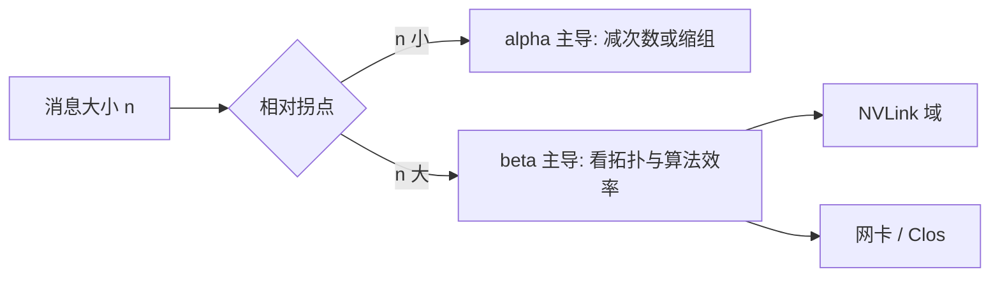

# 集合通信带宽模型

集体时间不是「字节除以网卡标称」。先付启动延迟，再按算法效率付有效带宽；小消息活在 $\alpha$ 区，大消息才摸到 $\beta$ 区。

<footer>—— Hockney 的 $\alpha$–$\beta$ 模型；集体算法分析见 Chan 等对 MPI 集合的经典整理</footer>

[上一课](/llm/nccl-algorithms) 给出了库如何选环和树。本课把选择变成**可算的时间**：给定 $n$ 字节、$N$ 卡、链路延迟与带宽，All-Reduce / All-Gather / All-to-All 各该落在哪一段屋顶线上。缺口是定量，不是再列算法名。[预训练通信](/llm/pretrain-comm) 写过 $T\approx\alpha+n\beta$；本课把 $\alpha$、$\beta$ 接到具体集体，并说明 busbw 与标称 Gb/s 差在哪。后课拓扑与拥塞处理 $\beta$ 不是常数的情况。

## 问题

网卡写 400 Gb/s，不等于 400 Gb/s 的梯度同步。集体算法有冗余与流水，有效带宽常写成 $\frac{N-1}{N}$ 一类因子；协议与 chunk 又吃掉一部分。更关键的是分区：消息小于某拐点时，时间几乎不随 $n$ 降，因为全是 $\alpha$——启动、同步、内核 launch、PCIe 门铃。张量并行的短 All-Reduce、MoE 小微批的 All-to-All，经常停在这个区。再买更胖的网卡，$\beta$ 变好，$\alpha$ 几乎不动，step 不变。

问题因此是：对每一种原语，写出 $T(n,N)$ 的主导项，并用 `nccl-tests` 的 busbw 曲线把拐点测出来。没有拐点，并行网格是拍脑袋。

busbw 是 NCCL 测试里按算法理想因子反推的「总线带宽」，用来和链路规格比。algbw 是 $n/T$。两者都要看：algbw 接近应用，busbw 接近硬件是否吃满。

## 方法

点对点：$T \approx \alpha + n\beta$，其中 $\beta=1/B$，$B$ 为该路径有效带宽（NVLink 一档，IB/RoCE 另一档）。

Ring All-Reduce：约 $T \approx 2(N-1)\alpha + 2\frac{N-1}{N}n\beta$。前项随 $N$ 涨，后项接近 $2n\beta$。大 $n$、中等 $N$ 时第二项主导，这是环「带宽最优」的含义。

Tree All-Reduce：跳数 $O(\log N)$，前项变成 $O(\log N)\,\alpha$，数据项通常差于环（根附近不能把体积摊匀），除非层次化把跨节点 $n$ 先除以每节点 GPU 数。

All-Gather / Reduce-Scatter：大约是 All-Reduce 数据项的一半，延迟项仍随算法的步数走。

All-to-All：数据项约 $(N-1)m\beta$（$m$ 为每对净荷），延迟项依调度是 $O(N)$ 或 $O(\log N)$。没有 $\frac{N-1}{N}$ 那种「加完变少」。

工程上：对每个进程组（TP / DP / EP）用真实消息大小跑微基准，标出拐点。TP 组应落在 [NVLink](/llm/nvlink) 的 $\beta$ 区或至少 $\alpha$ 可接受；DP 组允许跨节点，但要把 All-Reduce 与计算重叠，使暴露出来的 $T$ 小于层计算。EP 组若 $m$ 落在 $\alpha$ 区，先加微批或缩 EP 度，再升级网络。

## 机制

$\alpha$ 来自软件栈与同步：NCCL 内核启动、FIFO、跨节点 RDMA 握手、以及集体的全局同步波。多进程组并发时，$\alpha$ 会变差，因为门铃与完成队列互相干扰。$\beta$ 来自链路与争用：同一 NVLink 域里 TP 与另一组 All-Gather 抢注入，有效 $B$ 下降。模型里的 $B$ 必须是**该 step 同时在飞的集体之和**下的剩余，而不是空载规格。

层次化改变的是代入公式的 $n$ 与 $N$：节点内 $N_{\mathrm{local}}$、$B_{\mathrm{nvlink}}$；跨节点 $N_{\mathrm{nodes}}$、$n_{\mathrm{node}}=n/N_{\mathrm{local}}$、$B_{\mathrm{nic}}$。总时间是两段之和，不是用集群总卡数套一次环公式——那会严重高估跨节点环的 $\alpha$。

通信 dtype 进入 $n$。BF16 梯度相对 FP32 减半；FP8 再减。数值协议必须在所有 DP 副本对齐，见预训练通信课。模型里改 $n$ 之前，先确认这是配方允许的精度，不是网卡开关。

## 边界与工程取舍

$\alpha$–$\beta$ 忽略拥塞与丢包：它是空载或轻度负载的一阶模型。下一课起的轨拓扑与拥塞控制处理 $\beta$ 随时间变的部分。也不要把 GPU 核内归约时间漏掉：极小消息时，本地加与同步可能比链路更贵。

不要用峰值 FLOPS 去除通信时间来「证明」重叠成功。重叠成功的判据是：step 时间 ≈ 计算屋顶线，而不是通信公式的 $T$ 单独变小。公式用来决定并行维画在哪张图上，用来解释为何加带宽救不了 TP。

## 小结

- 集体时间 = 延迟项 + 数据项；拐点以下加带宽无效。
- 环 All-Reduce 数据项约 $2\frac{N-1}{N}n\beta$；All-to-All 没有归约减体积。
- 层次化要分段套公式，禁止用总卡数套一次环。
- 用 nccl-tests 的 busbw 曲线标定每个进程组的拐点。
- 出处：Hockney $\alpha$–$\beta$；Chan 等对集合通信的算法分析；NCCL 测试指标。
