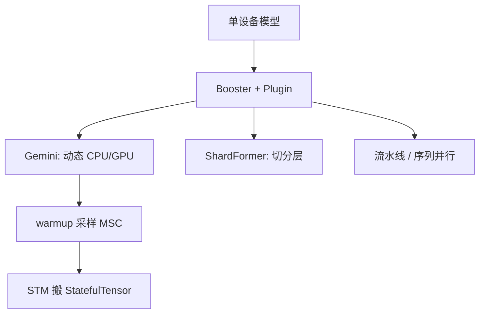

# Colossal-AI

    
把 1D 张量并行当成默认不够：在不同机器拓扑上，2D / 2.5D / 3D 切矩阵可以换通信体积；异构显存再交给 Gemini，而不是只提供另一套 ZeRO 配置文件。

    <footer>—— Bian et al., Colossal-AI: A Unified Deep Learning System For Large-Scale Parallel Training, arXiv:2110.14883</footer>

HPC-AI Tech 的 **Colossal-AI**（开源仓库 `hpcaitech/ColossalAI`）把自己定位成统一的大规模并行训练系统：多维张量并行、流水线、序列并行、数据并行，以及异构内存管理 **Gemini**（思路来自 PatrickStar，arXiv:2108.05818）。2021 年系统论文 2110.14883 是读它的起点；后来的 Booster 插件、ShardFormer、Gemini 动态卸载是同一条产品线上的接口演化。本篇写系统主张与论文里的切分家族，并标明：**当前主线文档已写明 2D/2.5D 等旧模块不再直接支持、计划并入 ShardFormer**——不要把 2021 论文的 API 当成 2026 年 `pip install` 的默认路径。不编造未写入论文或文档的「一张卡训 GPT-3」营销数；对比 DeepSpeed-Chat 的 15× 是对方论文的对照，不是 Colossal 自己的主结果。

## 问题

Megatron 式 1D [张量并行](/llm/tensor-parallel) 对 NVLink 友好，但激活仍常按完整序列驻留，通信是每层 All-Reduce。机器若是弱于 DGX 的以太网网格，或卡数刚好是平方/立方，1D 不一定是通信最优。学术界已有基于 SUMMA / Cannon 的 2D 切法、基于 2.5D 矩阵乘的深度维、以及 3D 立方切分：它们同时切输入、权重与输出，内存与通信公式随处理器网格变。需要一个系统把这些切法收成可切换的层实现，而不是让用户自己改集合通信。

第二问是少卡大模型。ZeRO-Offload 常把优化器与梯度**静态**划到 CPU：GPU 侧预算写死，一旦非模型显存（激活、碎片）涨一截就 OOM，即使主机 DRAM 仍空。Gemini 要动态地在 CPU–GPU 之间搬模型张量，用迭代的周期性先采样再调度。

### 多维张量切分是系统卖点

论文把 1D 之外的选项写成：

- **2D**（Xu 等）：$N$ 张卡排成方阵，形状 $[P,Q]$ 的张量切成 $[P/\sqrt{N},\,Q/\sqrt{N}]$ 的块，矩阵乘走 SUMMA/Cannon。激活与权重都切，内存更匀；通信模式与 1D All-Reduce 不同。
- **2.5D**（Wang 等）：$N=S^2\cdot D$，多一个 depth。$D=1$ 退化近 2D；$D\gt 1$ 用更多卡换通信。文档曾给出基于 ring 的带宽/延迟阶。
- **3D**（Bian 等）：立方切分；并非每个张量都有三维，实现上常对第一维切两次。

选择哪一档，应对齐机器拓扑：方阵网卡走 2D，有额外深度维再开 2.5D。流水线与数据并行仍可叠。序列并行另切激活的序列维。这是 2021 系统相对「只提供 Megatron 1D + ZeRO」的差异化。

最新 Colossal-AI 文档写明 2D/2.5D **当前版本不直接支持**，将并入 ShardFormer；旧用户看 ColossalAI-Examples。写实验记录时应写版本与插件名（`GeminiPlugin` 等），不要只写「开了 2.5D」。

## 方法

今日推荐入口是 **Booster + Plugin**，而不是 2021 论文里的 `colossalai.nn.layer.parallel_2p5d` 直接 import。

`GeminiPlugin`：ZeRO-3 语义加 chunk 与异构内存。适合「十亿到百亿、跨节点带宽尚可、千卡以下」一类文档描述的场景；文档也写明不支持本地梯度累积。`ShardFormer`：按配置把 Hugging Face 式模型改写成切分实现，承接未来的多维 TP。流水线、序列并行、混合精度作为正交开关。PatrickStar / Gemini 的两阶段：warmup 若干 step 用 MemStatsCollector 采样非模型显存；之后 StatefulTensorMgr 按采样结果搬张量，目标是减少 CPU–GPU 流量，而不是每步贪心。

相对 ZeRO-Offload 的静态划分，Gemini 的图景是：GPU 预算随激活波动时，把一部分模型块换出到 CPU（文档还提到 NVMe 作为存储层级的组成），避免「GPU 差一口气、主机闲着却崩」。代价是预热步的统计若不准，稳态会过度搬运。

### Gemini 与 ZeRO-Offload 的差别

Offload 把「哪些状态在 CPU」写成配置常数。Gemini 把张量标成有状态对象，按迭代相位决定驻留。warmup 必须发生在真实 batch 与激活检查点开关已经定下来之后；改序列长度却不重做采样，调度会按过期直方图搬错。chunk 粒度决定 All-Gather 次数与碎片：太大则峰值高，太小则启动税高——与 FSDP wrap unit 是同一旋钮，名字不同。

Gemini 不是新的并行维。数据仍按 batch 切，参数仍按 ZeRO 下标切。它不替代 2D TP 去加速单层 GEMM，只是让少卡在异构内存上活下来。宽矩阵仍要 TP 或近端带宽。

## 机制

2D/2.5D/3D 的正确性来自分布式矩阵乘：部分积在网格上广播或平移，数学上恢复 $Y=XW$。实现错误通常表现为某条网格维上少一次 reduce，logits 只有分片词表能学。1D Megatron 用一对 $f,g$ 就能讲完；2D 必须讲清 SUMMA 的面板广播顺序，调试更难。这是后来主线收缩到 Gemini + ShardFormer、把高维 TP 降为「将并入」的工程原因之一：维护成本高于 1D+ZeRO 对大多数用户的收益。

Gemini 的机制是把非模型显存当成外生扰动：激活检查点一开，GPU 空出一截，STM 可以把更多参数拉回；flash attention 一开，空出的可能是另一截。所以「Gemini 比 Offload 更能塞大模型」是条件句，取决于采样是否覆盖你的真实核。

### Booster / ShardFormer 之后怎么读旧论文

2110.14883 仍是引用多维 TP 公式的正确出处。复现 2.5D 应回到当时示例仓库或论文算法，而不是假设 `GeminiPlugin()` 已经打开 2.5D。EnergonAI 等推理侧项目、以及后续博客里的具体模型配方，要以对应文档为准，不要全部算进 2021 系统论文。DeepSpeed-Chat 文中相对 Colossal 的倍数，用的是对方选定的 RLHF 基线，不能反过来说 Colossal 预训练一定慢 15×。

## 边界与工程取舍

不要在没有方阵进程网格的作业上强开 2D。不要把「异构训练」理解成 Infinity 的 NVMe 流水已经默认打开——Gemini 文档以 CPU–GPU 为主，NVMe 是否启用看版本。检查点与插件、chunk、TP 度绑定。数值上，ZeRO 聚集顺序与 CPU Adam 不保证与纯 GPU Adam 比特一致。

Colossal-AI 与 Megatron-Core、DeepSpeed、TorchTitan 重叠在「能 3D 并行训 Transformer」。差异化曾经是高维 TP + Gemini；2026 年读代码应以插件矩阵为准，而不是以 2021 摘要为准。

出处：Bian 等 arXiv:2110.14883；2D/2.5D/3D 张量并行的分篇论文（Xu、Wang、Bian）；PatrickStar arXiv:2108.05818；Colossal-AI 文档 *Meet Gemini* 与 Booster plugins。禁止给未标注出处的「单卡 GPT-3」演示填造 FLOPS。

## 小结

- Colossal-AI 是统一并行训练系统：多维 TP、PP、ZeRO 式分片，外加 Gemini 动态异构内存。
- 2D/2.5D/3D 切分写在 2021 论文；当前主线以 GeminiPlugin / ShardFormer 为入口，旧 TP 模块可能需示例仓。
- Gemini 相对静态 Offload：warmup 采样 + 按迭代搬张量。
- 出处：arXiv:2110.14883；开源 hpcaitech/ColossalAI。
