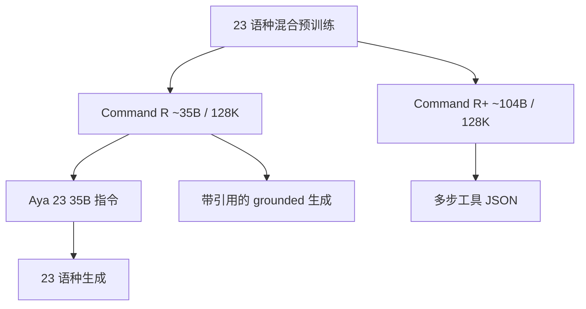

# Aya / Command-R+

Command R 系列为生产级 RAG 与工具调用而训：能根据给定文档片段做带引用的生成，并能把多步工具串成工作流；Aya 则把同一多语前置，用来试验「23 种语言上的深度」对「101 种语言上的广度」。

<footer>—— Cohere / Cohere For AI，Command R 发布说明与 Aya 23 技术报告，2024</footer>

Cohere 的企业叙事在 2024 年春天收成两条能下载权重的线。**Command R**（约 35B，2024 年 3 月）与 **Command R+**（约 104B，同年 4 月，8 月有 08-2024 权重更新）走检索增强与工具；**Aya 23** 的 8B / 35B 把 Command 系多语底座做成开放权重，覆盖 23 种语言。更早的 Aya 101 是另一条架构：面向 101 种语言的指令模型，许可更宽。本篇写清家族关系与 RAG 行为，不把后来的 Command A 倒填进来，也不给 Command R 编造不存在的 arXiv。

## 问题

通用聊天模型把文档糊进上下文，不一定会引用，也不一定按企业模板调用工具。生产 RAG 需要三件同时成立：长窗口装得下多段检索结果、生成时标出 **grounding span**（引用片段）、以及工具失败后还能多步重试。Command R 要把这三件写进后训练，而不是只靠提示词「请列出资料来源」。R+ 的问题更进一步：单步工具不够时，能否在同一对话里规划、调用、观察、再调用。

多语是第二条轴。Aya 101 用广度换覆盖；许多业务其实只需要十几种工作语言上的生成质量。Aya 23 明确做深度实验：预训练混合含 23 种语言，35B 档是 Command R 的继续微调。若深度赢了，开放权重里「少语种、同族底座」会比「101 语、另一架构」更适合那些语种上的产品。

### 不要把 Aya 101 与 Aya 23 写成同一个解码器

Aya 101（Üstün 等，2024）覆盖 101 种语言，是 Cohere For AI 的大规模多语指令项目，权重 Apache 2.0。Aya 23 技术报告写明：23 是深度对广度，底座是 Command 系解码器，35B 由 Command R 再微调而来；许可是 **CC-BY-NC** 加可接受使用政策，与 101 不同。词表约 256K。报告给出 8B 与 35B 的层数、隐宽与头数表；实现以开源配置为准，本文不把第三方博客里互相冲突的 GQA 头数写成定理。

Command 权重面向研究与非商用下载；商用走 Cohere API 或另行授权。不要把 CC-BY-NC 的 R+ 与 Apache 的 Mistral 7B 放在同一句「开源可商用」里。

## 方法

Command R / R+ 是优化过的解码器 Transformer，上下文 **128K**。模型卡强调：在给定文档列表上做 grounded generation，回复里插入指向片段的引用；该行为由监督微调与偏好微调、加上**必须遵守的提示模板**训出来。偏离模板，引用率会掉。工具方面，R 档官方定位为更简单的 RAG 与单步工具；R+ 定位为复杂 RAG 与**多步工具**（一次生成 JSON 动作列表，执行后再进入下一步）。08-2024 更新声明在同样硬件上提高吞吐、降低延迟，并加入可调的安全模式；能力叙事仍是 RAG + 工具，不是换骨干。

### Aya 23 与 Command 的衔接

23 种语言与 Command 预训练混合对齐，包括英语、中文、日语、韩语、阿拉伯语、法语、西班牙语、葡萄牙语、德语、意大利语、俄语等官方列出的集合（以报告与模型卡的完整名单为准）。Aya 23 在这些语种的判别与生成任务上，报告对照 Aya 101 以及当时的 Gemma / Mistral / Mixtral。合成多语指令曾借助 Command R+ 生成——报告写明这是条款下的专项例外，一般用户不能用 API 输出来训竞品。

## 机制

引用不是解码器里多了一层指针网络，而是后训练把「先读片段、再在答句里打 span」变成高频格式。检索器仍在模型外：相关性差的片段会被一本正经地引用，这是 RAG 的老问题，grounding 只保证**溯源格式**，不保证检索正确。128K 用来容纳多文档，注意力仍是二次的；企业把整库塞进窗口会先打爆显存，该切块还是要切。

多步工具的机制是对话状态机：模型输出动作，环境返回 tool 结果，再进入下一步。R+ 为之做了专门训练，但环境模式（超时、空结果、工具改名）一变，仍会循环或幻觉参数。JSON 模式与 [function calling](/llm/function-calling) 一样，属于约束解码与模板的配合，不是 104B 参数自带沙箱。

Aya 23 的深度机制是容量分配：同样 35B，少语种意味着每个语种见到更多 token 与更好的指令覆盖；101 语则把容量摊到长尾文字。因此 Aya 23 赢在 23 语种表内，并不自动翻译成「全球 101 语都更好」。8B 档把同一故事收到可单卡的体积，质量按报告表低于 35B。

评测语言集合：R+ 模型卡写训练 23 语、评测 10 语。不要把「支持 23 语」理解成 23 语都达到同一安全与帮助性门槛。未列入的语种可能能生成，产品上仍要当未覆盖。

### 工程上模板即模型的一部分

RAG 与工具的提示词、文档序号、引用标记是权重的条件分布的一部分。换成自创 XML 工具标签，等于把模型从训练域拉开。迁移到自建网关时，应先复现官方模板，再谈换检索器。8 月权重与 3–4 月首发在延迟与安全模式上有差，回归要用同一版本号。

## 边界与工程取舍

Command 不是通用知识的参数量冠军：对照同期 Llama 3 70B，企业选它是因为引用与工具，不是因为 MMLU 全面支配。知识截止与幻觉仍在；引用可能指向被检索到的错误 PDF。Aya 101 若需要真正的长尾语种，仍不可用 23 代替。后续 Aya Expanse、Command A 是新后训练与新旗舰，架构与许可以当时卡片为准，不写进本篇规格表。

不要给 Command R / R+ 伪造 arXiv。可引用的是 Cohere 官方文档与模型卡、Aya 23（arXiv:2405.15032），以及 Aya 101 的 arXiv:2402.07827。

Hugging Face 上的仓库名从 `CohereForAI` 迁到 `CohereLabs` 一类组织名，下载时核对 03-2024 / 08-2024 后缀。同名 `command-r` API 别名会随退役策略改指向，自托管应钉检查点哈希。

## 小结

- Command R（~35B）与 Command R+（~104B）是 Cohere 2024 年的 128K 开放权重，针对带引用 RAG 与工具调用。
- R+ 侧重多步工具与更重的 RAG；许可 CC-BY-NC，商用走官方渠道。
- Aya 23（8B/35B）在 23 语种上做深度，35B 基于 Command R；Aya 101 是 101 语种、不同许可与设定。
- 引用与工具依赖官方模板；长窗口不替代检索质量。
- 出处：Cohere Command R / R+ 模型卡与文档；Aryabumi 等，*Aya 23*，arXiv:2405.15032；Aya 101，arXiv:2402.07827。
