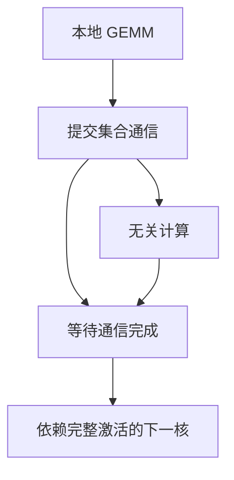

# 计算通信重叠

集合通信只要能与无关的 GEMM 同时飞，墙上时间就接近两者的最大值而不是之和；做不到，张量并行的 All-Reduce 就会把流水线刚省下的气泡又填回去。

<footer>—— 据 Shoeybi 等 Megatron-LM 与 Korthikanti 等对激活重计算、序列并行中的重叠讨论整理</footer>

[上一课](/llm/dualpipe)在流水轴上用第二套流量遮挡跨阶段传输。层内的 [张量并行](/llm/tensor-parallel) 仍在每次线性层后做 All-Reduce / All-Gather，默认会挡住下一层 GEMM。本课不重讲列切行切配对。缺口是把通信提交到另一条 CUDA stream（或等效的通信加速器路径），与本地计算重叠，以及哪些依赖让重叠非法。Ulysses 会改序列维通信模式；本课先处理通用的「藏通信」。

## 问题

TP 的通信体积随 $b\times s\times d$ 涨，长文档上采样把 $s$ 推高后，即使 GEMM 很胖，All-Reduce 仍可能暴露。若实现是同步 NCCL 再启动下一次矩阵乘，墙上时间是计算加通信。重叠要求：已发布的通信不与正在写的同一块激活冲突，且有足够的独立计算可盖住延迟。Korthikanti 等人在减激活重计算的工作里，把序列并行的通信与计算重叠写成系统问题，而不是开关一个 `async` 标志。

非法重叠的典型错误：下一层还要用这次 All-Reduce 的结果，却提前开算，静默数值错误。必须用事件依赖，而不是靠「通常挺准」。

### 能盖住的只有独立工作

流水的 $W$、下一微批的无关层、MoE 里尚未 dispatch 的本地路由，都可以当遮挡。若模型太浅、微批太小，没有独立工作，重叠百分比是零。这与 DualPipe 同一逻辑：并发度来自日历，不是来自驱动版本号。

梯度 All-Reduce（数据并行）与激活 All-Reduce（张量并行）可重叠的对象不同。前者常与下一层反向 GEMM 重叠；后者与同一层的后续计算或下一层前向重叠。配置里不要共用一个 `overlap` 布尔。

## 方法

对每个集合通信标注生产者缓冲区与消费者内核。能重叠的，post 通信后立刻在计算 stream 上跑不依赖该缓冲区的内核；消费者内核 wait 通信完成。Megatron / TransformerEngine 一类实现把 MLP 的 All-Reduce 与邻近 GEMM 排好。能拆的通信（reduce-scatter / all-gather 对）按块流水，使第一块数据回来就先算，不必等整张表。

测量要用按层的 profiler，而不是只看 MFU。重叠失败时 MFU 仍可能好看（GEMM 很满），墙上时间却差一截。应报通信暴露时间。

### 与精度、融合内核

融合的 LN+GEMM 若把本该当遮挡的小核吃进大核，重叠窗口消失。FP8 等低精度可能缩短 GEMM、暴露通信。重叠策略要随精度与融合开关重测，不能抄一份 1F1B+BF16 的日历到所有配方。

CPU 侧提交太慢会让 GPU 假重叠：通信 kernel 尚未 launch，计算已经跑完。需要 CUDA graph 或固定提交顺序，那是加载与图捕获的交界，后课会碰到。

## 机制

在依赖图上，通信边与计算边若无数据冲突，硬件可以并发。墙上时间 $\approx \max(T_{\mathrm{comp}},T_{\mathrm{comm}})$ 加上无法重叠的串行残余。TP 度升高，$T_{\mathrm{comm}}$ 涨、$T_{\mathrm{comp}}$ 因分片下降，重叠从「锦上添花」变成「能否扩展」的条件。这与专家粒度课里通信-计算比是同一张账，只是通信原语从 All-to-All 换成 All-Reduce。

## 边界

重叠不减少通信字节，带宽不够时 $\max$ 仍由通信决定。拓扑差（跨机架当 TP 组）会让 $T_{\mathrm{comm}}$ 大到无法遮挡——应把 TP 留在 NVLink 域。下一课 Ulysses 把长序列的注意力激活切开，通信模式变成按序列分片的 All-to-All，重叠对象又变。

## 小结

- 本课不重讲 TP 切片；只补合法地把集合通信与无关 GEMM 并发。
- 依赖必须用事件表达；非法重叠是静默错。
- 微批、融合、精度会吃掉可遮挡窗口；用暴露时间而不是只看 MFU。
- 不减少字节，只改墙上时间的加法变最大值。
- 出处：Shoeybi et al., Megatron-LM；Korthikanti et al., *Reducing Activation Recomputation in Large Transformer Models*。
