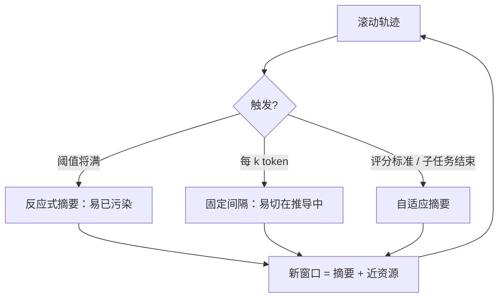

# Compaction 摘要压缩

把快要顶满窗口的对话蒸馏成高保真摘要，再用摘要重新开一个窗口，使代理能在尽量小的性能损失下继续。

<footer>—— Anthropic Applied AI，Effective context engineering for AI agents，2025-09-29</footer>

长程代理的轨迹由思维、工具调用与观察叠成。窗口是硬顶，更早到来的是 [上下文腐烂](/llm/context-rot)：过期工具输出与错误分叉会锚定后续生成。Anthropic 把 **compaction** 定义为：在接近窗口上限时，把历史摘要成较短文本，**用摘要重启上下文**，并常保留最近访问的资源。Claude Code 的实现是把消息史交给模型，保住架构决策、未解决缺陷与实现细节，丢掉重复的工具结果与闲聊；压缩后再带上最近访问的约五个文件继续。Li、Zhang、Khashabi 等的 SelfCompact（arXiv:2606.23525）指出：工业系统多用 **固定 token 阈值或固定间隔** 触发，不顾轨迹结构，可能在推导中途把已核实的事实抹掉。本篇写摘要式压缩的合同与触发时机，结构化外存见 [结构化记忆压缩](/llm/structured-memory-compaction)，检索式见 [检索式上下文压缩](/llm/retrieval-based-compaction)。

## 问题

固定间隔压缩（每 $k$ 轮或每 $k$ token）与反应式压缩（直到窗口将满）在内容上无知。前者可能在「四条事实刚核实完、尚未合成答案」时开火，摘要若写丢一条，后续只能猜——SelfCompact 图 1 用 BrowseComp 的 Medusa mushroom 题说明：固定间隔把四条已核事实擦掉，模型猜成 Morel。后者把腐烂 token 留到最后一刻，中间许多步已经被垃圾条件污染。两种失败不对称：适时压缩丢掉的是已兑现价值的过程；错时压缩丢掉的是仍在用的中间结果。

未提示的模型也不擅长判断「自己的上下文是否在烂」。SelfCompact 把这写成元认知缺口：只给压缩工具，开源模型调用时机不均，有的乱压，有的从不压；只给一段评分标准而没有可调用的动作，则无法执行。需要 **工具 + 评分标准** 一起出现。Anthropic 则从产品侧强调：压缩提示要先最大化召回（复杂轨迹里该留的都留下），再迭代提高精度（删掉事后证明无用的过程）。过猛的压缩会丢掉当时看起来琐碎、后来才关键的约束。

### 摘要与清理工具结果不是同一刀

Anthropic 把最轻的压缩写成 **tool result clearing**：工具一旦在很深的历史里调用过，原始长输出往往不必再出现，调用记录可以留。这是删除可再获取的字节，不是改写。摘要压缩会改写：把多轮推理收成段落，错误也可能被写进「事实」。API 侧后来提供阈值触发的 `compact` 内容块（cookbook 中的 `compact_20260112` 一类），在摘要边界上处理 tool-use 配对。工程上应先上清理，再上摘要，因为清理可逆（再调一次工具），摘要不可逆。

压缩不是加长窗口的替代品，也不是免费的记忆。它把过程变成有损快照。快照里没有的指针、ID、未提交决定，下一窗口就不会再「记得」——除非另有外存。Claude Code 保留最近文件，正是承认摘要覆盖不了工作区状态。

## 方法

Anthropic 配方可以收成：序列化消息史 → 专用摘要提示 → 新窗口 = 系统指令 + 摘要 + 最近资源。提示应明确列出必须保留的类型（目标、约束、决策、未决 bug、关键路径）与必须丢弃的类型（重复 grep 输出、已合并的失败尝试细节）。用真实复杂轨迹调提示：先查漏，再查冗。子代理架构是另一种压缩：子代理消耗数万 token 探索，只回传 1k–2k 的蒸馏结果，主代理窗口保持干净；那是空间隔离，不是时间上的摘要重启，但都在减 token。

SelfCompact 把触发权交回模型。脚手架周期插入评分标准探测（间隔 $N$ 步），模型输出 `COMPRESS` 或 `CONTINUE`；若压缩，再插入摘要提示，用 **同一个模型** 写摘要，从摘要前缀继续。评分标准规定：子任务已收束或轨迹在收敛时开火；推导中途或卡住时抑制——卡住时压缩反而可能丢掉诊断线索，原文选择抑制，与「卡住就重启」的产品直觉不同。六个基准、七个模型上，相对无摘要基线，竞赛数学最多 +18.1 分，代理搜索 +5–9 分，单题费用低 30–70%，并匹配或超过固定间隔摘要。消融：去掉评分标准后工具使用不稳。代码在 `tianjianl/selfcompact`。

### 高保真要保住什么

摘要的评价不能用普通 Rouge。代理需要的是 **决策与约束的可继续性**：接口名称、复现命令、已排除的假设、尚未跑的测试。工具 JSON 全文、过时的文件片段、重复的自我鼓励，优先删。SelfCompact 强调按「已关闭的推理单元」切：一条事实被核完再压，四条核完再合成。数学推导中途的部分式子若被压成「正在求 x」，下一步可能符号对不上。这是结构敏感，不是长度敏感。

## 机制

压缩改变的是下一轮的条件前缀。从信息论看，摘要是对历史的有损编码，解码器是同一个 LLM。编码失败的典型模式有三：幻觉（摘要写入从未发生的决策）、删除（丢掉一条约束）、冻结（把已过期的猜测写成定论）。评分标准不能消除幻觉，只能改善 **何时** 编码。内容质量仍取决于摘要提示与模型。因此生产系统常把不可从摘要恢复的东西另存：待办列表、`NOTES.md`、记忆工具目录——那是下一篇的结构化记忆，不是本篇的窗口内摘要。

固定阈值的吸引力是可运维：95% 窗口就压，Claude Code 一类产品如此。代价是与轨迹正交。自适应触发降低错时风险，但引入一次额外前向（探测）。SelfCompact 用 KV 前缀复用探测与摘要，使额外成本主要是短生成。探测间隔 $N$ 仍是超参：$N$ 太大接近反应式，$N$ 太小变成每步问一次「要不要压」。

把压缩写成用户命令 `/compact`，是把元认知外包给人类。SelfCompact 证明一段短标准可以在无训练条件下补上部分判断。二者可以并存：自动策略负责常规边界，人工压缩负责「我知道刚才那段推理全错、请丢掉」。

### 与腐烂、中间丢失的关系

腐烂说长度与污物会伤质量；中间丢失说位置会伤检索。摘要同时缩短长度、丢掉中段污物，并常把「还重要的信息」放到新窗口的前部或紧邻生成点，客观上缓解两条曲线。它不修复模型的位置癖好：摘要本身若写得很长，读者仍可能丢掉摘要中部。所以摘要要短，且把当前目标放在末尾。

## 边界与工程取舍

Anthropic 博文是工程立场，不是对照实验；引用时写清「产品经验 + 原则」。SelfCompact 是训练免费脚手架，数字绑在所列数学与搜索基准、所列开源模型；不要把 +18.1 写成任意代理的保证。阈值压缩在对话型、需要语气连贯的任务上可能更合适；评分标准压缩在可分段的解题与搜索上更合适。法律、医疗等需要逐字引用的域，摘要会破坏可审计性，应改用摘录式压缩或外链原文。

压缩与子代理不要重复做同一件事：子代理已经回传过蒸馏，主轨迹再定期把子代理摘要摘要一次，会二次失真。工具清理应先于摘要，以免摘要模型去「总结」一篇即将被删除的 HTML。

评测压缩必须看下游任务，而不是摘要流畅度。SelfCompact 用最终答题与费用；Claude Code 用能否继续改同一仓库。用人工读摘要打分，会偏好好看但丢掉复现命令的段落。

## 小结

- Compaction 将接近上限的轨迹有损蒸馏后重启窗口，是长程代理的第一杠杆。
- 固定阈值与固定间隔对轨迹结构无知，可能抹掉仍在使用的中间结果。
- 最轻的一刀是清理可再获取的工具结果；摘要会改写，错误可被冻结成「事实」。
- SelfCompact 用压缩工具加评分标准做自适应触发，数学上最多 +18.1 分、搜索 +5–9 分，费用低 30–70%。
- 摘要提示应先保召回再削精度；当前目标放在新窗口末端，并另存不可恢复状态。
- 出处：Anthropic，*Effective context engineering for AI agents*，2025-09-29；Li 等，*Self-Compacting Language Model Agents*，arXiv:2606.23525。
