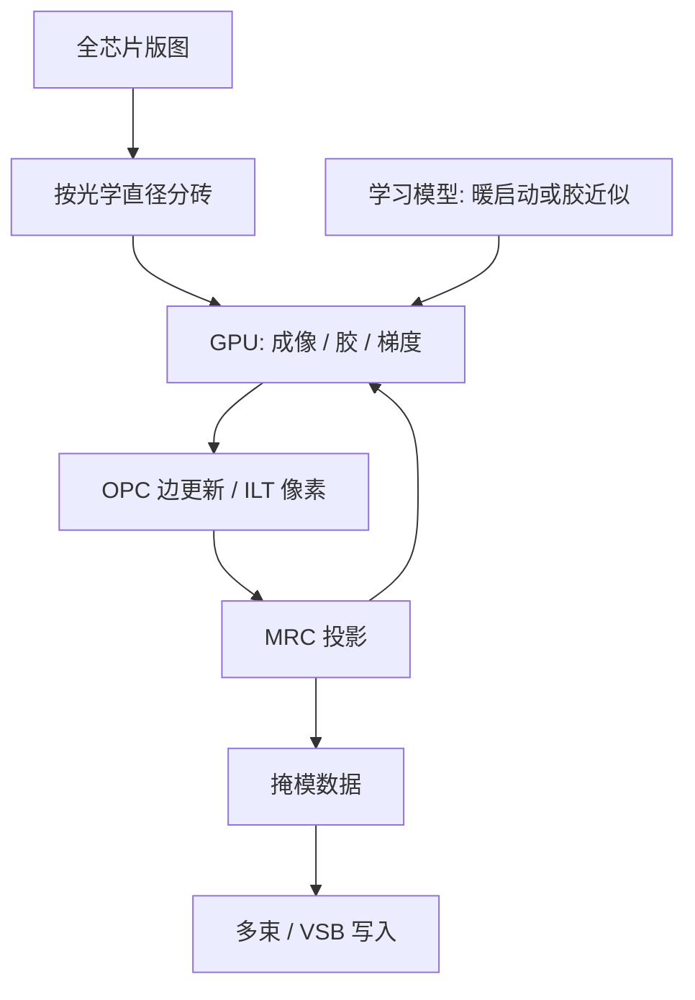

# GPU / AI 加速 OPC（cuLitho 等）

计算光刻是半导体里最重的高性能计算负载之一：一张掩模的光学邻近修正可以消耗数万 CPU 核时。把同样的物理模型搬到 GPU 上，日历才能跟上班次。

<footer>—— 对照 NVIDIA cuLitho 与代工厂公开的计算光刻加速论述</footer>

[OPC](/llm/opc)、[SMO](/llm/smo)、[ILT](/llm/ilt-curvilinear) 的前向核是反复求空中像与抗蚀剂轮廓。全芯片上这是 $10^{12}$ 量级的像素—衍射运算，历史上靠 CPU 农场按周跑。节点越紧、EUV 掩模 3D 越贵、曲线变量越多，计算量比晶体管密度涨得更快。NVIDIA 与代工厂、EDA 合作的 cuLitho 一类栈，把成像与优化核映射到 GPU：目标不是换一套更糙的模型，而是让全芯片 ILT 和隔夜 OPC 变成可排产的工序。AI 另开一轨：用学习模型逼近胶轮廓或给逆问题暖启动，但量产仍要物理模型收口。

## 问题

计算光刻的墙有三块。时间：TAPOUT 到回片的日历里，OPC 不能占掉一截不可预测的周。精度：加速若靠降采样或丢掉掩模 3D，EPE 会把工艺窗口吃掉，加速无意义。规模：单层全芯片加扰动（剂量、焦点、掩模误差）是参数扫描，CPU 线性加核很快碰到机房与电费。EUV 之后前向更贵（多层膜、斜入射），ILT 又要梯度，需求从「能跑」变成「能在班次内跑完」。

传统 CPU 实现把 clips 分包到核上，成像核的算术强度其实适合 GPU：TCC 卷积、厚掩模近场、轮廓提取，都是规则网格上的密集运算。问题是软件栈：EDA 与代工厂的校准模型、MRC、数据格式绑在 CPU 流水线上，不是把 CUDA 核写出来就结束。

### 加速必须保持同一物理合同

把网格加粗一倍可以立刻「快四倍」，那不是 cuLitho 要卖的东西。合同是：同一套光学与胶模型、同一套 PV-band 指标，墙钟下降一个数量级。任何 AI 替代若不能在计量点上对上物理模拟，就只能当提议器，不能当签核器。

不要把「GPU 光刻」理解成用生成模型直接画掩模。cuLitho 公开表述的重心是物理计算光刻的 GPU 化。学习模型可以加速或初始化，签核仍落在校准过的成像上。

## 方法

GPU 路径把场切成与片上内存匹配的砖块，在砖内做光学传播与胶模型，砖间按光学直径交换晕区，避免邻近被切开。SMO/OPC 的迭代在 GPU 上更新边或像素，减少往 CPU 搬轮廓。ILT 的伴随成像与前向共用同一套传播核，梯度不再是CPU 上的二流实现。NVIDIA 公开的合作图景是：代工厂提供模型与产线约束，EDA 把流程接进 GPU，硬件提供吞吐。

AI 方法大致三类。端到端：图像到掩模，难保证 MRC 与窗口。算子替代：用网络近似抗蚀剂或蚀刻偏置，物理光学仍精确算，这是最容易签核的。暖启动：网络给出接近的曲线或 SRAF，物理 ILT 少迭代几轮。量产更可能是后两类。无论哪类，训练数据必须覆盖剂量焦点角与层别，否则网络会背下某一层的指纹。

### 全芯片、热区与隔夜窗

工程切分是：常规 OPC 全芯片走 GPU 以压缩日历；ILT 先热区，算力富余再扩层。隔夜窗（一次班次内出齐一层）是真正的产品指标，比峰值 TFLOPS 重要。数据准备、[多束位图](/llm/multibeam-mask-writer) 与 GPU 成像若不同步，GPU 只会提前把队列堆到掩模厂门口。

## 机制

空中像计算在 discrete 上接近卷积或特征分解后的乘加，算术强度高，吃得满 Tensor Core 或等价矩阵单元。瓶颈常在：不规则多边形光栅化、MRC 投影、以及与 CPU 侧网表/分层的往返。成功的加速是把「可规则化的物理核」留在 GPU，把「稀疏离散约束」做成能融合的投影，而不是整条 EDA 流程无脑搬。

AI 替代胶模型之所以诱人，是因为胶与蚀刻的紧凑模型本就是拟合物，见 Mack 对抗蚀剂模型层次的划分：它们从来不是第一性原理。用网络拟合更多计量，只要在签核域内插值、在域外拒绝，就能降前向成本。危险是外推：新胶、新硬掩模、新随机配方，网络会给出看起来光滑的错轮廓，ILT 会把错当目标去反演。

计算光刻的「正确」以晶圆计量为准，不以 GPU 与 CPU 的比特一致为准。浮点顺序不同导致的亚纳米差，要用 EPE 分布衡量，而不是要求逐像素复现 CPU 参考。

### 与工厂日历的耦合

加速改变的是迭代次数预算：以前只能做两轮 OPC 的层，现在可以做鲁棒 ILT。收益应体现在窗口与热区数量，而不是只报「快 40 倍」。倍数依赖层别、是否 EUV 3D、是否曲线；把某一演示倍数写进所有层的计划，会在最重的层上再次超期。

## 边界与工程取舍

GPU 不降低模型校准的实验成本，也不消除随机效应：均值轮廓算得再快，缺失孔仍要剂量与 [胶化学](/llm/euv-resist)。出口管制与机房功耗会限制谁能建这种农场；计算光刻能力会像 EUV 机台一样成为稀缺资本，而不只是软件许可证。

EDA 三家与代工厂各有自己的 GPU 或加速路线，cuLitho 是其中被公开最多的名词，不是物理上的唯一解。评估应对齐：同一层、同一模型、同一 EPE，比较墙钟与窗口，而不是比较新闻稿倍数。AI 若进入签核路径，要有域外检测，避免逆问题把幻觉刻进掩模。

引用 cuLitho 或同类加速时写清：加速的是 OPC、ILT 还是 SMO，是否含掩模 3D，对比基线是多少 CPU 核。只报「四十倍」而不报工作负载，无法规划产能。

## 小结

- 全芯片 OPC/ILT 是规则网格上的重计算，适合 GPU；日历约束比峰值算力更硬。
- 加速合同是同一物理模型下的墙钟下降，而不是加粗网格。
- AI 宜做胶近似或暖启动，签核仍用校准成像；端到端生成难进量产。
- 分砖晕区、MRC 与 CPU 往返决定实际倍速，不只是 TFLOPS。
- 加速必须与多束写入、数据准备同一张产线表。
- 收益应落在工艺窗口与热区，而不是演示倍数。
- 出处：NVIDIA cuLitho 公开材料；Mack 光刻模型层次；代工厂计算光刻公开表述。
