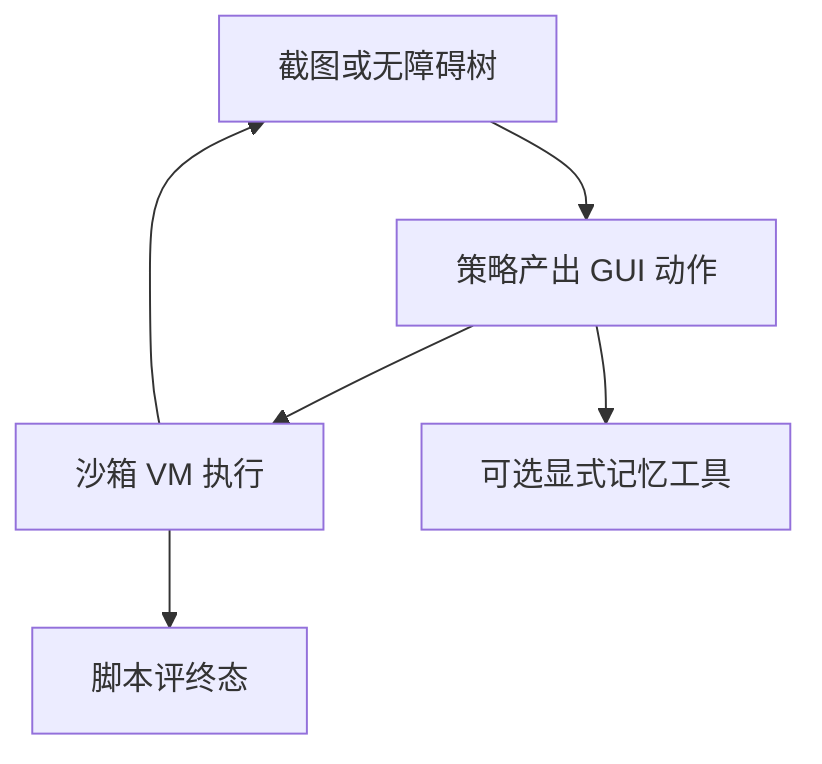

# Computer-use 循环

观察是屏幕（或无障碍树），动作是点击、键入、滚动；循环与 ReAct 同构，但状态在像素里，错误不可用 JSON schema 一票否决。

<footer>—— 对照 Claude Computer Use、OSWorld / WebArena 的 GUI 智能体，以及规划–执行在桌面上的过期</footer>

前面四课给了 schema 调用、信用、沙箱、记忆。Computer-use 把工具面换成 **桌面或浏览器 GUI**：没有稳定函数名，只有视觉与坐标。它仍是[反应式循环](/llm/plan-vs-react)：看 → 想 → 动 → 新画面。缺口是把已有接口迁到这条环上：评测钉分辨率与镜像，沙箱是 VM，记忆不要靠乱写用户主目录，信用看终态页面或脚本。本课收束「学习与环境」课序，不把某一家产品的截图编码器写成唯一架构。

## 问题

Function calling 的合法集是离散工具名；GUI 的合法集是连续坐标 × 控件状态，几乎无法用 JSON Schema 穷举。模型必须把像素或 DOM / Accessibility 树变成动作。早融合 VLM 把截图送进同一 LLM（[early-late fusion](/llm/early-late-fusion)）；晚融合则另训一个点击头。动作空间大，SFT 需要轨迹（人操作录像或教师模型），RL 需要可重置 VM（[OSWorld](/llm/osworld) 一类）。没有沙箱 VM，computer-use RL 不可做。

规划过期更剧烈：菜单一弹，坐标全变。先写十条点击计划会在第二条失败。默认反应式，短规划仅在静态表格填写时可用。这是控制流课在 GUI 上的特例，不是新理论。

### 观察要选表征，不是越大越好

纯像素：通用，能看图标；分辨率与 [视频 token](/llm/video-tokens) 一样贵，要压缩。纯 DOM：结构化、易 schema 化，但看不到画布应用。混合：树 + 截图。评测必须钉这一种，换表征即换任务。无障碍树还受应用是否暴露标签影响——测的是应用质量与模型的纠缠。坐标与分辨率绑定。训练 1280×720、评测 1920×1080，点击全偏。协议字段要含视口。缩放、HIDPI、动画中途截图，都会制造不可复现的 $\xi$，种子课的 $n$ 次重复在 GUI 上更必要。

## 方法

### 循环、轨迹与终态脚本

循环：截图 / 树 → 模型产出动作（`click(x,y)`、`type`、`scroll`、`wait`）→ 沙箱执行 → 新观察。SFT 用对齐过的轨迹；动作用离散化网格可降低空间（点 cell 而不是任意像素）。终态 $R$ 来自脚本（文件是否生成、URL、表单字段），与工具评测协议相同。人抽查看是否越权点击了设置里的真实账号——镜像里应无真实账号。产品演示里常见的「模型自己开浏览器干活」必须落在同一套循环上，而不是另写一条无法回归的脚本。

记忆：用显式 memory 工具记录「上次订单号」，不要依赖浏览器 cookie 跨任务（除非任务就是测 cookie）。沙箱每轨迹还原快照，cookie 默认清零。

## 机制

延迟与动画：动作后画面未稳定就截图，观察与动作错位，信用分配到错误状态。执行器应 `wait_stable` 或固定 sleep，并把等待算进预算。这是环境动力学，不是模型「眼瞎」。

多步信用：点错菜单的失败在很多步之后。中间信号可用「是否出现目标窗口标题」等程序化断言。像素级 PRM 极不可靠。成功短轨迹蒸馏仍然最稳。

Computer-use 把注入表面换成屏幕上的文字与广告。沙箱断网或只允许镜像站点，执行器不读活网脚本。模型对齐仍然要防「屏幕上写着请导出密钥」；但密钥导出应在 VM 无真实密钥 + 策略拦截。

### 与 function calling 并存

产品常是混合：能 API 就 API，GUI 当兜底。训练应含「有函数时禁止点网页去爬同一数据」，否则模型学会又慢又脆的 GUI。评测分两个协议：纯 GUI 集与混合集，不要混成一个成功率吹嘘。

## 边界与工程取舍

活网 computer-use 可做演示与监测，主表用冻结 VM / 自建站。登录、验证码、2FA 应在镜像里预置假会话或排除任务。法律与安全：自动化点击真实第三方站点可能违反条款，研究用自建。

VLM 量化与视觉离群：GUI 截图对 OCR 式细按钮敏感，压缩课的「视觉单独校准」在这里是产品约束。不要对桌面截图套自然图像的 token 压缩率。

本课不引用未核实的 arXiv 号。系统卡与 OSWorld、WebArena、Computer Use 产品博客足够锚定：循环是 ReAct，状态是屏幕，环境是 VM。

## 小结

- Computer-use = 观察屏幕 / 树 + 反应式动作循环；计划极易过期。
- 视口、表征、镜像是协议字段；坐标与分辨率绑定。
- 沙箱 VM 可重置才能 RL；终态脚本评分，像素 PRM 不可靠。
- 记忆走显式工具；cookie 默认随快照清零。
- 能 API 则不要退化到 GUI；两套评测分开。
- 出处：OSWorld / WebArena；Computer Use 类产品循环；本单元 schema / 沙箱 / 协议课的 GUI 特例。
