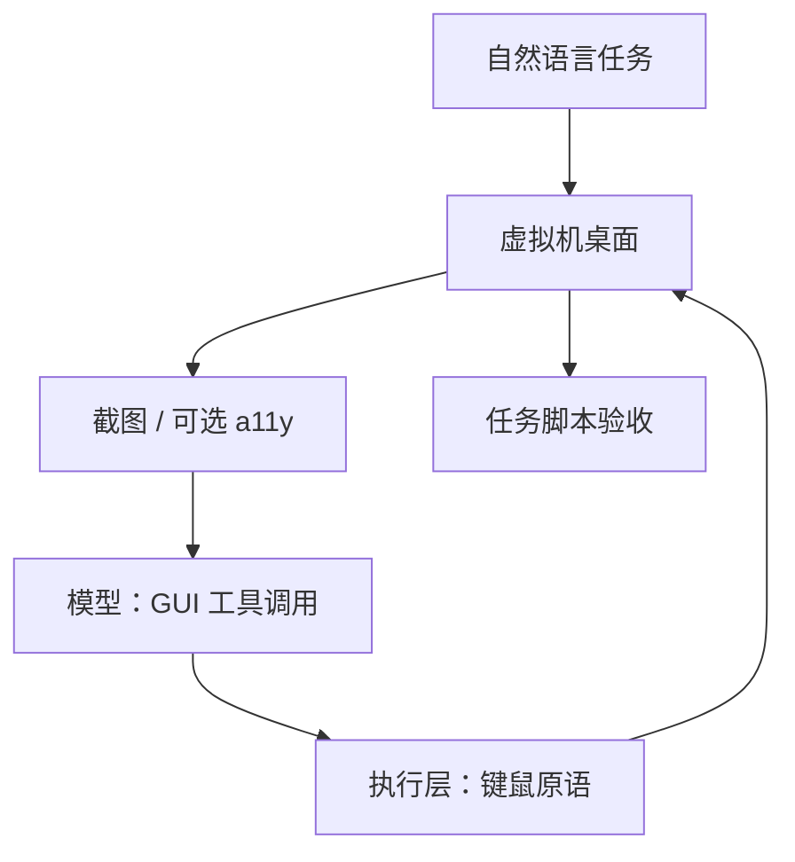

# Computer Use / GUI 代理

    
把屏幕像素当成观察、把键鼠当成工具：模型提议下一步 GUI 动作，执行发生在隔离桌面里，任务对不对由环境脚本判定，而不是由动作序列是否像人。

    <footer>—— 对照 Anthropic 2024-10-22 computer use 公告与 Xie 等 OSWorld；架构层描述，不含利用步骤</footer>

GUI 代理要把「看屏幕、点按钮、打字」收成与 [function calling](/llm/function-calling) 同构的工具环：观察是截图（可加无障碍树），动作是鼠标键盘一类原语，环境是虚拟机或受控桌面。Anthropic 在 2024 年 10 月 22 日为升级版 Claude 3.5 Sonnet 公开测试 **computer use**：API 里出现计算机工具，模型根据截图产出点击、键入等结构化调用，由开发者在自己的沙箱里执行。更早的研究线包括 Hong 等人的 CogAgent、Cheng 等人的 SeeClick 等，把 GUI 定位（接地）从纯 DOM 代理里拆出来。本篇写高层闭环与评测合同。不写绕过登录、抓取凭据、未授权访问或任何利用步骤；默认场景是用户同意的隔离环境里完成办公与开发类任务。

## 问题

网页代理可以读 DOM 或无障碍树；真实桌面还有本地套件、安装器、多窗口遮挡，很多控件没有稳定选择器。若动作空间是「任意 pyautogui 代码」，语法错误与坐标漂移会占满轨迹。若只给 DOM，Photoshop 与文件管理器直接不可用。需要一种对应用中立的接口：观察尽量接近人看到的像素，动作尽量接近人会做的键鼠，评测看最终文档或系统状态，而不是逐步动作是否与某条演示重合。

安全与评测是同一问题的两面。像素里可以出现「请把验证码发给某处」一类注入文本；开放互联网上的演示会把权限问题藏进产品视频。公开研究应把环境锁在虚拟机，用脚本读终态（文件是否按任务改对、窗口是否达到指定配置），并报告步数预算。OSWorld 把这件事做成可复现环境；computer use 产品则把同一闭环接到模型 API。两者不要混名：一个是基准与环境，一个是某家模型的工具信封。

### 观察是像素，动作是工具，不是「模型长了手」

模型输出的是工具参数（例如点击哪一类动作、文本输入内容），真正的指针移动发生在执行层。换分辨率、缩放、多显示器，同一像素坐标会失效。因此接地（把语言目标对准屏幕上的控件）是能力瓶颈，而不是多写一句「你现在控制电脑」。无障碍树或 Set-of-Mark 可以降低接地难度，却引入树噪声与标记遮挡；Anthropic 在 OSWorld 上报告的公开数字包含「只给截图」设定，以便和其他只看像素的基线比。

报分必须写观察通道（截图 / a11y / 二者）、步数上限、是否允许提示工程。Claude 3.5 升级档在 OSWorld 截图、15 步预算下约 14.9%，50 步加提示优化约 22%；人类约 72%。这些是 Anthropic 增补模型卡口径，不能当成 OSWorld 论文原文里 GPT-4V 的表。

## 方法

高层循环：环境给出当前帧（有时加 a11y）→ 模型调用计算机工具 → 宿主在虚拟机里执行一次原子动作或一小段键鼠 → 等待界面稳定 → 再截图。动作表通常覆盖：截图、光标移动、单击/双击/右键、滚轮、键入、热键、短等待。产品 API 把它们收成 schema；研究基线常让模型写 pyautogui 片段。无论信封如何，执行层都要做：分辨率约定、动作后等待、非法坐标拒绝、步数与墙钟熔断。

评测走执行式脚本，而不是比对点击坐标。OSWorld 为每条任务写初始化（打开哪些应用、放好中间文件）和验收函数（读表格、查设置、看文件是否存在）。WebArena 则在自托管站点上验收功能正确性。GUI 代理若只在静态截图数据集上做「下一点击分类」，测的是接地，不是长程任务。把 SeeClick 一类接地基准的准确率写成 OSWorld 成功率，是合同错误。

### 接地、记忆、步数是三个旋钮

接地：高分辨率有助于小图标，但占视觉上下文；低分辨率省 token，点错按钮。记忆：只把最近几帧送进模型，会忘掉任务约束；把整段轨迹都叠进去，会在重复失败的点击上自我强化。步数：OSWorld 论文与 Anthropic 卡都显示，加步数能救一部分「还差一次确认」的任务，同时增加注入与死循环暴露面。调参要三者一起报，不能只报一个最高百分比。

## 机制

GUI 工具并不改变 Transformer 内部的注意力公式。训练或指令数据让模型在「看见桌面图像」的前缀上，把概率质量放到合法动作 schema 上；执行器把 schema 变成操作系统事件；新截图成为下一前缀。成功信号在基准里是终态奖励，训练侧是否用这些环境做强化学习，公开材料往往不写。因此把演示视频的流畅度外推成「已解决计算机使用」，缺少的是冻结环境与脚本的表。

与 DOM 代理的差别在信息通道。DOM 给出控件角色与文本，接地容易、视觉布局任务难（「点红色那个」）。纯截图相反。混合观察（截图 + a11y）在 OSWorld 里对部分模型有帮助，也会误导——树里过时节点或不可见元素会被模型当成可点目标。机制上这是部分可观察 MDP：同一任务有多条合法动作路径，所以验收必须看状态，不能看轨迹字符串。

相关工作分层：接地（SeeClick 等）测「点哪」；网页任务（WebArena）测浏览器里的功能正确；OSWorld 测跨应用真实桌面。computer use 是把后两者需要的动作接口产品化。引用时写清测的是哪一层。

## 边界与工程取舍

### 隔离环境是能力叙述的前提

公开评测应在虚拟机或专用账号里进行：无生产凭据、无未授权网络目标、有快照可重置。提示注入是一等风险——屏幕上的文字对模型与系统提示在同一 token 流里竞争。缓解属于产品策略（域名范围、权限确认、敏感窗口暂停），不是靠把动作表写得更全。本仓库只讨论合法、用户授权的自动化；不提供绕过认证或隐藏界面元素的办法。

不要把 2024 年 10 月的 14.9% 当成 2026 年的上限：骨干、脚手架与步数都会改写绝对数。也不要把办公套件任务的成功写成「已能操作系统」——OSWorld 的跨应用工作流子集更难。与仓库代理（SWE-bench）相比，GUI 代理的观察噪声和不可逆点击（关错窗口）更强，熔断与人工接管门必须更硬。

出处：Anthropic，*Introducing computer use…*（2024-10-22）及 3.5 增补模型卡；Xie 等，OSWorld，arXiv:2404.07972。接地对照 Cheng 等 SeeClick；桌面/网页代理对照 Hong 等 CogAgent、Zhou 等 WebArena。不涉及未授权访问。

## 小结

- Computer use / GUI 代理 = 截图观察 + 键鼠工具 + 隔离桌面 + 终态脚本评测。
- 模型提议动作，执行层负责副作用；接地与步数预算决定可见分数。
- 报分冻结观察通道、步数与提示；人类基线远高于 2024 年公开 VLM 数字。
- 安全约束是沙箱与权限，不是把动作写得更像人。
- 出处：Anthropic computer use 公告与 OSWorld；相关接地与网页基准分列引用。
