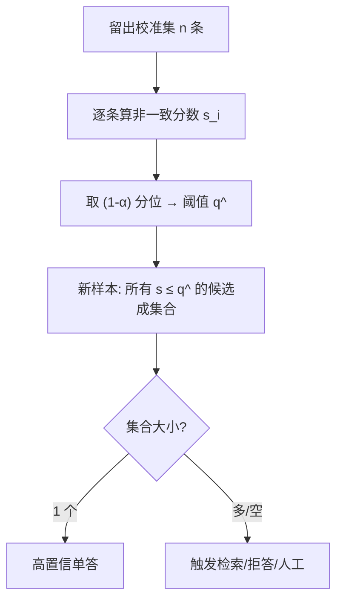
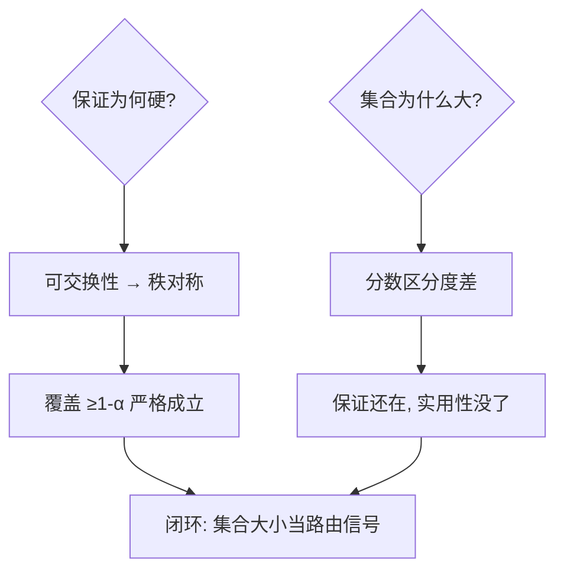

# conformal-prediction-llm

「模型说它对」不算数，要「错误率不超过 10%」才有合同价值——保形预测把 LLM 输出从意见变成带保证的集合。

<footer>—— 据 Vovk 保形预测框架 (2005)；Angelopoulos–Bates《Conformal ML 入门》(2023)；Kumar et al. LLM 校准应用 (2023)</footer>

[语义熵](/llm/semantic-uncertainty)给「这次在不在猜」的即时信号，本课给更硬的东西：**统计保证**。缺口是**保形预测进 LLM**——用校准集把任意不确定性分数转成「错误率 ≤ α 的预测集合」，分布无关、无需重训。它回答的是审计者的问题而非用户的问题。本课不进保形框架的渐近理论。

## 问题

LLM 应用上生产线的障碍是「没法承诺错误率」：客服说「错误率 10%」，法务问「白纸黑字吗」。传统校准（Platt/温度缩放）给的是平均校准，不保证单条输出的错误率。缺口：**有限样本、分布无关的单例保证**——这正是 split conformal 的定义域。

术语翻译：保形预测（conformal prediction）= 给出预测**集合**而非点估计，保证以 ≥1−α 的概率覆盖真值；split conformal = 留一部分数据当校准集，算分数的分位数做阈值；覆盖（coverage）= 真值落在集合内的比例。

数字实例：抽取式问答，校准集 500 条，分数 = 1 −（含真答案的最短 span 的模型置信度）。取分数 90% 分位当阈值 λ=0.78：输出「答案 span 集合」，保证错误率 ≤ 10%。集合平均含 1.4 个候选——「多数时候一个、偶尔两个答案」，这就是可写进合同的承诺。

## 方法

Split conformal 三步（以 QA 的 span 集合为例）：**校准**——留出集 n 条，每条算非一致性分数 $s_i$（1−正确 span 的模型分）；**定阈**——取 $\hat q$ = $\lceil(n+1)(1-\alpha)\rceil/n$ 分位；**部署**——新样本输出所有分数 $\le\hat q$ 的候选（多个 span、多个答案选项）。LLM 场景的分数设计是全部学问：候选集来自采样（RAG 下多个 chunk）或 top-k；分数用语义熵、自洽度、verifier 打分皆可——保形框架对分数只要求「可交换性」，不要求它准。

直觉类比：像质检抽检定允差——不知道每件产品（每条输出）的个体质量，但抽 500 件量出「误差分布的 90% 分位是 0.78」，往后每件的承诺按这条线开。承诺的不是「这件一定好」，是「十件里至多一件超差」——这恰是审计语言。

## 机制

保证成立的机制只有一条：**可交换性**（校准数据与部署数据同分布、可交换）。数学核心：校准分数与测试分数在秩上对称，$\Pr(s_{test}\le\hat q)\ge1-\alpha$ 严格成立——不依赖分布形状、不依赖分数准不准。LLM 场景的机制重心因此落在「分数怎么设计才让集合小而有用」：分数越好（区分对错越强），同样 α 下集合越小；分数烂则集合巨大——保证依然成立，只是没用。生产模式的闭环：集合大小本身作为路由信号——单候选直出、多候选让 verifier 精排、空集或大集转人工/检索。

常见误区：把保形集合的「错误率 ≤ α」读成「答案正确」——它承诺的是集合包含真值，集合里有垃圾候选照样保真；另一误区是校准集用了一次后不更新——分布漂移（新话题、新用户群）击穿可交换性，保证静默失效，线上要监控实际覆盖。

## 边界

保证的前提是**可交换**，流式/自强化场景（用户反馈改变分布）需自适应保形（online conformal），覆盖保证从严格变渐进。集合形式的定义是自由度也是坑：「答案集合」对开放生成（摘要）无法枚举，实践多退化为「声明级抽取 + 保形」或「拒答决策的二元保形」。分数工程的成本：好分数（语义熵、verifier）让集合实用，但 verifier 本身的错误率不被保证覆盖。与语义熵的分工重申：语义熵是**分数**，保形是**把分数变成合同的框架**——先有好温度计，才有可信的天气预报。与幻觉审计的关系：CQA 系统「每 100 条至多 10 条错」的承诺，最终靠这套机制落到纸面。

直觉类比：语义熵是体温计，保形是「按体温计读数定发烧线」的质检流程——体温计准不准（分数质量）决定流程好用不好用，但「90% 分位这条线」的有效性只依赖「抽检与出货同源」（可交换性），不依赖体温计牌子的对错。

## 小结

- 保形 = 非一致分数 + 校准集分位 → 覆盖 ≥1−α 的预测集合。
- 对分数不挑食：分数越好集合越小，保证恒成立。
- 可交换性是命门；分布漂移需 online 保形 + 覆盖监控。
- 出处：Vovk et al.《Algorithmic Learning in a Random World》2005；Angelopoulos–Bates 2023；Kumar et al. 2023。
