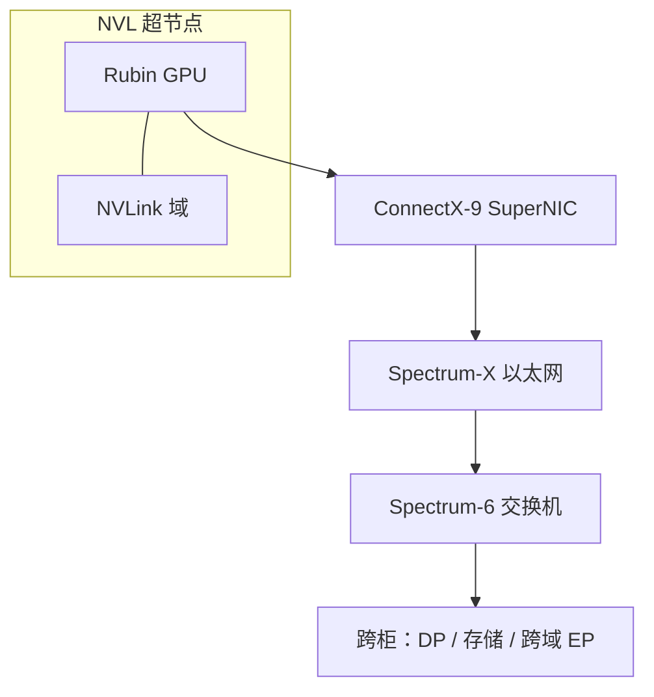

# ConnectX-9 SuperNIC 与 Spectrum-X 向外扩展

机柜内的 NVLink 域把几十张 GPU 收成一块加速器；机柜之间要把许多这样的域连成工厂，以太网必须按集合通信来设计，而不是按网页流量来设计。

<footer>—— NVIDIA 对 Spectrum-X Ethernet 的公开定位：面向 AI 的 scale-out 以太网，与 ConnectX SuperNIC 成套</footer>

[Scale-Up 与 Scale-Out](/llm/scale-up-vs-scale-out) 把扩展分成两层。本篇只写向外那一层的端点：NVIDIA 公开产品线里的 ConnectX-9 SuperNIC，以及它和 Spectrum-X Ethernet 一起承担的 GPU 到 GPU 通信。Vera Rubin 平台把 ConnectX-9 与 Spectrum-6 交换机写成下一代 Spectrum-X 的两端。数字只引用厂商已经写上产品页与技术博客的规格——例如 SuperNIC 页上的「每 GPU 最高 1.6 Tb/s 吞吐」、以及 BlueField-4 介绍里把 ConnectX-9 写成 800 Gb/s 网络——不把某一栏加速比抄成自己的测量，也不编造未公开的 SerDes 眼图或未发布的 SKU 功耗表。

## 问题

NVL72 一类超节点把张量并行、宽专家并行收进机柜；训练的数据并行、检查点、跨柜 MoE、多副本推理，仍然要穿数据中心网络。传统以太网是为南北向流量准备的：用户、存储、虚拟机迁移，突发、不对称、不要求所有端点同时说话。大模型的 east-west 正好相反：一次 All-Reduce 或 All-to-All 会让成千上万个端点同时灌满链路。货架以太网在这种同步突发下容易出现哈希极化、ECN 反应慢、尾延迟把一步集合通信拉长。GPU 算完却在等网，利用率掉的是工厂而不是单卡。

NVIDIA 把这件事产品化成 Spectrum-X：交换机侧做自适应路由、拥塞控制与性能隔离，网卡侧用 SuperNIC 而不是「一块普通 100G 网卡」。ConnectX-7 / ConnectX-8 已经走在这条路上；ConnectX-9 是公开产品组合里面向下一代 AI 工厂的 SuperNIC，用来把 Rubin 机柜接到 Spectrum-X 上。问题不是「要不要以太网」，而是：scale-out 端点的速率、多平面、与 GPU 的亲和，能不能让跨柜通信不再是默认同步税。

### SuperNIC 不是把网卡改个名字

NVIDIA 把 SuperNIC 定义成一类面向超大规模 AI、以太网云的网络加速器，职责是加速 GPU 到 GPU 的数据搬移，并与 Spectrum-X 交换机成套。它仍是以太网端点，走 RoCE 一类 RDMA，不是把 NVLink 延伸到机柜外。公开材料强调的是：为 AI 集合通信优化的拥塞与负载均衡，而不是多功能主机卸载的全集。BlueField 才是把 Grace 类 CPU 与网卡做成基础设施卸载平面的 DPU，见 [BlueField-4](/llm/bluefield-4)。把 ConnectX-9 写成「又一块 DPU」会把运维模型弄错：它首先是 scale-out 的高速端点。

产品页写 ConnectX-9「每 GPU 最高 1.6 Tb/s」，同一代材料里也出现 800 Gb/s 的端口/链路叙述。规划时应把「每 GPU 聚合」与「单端口速率」分开抄，不要把两个口径加成一倍。未出现在官方表里的单通道调制细节，本文不写。

## 方法

把 ConnectX-9 当作机柜的 scale-out 网卡，而不是机柜内 TP 的替代。机柜内集合通信仍应走 NVLink 域，见 [机柜作为一块逻辑加速器](/llm/rack-as-accelerator)。跨柜的数据并行、存储、以及超节点装不下的专家并行，走 Spectrum-X。NVIDIA 公开说 Spectrum-6 交换机芯片与 ConnectX-9 SuperNIC 组成下一代 Spectrum-X，并作为 Vera Rubin 的一部分与 Vera CPU、Rubin GPU、NVLink 6 Switch、BlueField-4 一起出现。软件侧，Network Operator 文档已经把 ConnectX-9 的设备 ID 写成 `1025`，并列出 Spectrum-X 优化与硬件多平面负载均衡（`hwplb`）等模式；文档同时标明 ConnectX-9 的 Spectrum-X 支持在部分版本里仍是 Tech Preview，配置要以当时的参考架构为准，不要把评测集群的配置直接当成已验证的 RA。

### 多平面与自适应路由是给集合通信用的

货架 Clos 常用 ECMP：五元组哈希把流钉在一条路上。AI 的大象流少、同步多，哈希不均会让少数链路先满。Spectrum-X 公开能力包括自适应路由、拥塞控制、性能隔离，以及硬件多平面拓扑——NVIDIA 称多平面可减少数据中心所需交换机数量约 1.7 倍。ConnectX-8 / ConnectX-9 在运营商文档里可以配 `hwplb`（硬件包级负载均衡）与平面数；ConnectX-7 则被写成单平面。这些是配置面，不是新的集体通信算法：NCCL 仍然发消息，底下的路径选择由网卡与交换机共同做。规划时要问的是：这组 rank 的报文是否被允许喷洒到多条等代价路径上，而不是假设「开了 RoCE 就等于 NVLink」。

NVIDIA 还给出过相对货架以太网约 1.6 倍的 AI 网络性能、以及超过十万 GPU 部署上约 95% 网络效率的平台数字。那些是厂商在指定拓扑与负载下的规格，用来理解「专用以太网相对 OTS 有一档」，不要当成任意 Clos 的保证。

## 机制

Scale-out 变快，靠的不是把以太网改名叫 NVLink，而是把「同步突发 + 多路径 + 快速绕开故障」做成端到端的默认行为。交换机看见拥塞就改路，网卡把 GPU 直接 RDMA 的消息对齐到这些路径上，软件栈（DOCA / 驱动 / NCCL 插件）把 RoCE 参数收成一套，而不是每家云自己调一遍 PFC 与 ECN 阈值。ConnectX-9 把端口速率再抬一档，是为了让单 GPU 的向外带宽跟上 Rubin 一代的 scale-out 需求：官方 SuperNIC 页把这一档写成每 GPU 最高 1.6 Tb/s。

对 LLM 训练，这一层主要吃梯度同步与跨柜激活；对推理，它吃的是多副本之间的路由、[PD 分离](/llm/pd-disaggregation) 之后的 KV 传输、以及跨机专家并行的 All-to-All。Decode 步小，跨柜 TP 仍然不划算——ConnectX-9 再快，也填不平 NVLink 与以太网之间的那一档延迟。正确用法是：域内并行走超节点，域间复制与存储走 SuperNIC。

Spectrum-X 是以太网平台，不是 InfiniBand 的别名。同一代 Rubin 材料里，向外扩展还可以走 Quantum-X InfiniBand。选哪一种以机房与参考架构为准。本篇只写 Ethernet SuperNIC 这条公开产品线。

### 与主机、GPU 的亲和

SuperNIC 要靠近 GPU：PCIe（公开材料把这一代平台与 Gen6 准备连在一起讨论）或平台规定的主机接口，决定 GPU Direct / GPU 直接 RDMA 能不能绕开多余拷贝。接口不够宽，1.6 Tb/s 的网卡规格会被主机总线削掉。这是系统问题，不是把网卡插到任意 x16 槽就成立。编排上应把「本节点的 Spectrum-X 网卡」标成拓扑资源，避免把跨 NUMA、跨交换机的网卡塞进同一条延迟敏感的通信子。

## 边界与工程取舍

不要用 ConnectX-9 去「模拟」机柜内 NVLink。不要在没有 Spectrum-X 调优的货架叶子上假设能达到官方 1.6 倍数字。不要把 Tech Preview 的 ConnectX-9 配置文件当成已经 RA 认证的生产模板——NVIDIA 网络文档写过：RA 2.3 等配置未覆盖 ConnectX-9 时，需要带设备 ID `1025` 的 profile。不要编造未公开的单芯片功耗、未发布的固件特性列表，或把 ConnectX-8 的 800 Gb/s 总带宽表直接改名成 ConnectX-9。

故障语义与超节点不同。网卡或叶子故障影响的是部分轨、部分副本，而不是整柜 NVLink 域。运维上仍按分布式系统隔离；但若自适应路由与多平面没有配上，一次哈希极化就会让「看起来带宽很多」的集群在集合通信上变成一条细管。

出处：NVIDIA Ethernet SuperNIC 产品页（ConnectX-9 每 GPU 最高 1.6 Tb/s）、Spectrum-6 / Spectrum-X 官方博客、Vera Rubin 平台技术博文中的六芯片描述，以及 NVIDIA Networking 文档中对 ConnectX-9（device ID 1025）与 Spectrum-X 的配置说明。不引用未公开带宽。

## 小结

- ConnectX-9 SuperNIC 是 Spectrum-X 向外扩展的端点，加速 GPU 到 GPU 的以太网通信，不替代机柜内 NVLink。
- 公开口径同时出现「每 GPU 最高 1.6 Tb/s」与 800 Gb/s 级链路叙述，抄规格时要分清聚合与端口。
- Spectrum-X 用自适应路由、拥塞控制、性能隔离与多平面，把以太网改成适合集合通信的 fabric。
- 与 Spectrum-6、BlueField-4、Rubin GPU 同属 Vera Rubin 公开平台的一部分。
- Decode 跨柜 TP 仍然不划算；SuperNIC 服务的是 DP、存储与跨域 EP。
- 出处：NVIDIA SuperNIC / Spectrum-X 公开产品与文档。
