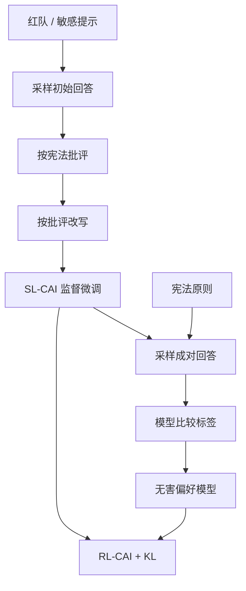

# Constitutional AI

用一份书面原则代替人类去标注无害性：模型按宪法自我批评并改写，再在模型给出的比较上做强化学习，从而减少标注员直接接触有害文本。

<footer>—— Bai et al., Constitutional AI: Harmlessness from AI Feedback, 2022</footer>

Bai、Kadavath、Kundu 等人 2022 年的 Constitutional AI（CAI）针对 InstructGPT 式 RLHF 里最难规模化、也最伤标注员的那一块：无害性。有用性仍可以让人比较两条回答谁更帮得上忙；无害性要求人反复阅读攻击、自伤、歧视内容再打序，贵，而且把伤害转嫁给标注者。Anthropic 的处方是写一份「宪法」——若干自然语言原则——让模型按原则批评自己的回答、改写，再让模型按原则对两条回答做比较，用这些 AI 反馈训练偏好模型并做 RL。人类仍参与有用性；无害性尽量改由原则驱动。本篇写监督阶段与 RL 阶段如何接起来，以及宪法在机制上代替了什么、代替不了什么。

## 问题

HHH（helpful, honest, harmless）里，无害与有用经常冲突：拒绝会降低有用，顺从会降低无害。若只用人类比较、且多数比较来自「哪个更有用」，无害性会被挤掉；若让人专门标有害内容，规模与职业暴露都不可接受。需要一种反馈源：可复制、可公开检查、不必让人读完每条有害样本，同时仍能对策略做梯度更新。

CAI 的回答是：把无害性的规范从「标注员脑子里的指南」写成模型可阅读的条款。条款不是可微约束，而是采样时的提示词。问题变成两段工程。第一，如何用条款把已经会说的有害完成改写成更无害的完成，并用来做监督微调。第二，如何用条款产生成对比较，接上与 InstructGPT 同构的奖励模型 + RL，而不再为无害性雇佣人。诚实性在原文里没有单独拆成第三条流水线，仍大部分交给有用性数据与模型自检。

### 宪法是提示，不是形式化验证

原则形如「选择更少伤害的那条」「不要协助犯罪」「尊重自主」。它们没有把输出空间切成可判定的安全语言。同一条完成可以对着不同原则得到不同批评；论文用随机抽取若干条原则、多次批评-改写，来降低单条原则的捷径。这与后来把宪法写进分类器过滤层不是同一对象：CAI 原文改的是生成策略本身，分类器是另一篇工作。

减少的是无害性上的人类比较，不是全部人类监督。有用性比较、红队提示的设计、宪法文本的撰写，仍然是人。把 CAI 说成「无需人类反馈」是错的。

## 方法

监督阶段（SL-CAI）。从红队或不安全提示采样初始回答，提示模型：根据宪法指出该回答哪里有害，再根据批评写出修订。把「提示 + 修订后的回答」当成示范做 SFT。可以迭代多轮批评-修订，直到模型判断符合原则或达到轮数上限。这一阶段的目标是：即使还没有奖励模型，策略也已经会用自然语言做自我修正，并且修订后的分布更靠近无害区，给后面的 RL 一个不那么极端的起点。

RL 阶段（RL-CAI）。对同一提示采样两条回答，把宪法原则写入比较提示，让标注模型选出更无害的一条（可要求先写思维链再给标签）。用这些 AI 比较训偏好模型，再对策略做 RL，KL 仍拴在监督阶段模型附近。有用性可以继续使用人类比较训另一个偏好模型，再把有用与无害的标量组合进奖励。原文的要点是：无害通道可以全是 AI 反馈，有用通道不必强行也换成 AI。

### 自我批评必须写出可执行的修订

若批评只说「这有害」而不指出哪一句、哪种伤害，修订会变成空洞拒答或套话。论文要求批评具体，修订要改内容而不只是加免责声明。这是把思维链用在数据构造上：链的读者是后续的修订步骤，不是给终端用户看的解释。评测时仍应看最终回答，而不是看模型是否会背宪法条目。

## 机制

监督阶段改变的是条件分布 $p(y\mid x)$ 在敏感 $x$ 上的质量：更多质量放到修订后的拒绝、替代建议、以及去伤害化的解释。它不证明模型「理解」原则；它证明模型能在提示里使用原则文本完成一种固定格式的编辑。RL 阶段把同一原则从「编辑指令」变成「成对标签器」。标签器与策略可以同族，于是存在自举：策略变了，标签器若还是旧检查点，比较标准会滞后；若标签器也随策略更新，标准可能漂移。原文用独立的、较强的模型做标签，并冻住偏好模型的训练数据窗口，来减缓漂移。

与 InstructGPT 的差别主要在标签来源，不在 RL 公式。PPO、KL、偏好模型头，都可以沿用。新引入的偏差是原则捷径：模型学会在表面提及「我不会提供伤害性内容」，却在细节里仍给出可滥用的步骤；或过度拒答，把无害的虚构、医疗信息、安全研究也挡掉。宪法条目越短、越像口号，捷径越容易。条目越长、越具体，覆盖越窄，还可能互相矛盾。写宪法因此是超参，不是一次道德哲学完成。

CAI 的「AI 反馈」是带原则的比较，不是让模型给绝对安全分数。绝对分数会把不可识别的偏移送进 RL。成对比较与 BT 奖励模型仍然同构，只是标注员换成了带宪法提示的 LM。

### 标注员保护是一等设计目标

让人排序有害内容会造成二次伤害，也会让愿意做这份工作的人产生选择偏差。CAI 把这部分劳动移到模型，是论文相对纯 RLHF 的伦理主张，而不只是省钱。省钱是副产品：原则可复用，比较可并行生成。若产品把红队仍全部交给人看原始完成，这一主张在部署里被部分撤销。论文自己的红队仍需要人写攻击提示，只是完成侧的比较可以自动化。

## 边界与工程取舍

宪法不能覆盖未写入的伤害类型。新的滥用手法、特定语言文化里的侮辱、多模态越狱，都不会自动出现在 2022 年那份原则列表里。更新宪法等于改数据生成器，需要重新跑 SL 与 RL，而不是热切换一个配置文件。原则之间的冲突（例如「诚实」要求回答 vs 「无害」要求拒绝）没有形式化解；模型学到的是标签器在提示里的裁决风格。

自监督修订会把模型的说教腔写进示范：先道歉、再列举原则、再给替代方案。用户可能觉得安全但无用。有用性人类反馈必须继续压住这一风格，否则 CAI 单独看无害指标很好，产品上像一堵墙。论文用组合奖励处理这种张力，权重本身是另一组要扫的超参。

与后来 Lee 等人的 [RLAIF](/llm/rlaif) 相比，CAI 更强调「原则作为标签规范」和「先修订再 RL」；RLAIF 更强调用现成 LLM 在摘要、对话上替代人类比较，并测量与 RLHF 的胜率是否接近。CAI 不是通用指令合成方法，也不替代 SFT 里的有用示范。它也不能单独充当运行时过滤器：策略被训练后仍会失败，需要额外的分类与拒答层。

评测无害性时，不要只用模型自打分。标签器与策略同族会互相恭维。应用独立模型、人类抽检、以及红队成功率；并单独报告过度拒答，以免无害指标被「什么都不说」刷高。

## 小结

- Constitutional AI 用书面原则驱动自我批评-改写（SL-CAI）和 AI 成对比较（RL-CAI），把无害性从人标里拆出。
- 有用性仍可靠人类比较；原文不是无人类反馈。
- 宪法是采样提示，不是形式化安全证明；原则冲突靠标签器风格裁决。
- RL 公式与 InstructGPT 同构，换的是无害通道的标签来源。
- 捷径包括表面合规、过度拒答、说教腔；需与有用性奖励对冲。
- 保护标注员免于长期阅读有害文本，是与省标注费并列的设计目标。
- 出处：Bai et al., *Constitutional AI: Harmlessness from AI Feedback*, 2022。
