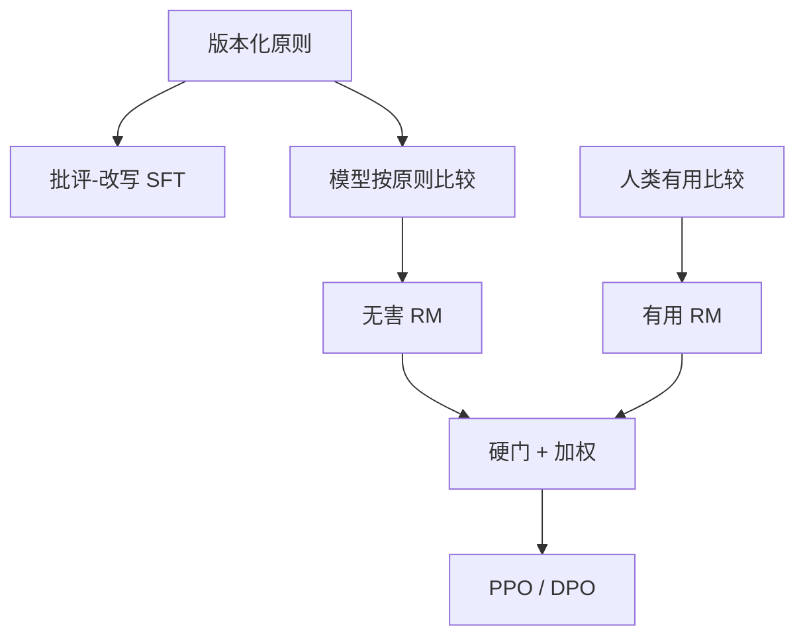

# 宪法式 RL 实践

原则写进比较提示，无害通道就可以少让人读有害文本；原则仍是人写的，冲突仍要产品拍板。

<footer>—— Bai 等 Constitutional AI；实践中的 RLAIF、书面规范与分类器叠层</footer>

[上一课](/llm/scalable-oversight)把宪法列为放大人类规范的一种协议。主干课 [Constitutional AI](/llm/constitutional-ai) 已写 SL-CAI 与 RL-CAI。本课写**实践缺口**：原则清单如何维护、如何与 [RLHF](/llm/rlhf-pipeline) 的人类有用通道共存、如何避免把宪法当不可审计的提示魔法。接到拒绝训练与诚实课。

## 问题

CAI 原文：有用仍可人类比较；无害用原则驱动的模型批评、改写、再比较。落地后出现三件事。一，原则冲突（「要有帮助」vs「拒绝犯罪」）在清单内部，模型会挑对它容易的条款。二，RL 阶段的偏好模型过优化原则的字面（免责声明变长）。三，后来的分类器层（constitutional classifiers）与生成策略不是同一对象，实践上常常两层都要，原文只改策略。

实践问题是版本化：哪一版宪法训了哪一版策略，红队用哪一版，事故归因才能做。

### 宪法不是形式验证

条款是自然语言，没有把输出空间切成安全语言。随机抽若干条做批评，只是降低单条捷径。与细则奖励课相同：合同必须贯穿标注、训练、评测。这里的合同是原则文本。

减少的是无害性人类比较，不是全部人类。红队题、原则撰写、有用比较仍是人。

## 方法

维护：原则 git 化，每条附反例与预期行为。训练：SL 批评-改写 → 模型比较造对 → RM + PPO 或 DPO，无害 $r$ 仅来自原则比较；有用 $r$ 来自人。合成用 [多目标加权](/llm/multi-objective-reward) 的硬门：原则失败则封顶。推理：可再跑分类器，不把训练过的策略当成唯一闸。评测：原则覆盖的伤害类型 + 过拒绝（XSTest 一类）必须成对报。

与自奖励的差别：比较器提示冻结为宪法，不让正在优化的 $\pi$ 随意改原则。原则更新是发布事件，不是训练步。

## 机制

原则把无害规范从标注员脑子里挪到可公开检查的文本，这是治理收益。RL 仍会 Goodhart 文本表面。实践对策：原则外红队、过拒绝金标、不把监视原则写进过强奖励（monitorability）。CAI 与校验器互补：能程序判定的伤害（明显恶意代码执行）走沙箱；规范判断走宪法。

多语言原则不是翻译一遍了事。同一条款在不同语言的模型比较里校准会漂。

## 边界与工程取舍

开源复现常缺红队预算，只剩「加一段系统原则」当 CAI，那是提示，不是 RL 实践。下一课拒绝训练把「何时不答」写成可优化行为，宪法是其规范来源之一，过拒绝是主要副作用。

## 小结

- 实践中的宪法式 RL：原则版本化、无害 AI 比较、有用人类比较、硬门合成。
- 原则会被字面过优化；需红队与过拒绝金标。
- 分类器层与策略层是两道闸，不是互相替代。
- 比较器冻结，不让当前 π 改宪法。
- 出处：Bai 等 CAI；RLAIF 实践；Llama 2 分头作对照；过拒绝评测见后课。
