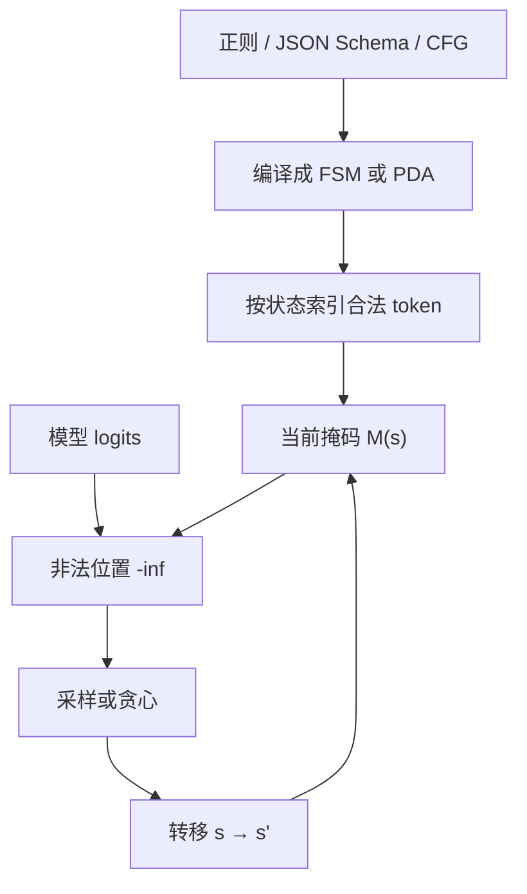

# Structured output / 约束解码

把合法续写写成自动机上的转移，再对词表建索引：每一步掩码可以是查表，而不必扫描整个词表去跑一遍正则。

<footer>—— Willard 与 Louf，Efficient Guided Generation for Large Language Models；以及 XGrammar 对 CFG 的推进</footer>

产品要的往往不是自由散文，而是能 `json.loads` 的对象、能进解析器的 SQL、或枚举里的一项。事后用提示「请输出 JSON」再正则抢救，失败率随 schema 变复杂而上升。约束解码把文法嵌进采样：每一步只允许自动机认为合法的 token。Willard 与 Louf 把正则（及可推到 CFG 的路径）收成有限状态机，并对词表做索引，使引导生成的开销接近常数级查表，实现落在 Outlines 库。SGLang 用压缩 FSM 进一步合并无分支路段；XGrammar 用下推自动机与自适应掩码缓存把 CFG 做到服务热路径可承受。本篇写掩码如何保证结构、以及结构保证不等于事实正确。

## 问题

自回归每步给出 $p_\theta(x_t \mid x_{<t})$，支撑是整个词表。合法 JSON 在某一步可能只允许 `"` 或数字的若干子词。无约束采样会在键名、逗号、转义上随时出轨，下游解析失败。逐 token 用 Python 正则去过滤词表，复杂度随 $|\mathcal{V}|$ 线性涨，对 3 万–10 万级词表不可接受。Guidance 早期路径被 Outlines 论文当作对照：每步从序列开头做部分匹配并扫词表。

文法还有比正则更强的：括号匹配、递归 JSON 值、简单程序语言，需要上下文无关文法（CFG）。正则对应的 FSM 记不住无限嵌套深度。CFG 要用栈（下推自动机，PDA）。栈使「下一步合法 token」依赖栈顶与内部状态，掩码不能全部离线预计算完，必须在运行时与预处理之间切一刀。这是 XGrammar 相对纯 FSM 方案的问题设定。

### 子词与文法字母表不对齐

LLM 的 token 不是字符。一个 JSON 键可能被切成多个 BPE 片，一个 token 也可能跨越文法里的多个终结符（例如 `",` 同时结束字符串并带上逗号）。只看「词法器吐出的最后一个终结符」会误判，Outlines 的这一限制后来被指出；跨多个 lexer token 的缓存与 PDA 是后续引擎要补的。约束解码的正确性必须相对于 **token 字母表** 定义，而不是假装模型按字符生成。

掩码改的是下一步的支持集，不改模型权重。被禁 token 的 logit 置 $-\infty$ 再 softmax。分布是条件于「前缀已合法」的截断分布，不是另训了一个结构化模型。长约束下质量好不好，仍取决于 $p_\theta$ 在合法集合上的质量。

## 方法

FSM 路径（Outlines）：正则编译成状态机。对每个状态 $s$，预处理时扫描词表，记录哪些 token 对应从 $s$ 出发的合法字节/字符推进，得到掩码 $\mathcal{M}(s)\subseteq\mathcal{V}$。生成时维护当前状态，每步只对 $\mathcal{M}(s)$ 采样，再按读入的 token 转移。索引把「扫词表」从热路径挪到编译期，逐步开销接近查表。CFG 可走 LALR 等解析器在概念上扩展同一框架，但运行时成本显著更高，这是原文指出的延伸而不是声称已免费。

压缩 FSM（SGLang）：在状态图上把出度为 1 的路径收成一条超边，对应一段唯一确定的 token 串。轮到这条超边时，不必逐步询问模型，直接写出这段字符串并跳转状态——键名、固定标点尤其受益。有多个合法后继时，仍要一次前向加掩码。

XGrammar：用 PDA 支持 CFG。把 token 分成与栈无关、可预计算掩码的一类，以及依赖栈、必须在运行时处理的一类；自适应掩码缓存记住见过的状态。再与 GPU 前向重叠，使结构化生成的额外延迟在服务场景里可被掩盖。评测对照包含 Outlines、llama.cpp 的文法引擎、lm-format-enforcer 等，对象是 JSON schema、XML、受限 Python DSL 等。实现细节以论文与仓库为准，不要把某一版微秒数写进架构定义。

### 与引擎的接合点是 logits 处理器

vLLM、SGLang、TensorRT-LLM、llama.cpp 都在采样前提供钩子：给定 `input_ids`，返回布尔或 logit 偏置。约束引擎是钩子的实现，不是另一套 Transformer。连续批下每条序列处于不同自动机状态，掩码必须 **按序列** 而不是按整个 batch 一份。页表与 radix 树不替你做文法；它们只保证 KV 对。结构化 JSON 仍能命中系统提示前缀，正文的键值部分通常很快分叉。

## 机制

正确性：若编译忠实于文法，且每个 token 的消费规则与分词器一致，则生成串一定属于该语言（或属于其 token 化像）。这比「高温度再 parse」可靠。完备性：合法的字符串只要能被该分词器切成某条 token 路径，且路径上每步都在 $\mathcal{M}(s)$ 里，就仍能被采到。若分词器把文法需要的字符序列切成「必须先走一个非法中间 token」的死路，会出现 **可表示性空洞**——文法允许、模型词表路径不允许。这是分词器与约束联合设计的问题，不是 softmax 的问题。

效率：预处理 $O(|Q|\cdot|\mathcal{V}|)$ 量级（$Q$ 为状态）换逐步近似 $O(1)$ 或 $O(|\mathcal{M}|)$。状态爆炸是正则的老问题：粗心的 schema 会得到巨大 FSM，编译时间与内存先爆。CFG 的 PDA 用栈换状态数，把爆炸从状态表转到运行时栈与缓存命中。压缩则减少「模型必须说话」的步数，直接降 decode 迭代。

约束不能修复幻觉内容。JSON 合法且 `"age": 327` 仍然可能是瞎编。结构层保证的是类型与括号，不是数据库里的真值。要把事实钉住，需要检索、工具或校验器在文法之外再跑一遍。

### 选择与 schema 的粒度

`select` 在短候选上甚至可以比较各候选的条件似然，不必逐步掩码。JSON Schema 的 `enum`、`const`、必填键顺序（若指定）都能编进自动机。键顺序若不约束，合法集合变大，掩码变松，模型更自由也更常把键写乱——有的系统固定键序以缩小语言。这是产品取舍：松 schema 好写，紧 schema 好解析、也好加速。

## 边界与工程取舍

不要用约束解码代替微调后的格式习惯。两者可叠加：模型在合法集合上概率质量更集中，掩码几乎不 intervening，质量与速度都好；模型很差时，掩码会逼它在一堆低概率合法 token 里爬，出现重复标点或极慢的「挤牙膏」。流式输出时，未完成的 JSON 对客户端不可解析，需要前端按自动机状态展示草稿，或等闭合后再发。

llama.cpp 的 GBNF、Outlines、XGrammar、引擎内置 JSON mode 都是实现，文法表达力与 token 跨越处理不同。移植 schema 时要测：嵌套数组、unicode 转义、数字的多种 token 切分。禁止伪造「某库对应某篇不存在的 arXiv」；上面三篇是 Willard & Louf（arXiv:2307.09702）、Zheng 等 SGLang（arXiv:2312.07104）、Dong 等 XGrammar（arXiv:2411.15100）。

把 logits 全部置零再只开一个 token，等于贪心走文法最短路径，模型分数被忽略。调试「约束后变笨」时，先看掩码是否过紧（只剩一条路），再看温度是否还在合法子集上。过紧的 schema 会把多样本变成同一骨架。

## 小结

- 约束解码在每步把 logit 截到文法允许的 token，保证输出属于编译后的语言。
- Outlines 用 FSM 加词表索引避免逐步扫词表；SGLang 压缩无分支路径；XGrammar 用 PDA 与自适应缓存服务 CFG。
- Token 化与字符文法不对齐会造成错误掩码或可表示性空洞。
- 结构合法不等于内容为真；热路径掩码必须按序列、可与连续批共存。
- Schema 松紧同时影响合法集合大小、编译成本和模型被逼到低概率区的程度。
- 出处：Willard & Louf, *Efficient Guided Generation for Large Language Models*, arXiv:2307.09702（Outlines）；Zheng et al., SGLang, NeurIPS 2024；Dong et al., *XGrammar: Flexible and Efficient Structured Generation Engine for Large Language Models*, arXiv:2411.15100。
