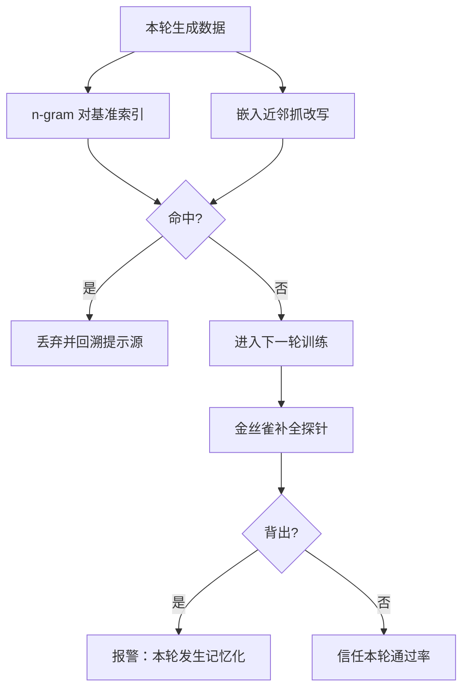

# 自训练数据的污染

去重把住的是语料入口，闭环在每一轮重新发明泄漏：模型把评测题改写成新训练样本，n-gram 看不见的等价类逐轮生长。

<footer>—— Carlini 等, Deduplicating Training Data Makes Language Models Better（2023）；Golchin 与 Surdeanu, Time Travel in LLMs（2023）</footer>

[上一课](/llm/player-selection-bias)的失效在对手侧；本课转向数据侧：评测集泄漏进训练闭环时，所有迭代指标一起说谎——通过率的增长是记忆，不是能力。传统污染治理发生在语料入库：对基准集做精确子串或 n-gram 重叠（如 13-gram）过滤。自训练闭环让这套防线失效的方式，是污染发生在入库之后、生成阶段之内：每一轮训练都在生产表面全新、语义等价的泄漏样本。

## 问题

泄漏路径有四条。预训练语料本就含基准题及其解答，教师与学生都见过。合成数据的提示以网络爬取的种子起步，种子里的评测题被改写进生成提示。蒸馏教师的输出原样带出评测题——[推理蒸馏到小模型](/llm/reasoning-distill-small)已因此要求蒸馏集去污染。最隐蔽的是闭环自己的再生：模型对评测题生成高置信答案，这些答案连同改写的题面进入下一轮训练数据；每过一轮，题面表述离原文更远一层，表面 n-gram 重叠趋零，语义等价不变。不这么做会错在哪：只做入库去重的团队会看到「每轮都涨」的通过率，并把污染驱动的记忆当成闭环在工作。

## 方法

闭环内的对策是把过滤从「入库一次」改成「每轮一道」。每轮生成数据对基准索引做两级匹配：n-gram 级抓原文复制，嵌入近邻抓改写；命中样本连同其近邻回溯到提示源头，提示含评测内容则整批丢弃。金丝雀是闭环里少数可主动部署的仪器：在每轮训练数据埋入唯一 GUID 串，事后用补全探针测是否被背出——背出说明记忆化在环内发生，且规模可估。更结构性的做法是保持一个永不进入闭环、永不公开的私有 held-out，并用训练截止之后新出的评测集做时间切分验证；三者的交集才是可信读数。

## 机制

污染在闭环里是复合过程。第一轮的泄漏改变模型对评测题的输出分布；第二轮它生成更多与评测题同分布的内容；第三轮这些内容成了「验证通过的训练数据」——同时验证器也坏了：法官见过这些题，会把背出来的完成判为正确。传统去重失效的根本原因是它假设污染态在数据进入管线前就固定；闭环的污染是生成动力学的一部分，每轮都在创造新的等价类。这与模型坍缩是同一枚硬币的两面：多样性与尾部在收缩，而高频部分——恰是评测题这类被反复生成的样本——在增密。指标上表现为：训练侧通过率、裁判分、环内奖励同涨，唯独外生 held-out 不动。

Carlini 等人 2023 的量化：对 C4 做精确子串去重后，可被提示拉出的记忆化样本降到约十分之一，训练-测试重叠同步下降。这是入库侧去重的收益上限——它对闭环内新生的改写无能为力。

## 边界

过滤器有假阴也有假阳：改写检测的阈值调紧，合法的同类题被误杀，课程多样性受损；调松，泄漏漏网。披露与指标卫生是底线：报告时分开「可能污染集」与「清洁集」的通过率，标注每轮数据对基准索引的最大相似度。已泄漏的题几乎无法从模型里移除——重训或拒绝采样只能压低触发概率。任何「我们每轮都涨」的闭环报告，第一个该问的是基准索引的匹配阈值与金丝雀探针的结果；答不出，读数就不进仪表。

## 小结

- 污染可以发生在生成阶段：闭环每轮制造 n-gram 全新、语义相同的样本。
- 过滤要每轮做，n-gram 与嵌入近邻两级，命中须回溯提示源头。
- 金丝雀、私有 held-out、截止后新评测是三种外生读数，取交集。
- 法官被污染时验证器失效，通过率与判分一起虚高。
- 出处：Carlini 等（2023）；Golchin 与 Surdeanu（2023）；蒸馏集去污染要求见推理蒸馏课。
