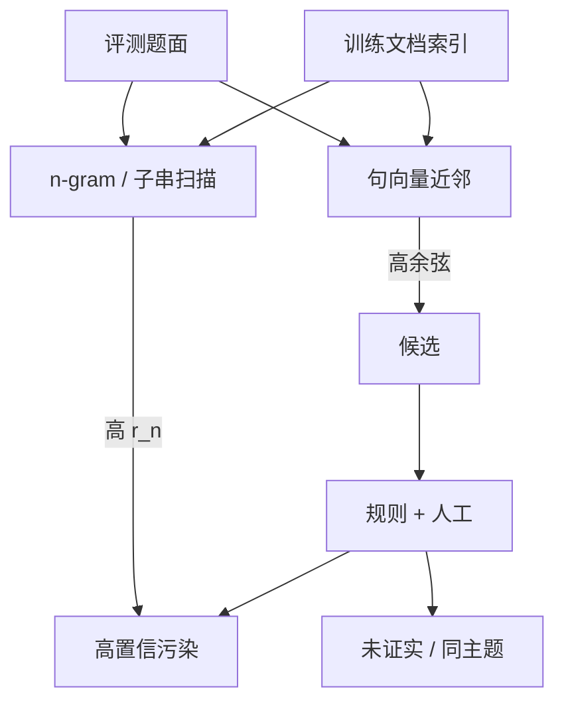

# n-gram 重叠与嵌入近邻

若评测题的长 n-gram 已经在预训练里出现过，准确率里就掺了记忆；只查精确子串会漏掉改写，只看向量近邻又会误伤同主题的独立题。

<footer>—— 评测污染检测要把表层重叠与语义近邻分成两张账</footer>

训练语料与评测集本应不相交。网页爬虫、书籍扫描、代码托管、题解论坛把这条边界磨穿之后，排行榜上涨的分既可能来自泛化，也可能来自「这道题见过」。GPT-3、PaLM、Llama 等报告里用过的经典探针，是看评测文档与训练文档是否共享足够长的 n-gram；后来的工作补上嵌入近邻，以捕捉释义、翻译、选项重排。它和训练集内部的 [MinHash 去重](/llm/minhash-dedup) 共用一些指纹技术，目标不同：内部去重减浪费与记忆，对基准去污是为了让分数还能代表能力。本篇写两种探针各抓住什么、阈值怎么设，以及为什么「没检出重叠」不等于「没污染」。

## 问题

污染在操作上不是一个布尔标签，而是一条谱。最硬的一端：评测题面连同标准答案完整出现在某一条训练文档里，模型等于在做闭卷抄写。中间：题面被改写、选项被打乱、代码题换了变量名，但解题路径仍在语料里。最软的一端：同一知识点的教材段落极多，模型靠分布知识做对，题面本身从未出现。评测要排除的是前两端，尤其是中间那段——它最像能力。

只靠人工抽查做不到覆盖。MMLU、HumanEval、GSM8K 这类集合有数百到数千条，预训练有万亿 token，必须上可扩展的相似度。n-gram 重叠便宜、可解释、假阳性低，但对同义改写几乎瞎。嵌入近邻能看见「意思差不多」，却会把同一章教材里的练习题和评测题判成一对，即使二者独立命题。方法问题因此是：用表层重叠做高精确率的确证，用向量近邻做高召回的候选，再把候选送去人工或更严的规则，而不是用单一分数给整份基准盖章。

### 污染与泄漏不是同一句话

泄漏可以发生在训练之后：有人把测试题发到论坛，下一版数据配方把它收进去；也可以发生在训练之中：爬虫本来就收录了 GitHub 上的基准副本。对已训练好的模型，我们往往没有语料索引，只能用成员推断、[Canary](/llm/canary-strings) 或「把题面当前缀看续写是否复述答案」来间接测记忆。对即将开训的配方，才有条件做文档级扫描。两种场景的工具集不同，报告里应分开写，避免把「我们扫了 Common Crawl 快照」说成「这个闭源模型没被污染」。公开基准的 GitHub 仓库、论文附录、Hugging Face 数据集页，本身就是高权重的污染源。去污扫描的第一批种子不应只是题面 json，还应包括这些镜像与题解博客。

## 方法

### n-gram 重叠：长匹配当罪证

把文档切成连续 $n$ 个 token 或词的窗口。评测题 $q$ 与训练文档 $d$ 的重叠率可写成

$$
r_n(q,d)=\frac{\bigl|\{g\in G_n(q):g\in G_n(d)\}\bigr|}{|G_n(q)|},
$$

其中 $G_n(\cdot)$ 是 n-gram 集合。$n$ 太小（如 3）会把功能词和公式片段算成重叠；$n$ 太大（如 50）会漏掉只改了一两个词的抄袭。经验上，英文词级 8–13 gram、或字节对编码下相当长度，常被用作「这段几乎是复制」的阈值。GPT-3 报告过用 13-gram 从训练里挖掉评测重叠；后续开源配方沿用类似规则，有的再加「连续匹配长度」以免稀疏命中凑成高比率。

实现上不会对万亿 token 做朴素集合交。常见做法是：为训练集建 n-gram 倒排或 Bloom 过滤器，只对评测题的 gram 做查询；或先用文档指纹缩小候选，再算精确 $r_n$。与 MinHash 的差别是：MinHash 估计的是整篇 Jaccard，适合抓转载网页；评测污染常常是「长文档里嵌了一小段题面」，整篇 Jaccard 可以很低，必须用子串或 gram 命中。

### 嵌入近邻：释义的候选网

对题面（有时加上选项、参考答案）算一个句向量，在训练文档的句或段向量里找 $k$ 近邻，看余弦是否超过阈值 $\tau$。这一步的召回高于 n-gram：翻译、被动语态、把「下列哪项」改成「请选择」，表层 gram 全断，向量仍近。代价是假阳性：同一科学事实的两种合法提问会靠得很近。实务流程是近邻出候选，再用更严的规则过滤——例如要求选项集合也相近、或要求答案跨度也出现在邻居里——最后抽检。

$$
\mathrm{NN}(q)=\arg\max_{d}\ \cos\bigl(f(q),f(d)\bigr)
$$

编码器 $f$ 本身若在含评测题的数据上训过，会把污染检测变成循环。应选用与待评模型无关、且尽量不在该基准上微调过的检索编码器。多语言题还要决定是按语言分别建索引，还是用多语句向量混排。

## 机制

n-gram 探针抓住的是复制粘贴通道：分词一致时，长匹配几乎不可能随机出现。它解释不了模型为什么能做对一道完全改写的题——那可能是污染的释义通道，也可能是真泛化。嵌入近邻把「改写」从不可见变成可排序，但排序依据是语义空间里的密度，不是「训练时是否当监督信号见过这道题」。高余弦只说明语料里有一段话在讲类似的事。

因此两种探针应级联，而不是投票出单一污染率。先报「有多少题存在超阈值 n-gram 命中」（精确率导向），再报「有多少题在 $\tau$ 下存在近邻」（召回导向），最后报人工确认的子集。用一个 0–100 的「污染分数」去和准确率做差，看起来干净，其实把不同机制揉在一起：有的题是题面泄漏，有的是题解泄漏，有的只是教材密度高。

对已训练模型，若拿不到语料，可以用模型自己当探针：给定题面，看它是否以远高于对照串的概率复述答案或罕见选项顺序。这是记忆实验，不是文档检索。它和 n-gram 扫描互补：扫描说「数据里有没有」，记忆实验说「权重里留下没有」。两者都阴性时，仍可能存在间接污染——例如合成指令把题意教过一遍，但字面与向量都不像原题。选项顺序是一类被低估的指纹。多选题若训练里见过「B 正确」的同一排列，模型会偏爱该字母而非该知识。去污时应打乱选项再测一遍；分差大，说明记忆的是版面而不是概念。

### 阈值必须跟着分词器走

同一句英文，词级 13-gram 与 BPE 13-gram 覆盖的字符跨度不同。换词表而不重标定阈值，历史论文里的「13-gram 去污」无法复现。代码评测更明显：空白、标识符重命名、import 顺序会切断 gram，却几乎不改变嵌入。代码污染检测往往要先规范化 AST 或去掉标识符再比，或主要依赖嵌入与测试通过率的异常组合（题极难但零样本全过）。不要用「训练集对基准做了 MinHash」代替 n-gram 子串扫描。整篇近重复去的是转载网页，嵌在长网页中的一道 MMLU 题常常活下来。去污清单应写明：子串、gram 长度、是否含选项与答案、是否扫了镜像仓库。

## 边界与工程取舍

假阴性是结构性的。任何公开过的题都可能以手写笔记、图片 OCR、口播转写的形式存在，文本索引看不见。动态基准把新题放到训练截止之后，是在时间上绕开扫描的盲区，见[题库轮换](/llm/live-benchmarks)。扫描仍要对历史窗口做，否则论文表格里的旧分数无法解释。

假阳性会误删合法知识源。若把所有高余弦的教材段落从预训练里删掉，模型会在该学科上变弱，评测分反而下降——看起来像「去污有害」，其实是把监督信号连根拔起。正确的删除单位是「评测题及其近复制」，不是「该主题的所有段落」。嵌入阈值必须偏严，宁可用人工看候选，不要用松阈值做全自动删除。

计算成本上，n-gram 倒排可以只为评测 gram 建查询侧签名，成本与题量成正比；全库句向量近邻则贵得多，通常只对评测句检索，不对训练句做全对。近似近邻索引会漏边界对，应在报告里写召回估计。多基准联合去污时，注意不要让基准之间互相当训练数据——一份「清洗过的指令集」可能正是另一份考题的题解。

与 [Canary 字符串](/llm/canary-strings) 的分工：Canary 回答「这次训练有没有吃到带标记的包」；n-gram 与近邻回答「自然出现的评测文本有没有进来」。前者是注入式审计，后者是观测式审计。配方论文应两样都有，评测论文至少要报告对公开训练快照的扫描结果，或明确写「无法扫描闭源语料」。

## 小结

- 评测污染是谱：完整复制、改写泄漏、同主题知识密度，不可收成一个布尔值。
- 长 n-gram / 子串重叠是高精确率罪证，对释义几乎无效；嵌入近邻提供高召回候选，假阳性来自同主题。
- 级联报告命中率、近邻率和人工确认率，不要用单一污染分去减准确率。
- 阈值必须绑定分词器与规范化规则；代码题需要 AST 或去标识符后再比。
- 整篇 MinHash 去不掉长文档中的嵌套题面；镜像仓库和题解页应列入扫描种子。
- 扫不到不等于没污染；时间切分与 Canary 补的是扫描的盲区。
- 出处：Brown et al. GPT-3 的 n-gram 去污实践，以及后续把嵌入近邻纳入污染审计的评测文献。
