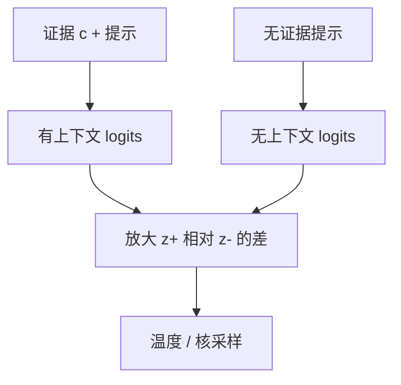

# 上下文感知解码

模型有时更相信自己的参数记忆，而不是你刚贴上的证据；把「有上下文」与「无上下文」的分布对比，才能把生成拉回当前证据。

<footer>—— Shi et al., Trusting Your Evidence: Hallucinate Less with Context-aware Decoding, NAACL 2024</footer>

[上一课](/llm/dola-decoding)对比的是同一前向里的深浅层，对象是参数里的「先验 vs 事实」。本课把对比轴换成 *条件*：同一层、同一权重，一次看见检索到的证据 $c$，一次看不见。Shi 等人的 Context-aware Decoding（CAD）用有上下文的 logits 减去无上下文的 logits，放大那些「只因为看见 $c$ 才升高」的 token。它针对的是上下文接地（context-grounded）生成：摘要、RAG、阅读理解。不要把 CAD 写成通用抗幻觉开关——没有 $c$，对比无定义。

## 问题

RAG 与长提示把证据写进前缀，但逐步分布仍可能跟参数里更强的共现走：实体名触发了训练中的高频属性，证据里的相反属性被忽略。这是忠实性问题在解码端的版本：[上一课](/llm/dola-decoding)假设事实在深层；这里事实在 *提示* 里，模型却不「信」。缺口是：如何在不改权重、不重训的前提下，提高 $c$ 对下一步的因果作用。

朴素做法「把证据重复三遍」浪费上下文窗口，且不保证逐步对齐。CAD 的对比明确针对这一点：无上下文分布 $p_\theta(\cdot\mid x)$ 代表先验，有上下文 $p_\theta(\cdot\mid c,x)$ 代表先验加证据；差放大后者相对前者多出来的质量。

两次前向共享大部分计算图，但不共享 KV：无上下文那次没有 $c$ 的键值。实现上这是两次 decode 步，或一次 batch=2 的前向。比 DoLa 的中间层钩子更贵，比 MBR 仍便宜。

## 方法

令 $z^+$ 为条件于 $(c,x,\text{prefix})$ 的 logits，$z^-$ 为只条件于 $(x,\text{prefix})$ 的 logits（生成前缀仍要一致，否则对比的不是「证据」，而是另一条链）。对比

$$
p_{\mathrm{CAD}}(x_t)\propto \mathrm{softmax}\big(z^+ + \alpha(z^+-z^-)\big),
$$

$\alpha\gt 0$ 是放大系数（原文把对比写成对点分的加权）。$\alpha=0$ 退回普通有上下文解码；$\alpha$ 过大把只在 $c$ 里出现的罕见拼写放大成胡话。温度与 top-p 加在对比之后，顺序同[核采样](/llm/sampling-temperature-topp)。

无上下文那条链的 KV 可以更短（没有 $c$），但生成前缀必须同步追加，否则 $z^-$ 条件错位。投机解码时，草稿若只跑 $z^+$，目标用 CAD，接受规则对的不是 CAD 分布——要么两边都做对比，要么承认有损加速。

## 机制

若某 token 在看见 $c$ 后 logit 升高、看不见时不高，它会被 CAD 进一步抬高；若两边都高（语言先验），差值接近 0，行为接近普通解码。这解释了为什么 CAD 对「证据与先验冲突」最有效，对「证据只是复述常识」几乎无感。它与 DoLa 正交：一个对比层，一个对比条件；可以叠，但归因必须分开做消融。

两次前向的墙钟接近 2×，除非做成 batch=2 共用权重加载——decode 带宽墙上，同一份权重乘两条序列，算术强度上升，边际成本低于 2。这是后课性能会计会再用的观察：对比解码是「小 batch 变 2」而不是「步数翻倍」。

## 边界与工程取舍

没有明确 $c$ 的闲聊不要开 CAD：随便把系统提示当 $c$，对比的是「有无系统提示」，不是证据忠实。$c$ 极长时，无上下文那次省下的 KV 可观，但有上下文那次仍是长上下文账单。证据互相矛盾时，CAD 会放大冲突里 logit 差更大的那一侧，不一定是对的一侧。评测要钉死 $c$ 的切分（段落、top-k 段落），否则数字不可比。

出处：Shi et al., NAACL 2024。不要把 PMI 提示或 Dola 的层差写成 CAD。

## 小结

- CAD 对比有无上下文的逐步分布，放大证据引起的 logit 差。
- 需要同步的两条条件，KV 不共享证据段；batch=2 可摊权重加载。
- 对象是上下文接地任务；无 $c$ 则无定义。
- 与 DoLa、投机叠用时必须声明对比是否进入接受规则。
- $\alpha$ 过大伤害流畅；过小等于没开。
- 后课处理更硬的约束：禁止已出现的 n-gram。
- 出处：Shi et al., NAACL 2024。
