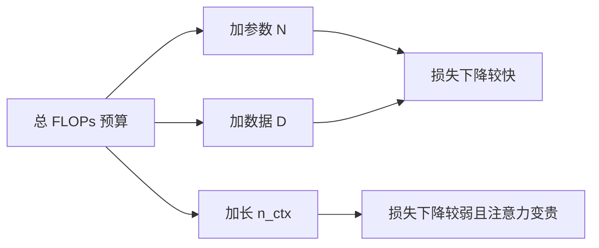

# 上下文长度与损失缩放

把上下文加长，语言建模损失会往下走，但这条幂律比加参数、加数据都弱得多；算力账不能把「更长窗口」当成「更多 token」来花。

<footer>—— Kaplan 等，Scaling Laws for Neural Language Models，2020；对照 Hoffmann 等对固定窗口下参数与数据的权衡</footer>

[二次注意力](/llm/attention-quadratic-cost) 让「把窗口加长一倍」在算力上不是把 token 数加长一倍：每层每 token 要看的键也加长了。Kaplan 等人 2020 年在缩放律里单独画过损失随上下文长度 $n_{\mathrm{ctx}}$ 的变化——它确实下降，指数却远小于模型规模 $N$ 或数据量 $D$ 那两条。Hoffmann 等人后来把计算最优写成 $N$ 与 $D$ 的匹配，实验里上下文往往钉死在一个常数（如 2048）。本篇只把「损失怎么随窗口变」和「算力最优怎么把窗口当常数」这两件事对齐，不把 Hoffmann 的参数–数据法则展开成专文。

## 问题

预训练目标是对下一个 token 的交叉熵。直觉上，看见更长的前文应当更能压低条件熵：远距指代、篇章主题、代码里的函数签名，都会进入条件。问题是下降有多快，以及为了这点下降要付多少 FLOPs。若损失随 $n_{\mathrm{ctx}}$ 急速下降，就应当把训练算力优先砸在窗口上；若几乎不降，窗口只是产品需求，不是缩放杠杆。

Kaplan 的观察是第二种更接近事实。在当时的模型尺度上，加宽上下文带来的损失改进是一条很缓的幂律。与此同时，注意力的计算与激活却按 $n_{\mathrm{ctx}}$ 或 $n_{\mathrm{ctx}}^2$ 涨。于是出现一个容易写错的等式：Hoffmann 意义上的「再多训一些 token」和「每个 token 看更长的前文」不是同一维。前者增加的是独立样本数，后者增加的是每个样本内部的依赖半径，边际收益和边际成本都不同。把 Chinchilla 最优直接套到「128k 窗口」上会算错账：那条曲线默认每个 token 的注意力跨度固定。拉长窗口以后，同样的 FLOPs 预算能喂进去的 token 数变少，最优 $N$–$D$ 配比会平移，而不是保持原公式。

## 方法

### 损失对 $n_{\mathrm{ctx}}$ 的弱幂律

Kaplan 等人在控制模型规模与训练 token 数的前提下变化上下文长度，得到经验形式

$$
L(n_{\mathrm{ctx}})\approx L_{\infty}+\alpha\, n_{\mathrm{ctx}}^{-\beta}
$$

其中 $\beta$ 明显小于他们对 $N$、$D$ 拟合出的指数。含义是：从 1k 到 2k，损失还能掉一截；从 8k 到 32k，再掉的那一截往往小于把同等算力用来加大模型或多看一遍数据。$L_{\infty}$ 可以理解为「即便无限前文也消不掉的熵」，来自语言固有的随机性与局部句法已经提供的大部分可预测性。

这条曲线测的是训练所用窗口内的平均损失，不是「把短训模型硬外推到长窗口」的损失。后者会先经历[位置外推](/llm/position-extrapolation)失败，损失陡升，与缩放律里「更长更低」的方向相反。讨论损失缩放时必须先声明：位置编码仍在训练支撑集内。

### 算力分解：token 数不是窗口长度

一次前向里，FFN 与 $n_{\mathrm{ctx}}$ 近线性，注意力近似

$$
\mathrm{FLOPs}_{\mathrm{attn}}\propto n_{\mathrm{layer}}\cdot n_{\mathrm{ctx}}^2\cdot d
$$

固定总 FLOPs $C$，加长 $n_{\mathrm{ctx}}$ 会挤占可处理的 token 数 $D_{\mathrm{eff}}$。Hoffmann 式的计算最优讨论的是在固定 $n_{\mathrm{ctx}}$ 下如何拆 $N$ 与 $D$；把 $n_{\mathrm{ctx}}$ 当成第三个自由变量以后，最优解是三维的，不能从二维曲线上读。实践中多数实验室仍把窗口当超参而不是当缩放轴：先按 Hoffmann 配好 $N$ 与 $D$，再在预算允许时把窗口从 2k 拉到 8k、32k，而不是指望窗口指数去替代参数指数。

### 训练窗口与推理窗口不要混在一条图上

损失缩放曲线有三种画法，纵轴都叫 loss，含义不同。其一，预训练时就用长度 $n$ 的序列，横轴是 $n$，这是 Kaplan 的设定。其二，模型在 $L$ 上训完，推理时在 $L'\gg L$ 上算困惑度，这是外推评测，见下一篇。其三，用位置插值或 YaRN 把窗口拉长再短续训，损失介于「真的按 $L'$ 预训练」和「硬外推」之间。本篇的缩放只指第一种：数据分布、位置支撑、注意力跨度同时变长时，交叉熵怎么走。

## 机制

弱指数来自信息论上的衰减，而不只是拟合巧合。自然语言的互信息随距离下降：相邻词约束最强，跨句主题弱一些，跨章节更弱。模型在短窗口里已经吃掉了大部分局部可预测性；再拉长窗口，新增的是稀疏、长尾的依赖，对平均交叉熵的贡献按 token 摊下来很小。这与「长上下文对某些任务极关键」不矛盾——任务可以几乎完全依赖那条长尾边，平均语言建模损失却仍对它不敏感。用验证集 PPL 决定要不要上 128k，会系统性低估长窗口的产品价值。PPL 是对所有位置的平均；检索、契约条款、仓库级代码要的是少数关键边。缩放律管的是前者，评测集管的是后者。

注意力二次代价放大了这一不对称：为了平均损失上一个很小的 $\Delta L$，支付的是每个 token 都变贵。线性注意力、滑窗、压缩记忆试图改的是代价这一侧，而不是让 $\beta$ 本身变大。$\beta$ 由数据的长程互信息决定，架构只能决定你为这部分互信息付多少钱。

Hoffmann 对照的机制则更简单：他们的 isoFLOP 曲面把 $n_{\mathrm{ctx}}$ 视为实现细节。Chinchilla 最优说的是「在你选定的窗口下，参数不该过大、token 不该过少」。它解释不了「窗口从 2k 换到 32k 之后最优是否还成立」——要重跑，至少要按新的每 token FLOPs 重标定 $D$。把两条文献叠在一张幻灯片上时，应画成正交轴，而不是把 Hoffmann 的斜率涂到 $n_{\mathrm{ctx}}$ 上。

## 边界与工程取舍

弱幂律是在 Kaplan 当年的规模与数据上测的。数据配比变成大量长文档、代码仓库、多轮对话之后，$\beta$ 可能变大，因为训练分布自己把长程依赖的权重提高了。不能把 2020 年的指数当成物理常数。反过来，若续训语料仍是短网页，只把切窗拉长，模型会看到大量填充和拼接伪依赖，损失曲线甚至会变差。

工程上还有一条：训练用的有效长度往往小于配置长度。打包、文档边界、注意力掩码会让许多 token 根本看不见 $n_{\mathrm{ctx}}$ 那么远。报表里写 32k、实际平均可见跨度 4k，画出的「缩放」是虚假的。应当同时记录平均可见距离，而不是只记录 `max_position_embeddings`。

产品要 128k，训练损失却几乎不再随窗口下降时，正确的反应是改评测与改架构代价（稀疏、缓存、压缩），而不是期待交叉熵自己证明窗口有用。损失缩放回答的是「平均预测还剩多少」，不是「这个窗口能不能当记忆」。

## 小结

- 语言建模损失随上下文长度下降，但 Kaplan 测到的幂律指数远弱于参数与数据。
- 加长窗口提高每个 token 的注意力成本，同等 FLOPs 下有效 token 数下降，不能与「多训 token」混为一谈。
- Hoffmann 等人的计算最优默认窗口固定；把 $n_{\mathrm{ctx}}$ 当自由变量后必须重标定，而不是套用原二维配比。
- 训练支撑内的损失缩放，与位置外推造成的损失陡升，是相反的两种曲线。
- 平均 PPL 对长尾依赖不敏感，不能单独用来决定产品上下文长度。
- 数据是否真是长文档、可见跨度是否真达到配置值，会改变这条曲线的形状。
- 出处：Kaplan 等，*Scaling Laws for Neural Language Models*，2020（损失随 $n_{\mathrm{ctx}}$）；对照 Hoffmann 等，*Training Compute-Optimal Large Language Models*，2022（固定窗口下的 $N$–$D$，不作本篇主题）。
