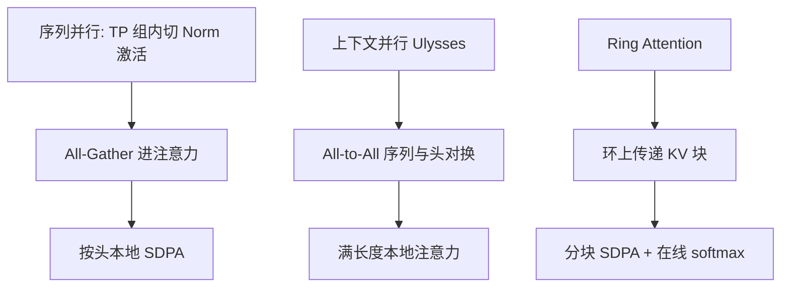

# 序列并行 / 上下文并行

把序列切开，每张卡只存一段 token；注意力要的键值不在本地时，用 All-to-All 换头，或沿环传递 KV 块。

<footer>—— Megatron 序列并行；上下文并行与 Ring Attention 为对照</footer>

张量并行切隐藏宽，流水线切深度，数据并行切 batch。序列足够长时，激活里体积最大的维是 $s$：LayerNorm、Dropout、注意力的 $QKV$ 都带着 $b\times s\times d$。序列并行与上下文并行都把 $s$ 切开，但动机不同。Megatron 的序列并行（sequence parallelism）绑在张量并行上：TP 组里本来完整复制的那一段激活，改沿序列分片，省的是 **Norm / Dropout 的激活内存**，通信仍在同一组 NVLink 卡之间。上下文并行（context parallel）面向超长上下文：每张卡持有连续的一段 token，注意力的全局依赖靠集体通信补齐——DeepSpeed Ulysses 一类用 All-to-All 把头和序列维对换；Ring Attention 沿环传递 KV 块，块上做局部注意力，数学上逼近或等于全局 SDPA。本篇把「为了省激活」和「为了放得下超长 $s$」分成两条，不把它们写成同一个旋钮。

## 问题

注意力是 $s$ 的二次，激活是 $s$ 的一次但系数很大：每层要存 $Q,K,V$ 与残差。$s=8\mathrm{k}$ 升到 $128\mathrm{k}$，激活可以涨 16 倍，ZeRO 切参数帮不上。重计算能丢掉中间 GEMM 的激活，挡不住注意力仍要的 KV。必须让每张卡只持有 $s/C$ 的序列。切开之后，SDPA 不再是本地 $QK^\top$：查询在卡 0 的前 $s/C$ 个位置，键在卡 3 的另一段，没有通信就没有全局注意力。

两条路对应两种缺的东西。序列并行缺的是「TP 之后仍被完整复制的那截 $s\times d$」，它不试图让单卡看不见其他位置的注意力——注意力仍在 TP 组内按头本地算，序列切分发生在注意力之外的算子上。上下文并行缺的是「别的卡上的 KV」，必须在注意力内部通信。混用名字会导致把一次廉价的 Reduce-Scatter 当成一次环形 KV 传递来估带宽。

### 序列维切开之后注意力缺什么

完整 SDPA 需要每个查询看见（因果掩码允许的）全部键。序列切成 $C$ 段后，本地块只覆盖一个区间。缺的是其他区间的 $K,V$。补法大致三类：

1. **先变成按头切**：All-to-All 把「每卡一段序列、全部头」换成「每卡全部序列、一部分头」，注意力按头本地做完，再 All-to-All 换回。这是 Ulysses 风格的上下文并行。
2. **块状传递 KV**：卡 $i$ 把本地 $K,V$ 发给环上的下一家，同时用当前收到的块与本地 $Q$ 算一块注意力，用在线 softmax 累加。环走 $C-1$ 步后，每个查询见过全部键。这是 Ring Attention 的图像。
3. **不补全局**：局部窗、稀疏模式，那就不是全上下文并行，而是改算法。

因果掩码在切分下必须按全局下标写：卡上的局部位置 $0$ 可能对应全局位置 $s/C$ 起。写错掩码会出现「未来泄漏」或「整段看不见」。

序列并行（Megatron）通常不走这三类里的任何一类去补 KV。它的注意力仍假设 TP 组内每张卡对**完整序列**做自己的那些头。切开的是注意力前后的激活。读论文时看到 sequence parallel，先问一句：注意力内部有没有跨卡 KV。

## 方法

**Megatron 序列并行**：在列并行线性之前，激活沿 $s$ 做 Reduce-Scatter，每卡持有 $s/T$；LayerNorm / Dropout 在分片上算；进入注意力或 MLP 的 GEMM 前再 All-Gather 回完整 $s$（或与 TP 的通信融合）。前向的 All-Reduce 常改写成 Reduce-Scatter + 后续 All-Gather，体积同阶，但 Norm 的激活降为 $1/T$。它要求已经开 TP，组大小 $T$ 即切分份数。单独开「序列并行」而不开 TP，在原论文设定里没有对应物。

**Ulysses 式上下文并行**：设备沿序列切成 $C$ 份。注意力前 All-to-All：把序列维与头维对换，每卡得到全部 $s$、头数 $h/C$。本地完整长度的注意力（仍可再走 FlashAttention），然后再 All-to-All 把输出换回序列分片。头数必须能被 $C$ 整除。通信体积与 $b s d$ 同阶，次数每层两次 All-to-All。优点是注意力内核可以复用现成的满长度实现；缺点是 All-to-All 的对端数随 $C$ 涨，跨节点时延迟扎手。

**Ring Attention**：不把头维切走。每卡固定持有自己的 $Q$ 块，KV 块在环上轮转。每一步用当前 KV 块与本地 $Q$ 做分块注意力，用 online softmax 把分子分母累积起来，保证与一次性 SDPA 在精确算术下等价（浮点顺序不同，末位有差）。通信是点对点、与计算重叠：算当前块时传下一块。因果情形下，有的实现只传需要的上三角块，体积可减。$C$ 可以大于头数，这是相对 Ulysses 的结构自由。

### Megatron 序列并行：为了激活，不是为了超长

把 $s$ 从 2k 拉到 8k，序列并行按 $T=8$ 把 Norm 激活降到原来 TP-only 的 $1/8$ 量级，注意力的 $QKV$ 在 Gather 之后仍是满 $s$。超长到单卡 Gather 后的注意力都放不下时，序列并行不够，必须上上下文并行或稀疏化。工程上二者可叠：节点内 TP+序列并行省 Norm，跨节点上下文并行切真正的 $s$。通信域仍然要分开记账。

## 机制

Ulysses 的 All-to-All 把布局从 $(s/C,\, h)$ 换成 $(s,\, h/C)$。每张卡发出自己的序列块给所有需要对应头的卡。负载在头之间均匀时，体积均衡；GQA 下 KV 头很少，$h_{\mathrm{kv}}<C$ 时对换失败，必须复制 KV 或改切分轴。Ring 的每步 P2P 体积是一块 $K,V$：$\propto b\cdot(s/C)\cdot d$。$C$ 步之后总流量 $\propto b s d$，与 All-to-All 同阶，但模式是邻居之间的带宽，更容易叠计算。环的直径是 $C$，最后一块 KV 到达的延迟 $\propto C$；过大的 $C$ 让末步的计算掩盖不住等待。

在线 softmax 是 Ring 等价性的核心：不能对各块各自 softmax 再平均，那会错。必须累积 $\max$、$\sum e^{s_{ij}-\max}$ 与加权值，按块更新。实现漏掉 max 的跨块传播，会出现一整段注意力被某一块主导或数值 Inf。FlashAttention 已经在单卡分块里做了同一套累积；Ring 是把块分到了不同卡。

上下文并行不降低注意力的渐近 FLOPs：全局 SDPA 仍是 $O(s^2 d)$，只是把二次计算摊到 $C$ 张卡上。每卡 $O((s/C)s d)=O(s^2 d/C)$。要降 FLOPs 只能改算法（局部、稀疏、线性）。并行只降墙钟与单卡内存。

### 上下文并行的 All-to-All 与环形传递

选 Ulysses 还是 Ring，看头数与网络。头多、节点内 $C$ 不大，All-to-All 实现成熟，内核复用满长度 FlashAttention，Ulysses 省事。头少、GQA、$C$ 很大、跨节点，Ring 的 P2P 与「$C$ 可大于头数」更有利。Megatron 后续的 context parallel 实现常走环形 P2P，与 Ring Attention 同一族，细节（是否与 TP 融合、因果是否减传输）以各框架为准。不要假定某一个开源名字等于 Liu 等人论文里的每一条优化。

与 TP 融合时，通信可以是「先 TP 的 All-Reduce，再 CP 的环」或把拓扑排成 2D mesh：一维头、一维序列。画错 mesh，会出现同一条消息既走 NVLink 又走 IB 的最慢路径。这是拓扑问题，公式 $O(s^2)$ 读不出来。

## 边界与工程取舍

序列并行几乎是 TP 的标配附件，代价小，应默认开——前提是实现把 Dropout RNG 与分片对齐。上下文并行是长序列训练 / 长序列离线推理的选项，短 $s$ 上 All-to-All 或环的启动开销不值得。服务期 decode 每步 $s$ 在变、batch 小，环的 $C$ 步延迟很痛，常常不用训练时的 $C$。

文档位置编码、因果掩码、滑动窗，都要按全局下标。RoPE 的 $\theta$ 用全局位置，不是块内位置。块间 Ring 若漏传某一块，表现为特定距离的依赖消失，下游长程评测掉点，训练损失未必立刻炸——这比 NaN 更难发现。应用固定长度探针测「距离 $k$ 的复制任务」来回归 CP 实现。

不要用上下文并行去补「TP 度不够」。单层矩阵过宽应加 TP 或 ZeRO-3；序列过长才加 CP。用 CP 切 $s$ 却仍在单卡上聚集完整宽度，是用错了轴。

检查点与随机性：序列分片使同一微批的 token 不在同一卡上，日志里的 per-sample loss 需要按全局位置拼回。对比不开 CP 的基线时，微批里的 token 集合应一致，只是放置不同。数据加载器按序列切而不是按样本切时，要保证 padding 与文档边界不会让某一卡长期吃空段，否则负载不均类似 MoE 热专家。

## 小结

- 序列并行（Megatron）在 TP 组内沿 $s$ 切 Norm/Dropout 激活，注意力仍见完整序列；目的是省激活，不是无限加长 $s$。
- 上下文并行让每卡只持有一段 token，注意力用 All-to-All 换头（Ulysses）或环传 KV（Ring Attention）补全局依赖。
- 二者通信量都与 $b s d$ 同阶，但不降 $O(s^2)$ FLOPs；Ring 的 $C$ 可大于头数，Ulysses 要求头数能被 $C$ 整除。
- 因果掩码与 RoPE 必须用全局位置；在线 softmax 保证分块与一次性 SDPA 等价。
- 短序列与在线 decode 往往不值得开上下文并行；训练拓扑要把 TP 与 CP 的通信域分开。
- 出处：Megatron 序列并行（Korthikanti 等，与 Shoeybi 等的 TP 配套）；DeepSpeed Ulysses 的序列–头 All-to-All；Liu 等 Ring Attention 作为环形 KV 传递的对照。
