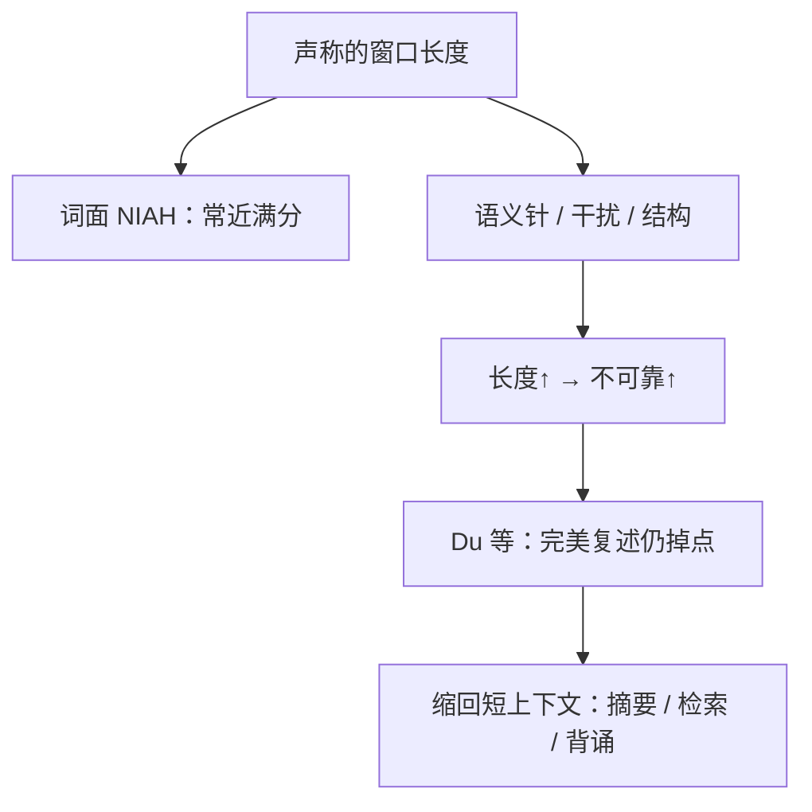

# Context Rot 上下文腐烂

<div class="epigraph">
<p>模型被假定对窗口里每一个位置同样可靠；实测里，输入变长之后，即便任务本身没有变难，表现也会变得不稳定。</p>
<footer>—— Hong、Troynikov、Huber，Context Rot: How Increasing Input Tokens Impacts LLM Performance，Chroma 技术报告，2025 年 7 月</footer>
</div>

窗口从 4k 涨到 1M 之后，产品叙事很容易写成：只要塞得进，模型就能用。Hong、Troynikov、Huber 把相反的现象命名为 **context rot**（上下文腐烂）：在 **任务复杂度保持不变**、只拉长输入时，一批前沿模型的表现仍随长度恶化，而且往往不是平滑的一条斜线。报告评了 18 个模型，含 GPT-4.1、Claude 4、Gemini 2.5、Qwen3。Anthropic 的工程博文随后把同一观察收成「注意力预算」：每多一个 token 都在消耗有限的 pairwise 注意力。Du、Tian、Peng 等人的 *Context Length Alone Hurts*（EMNLP 2025 Findings，arXiv:2510.05381）走得更远：即使证据能被 **逐 token 背出**，甚至把无关位置掩掉，长度本身仍能把解题准确率打掉 13.9%–85%。本篇写腐烂与「找不到针」的差别，评测协议见 Chroma 报告与 Du 等；位置 U 形曲线见 [Lost in the Middle](/llm/lost-in-middle)。

## 问题

Needle-in-a-Haystack（NIAH）把一句已知事实插进无关长文，再要求原样取回。许多长窗口模型在词面匹配的 NIAH 上接近满分，于是「长上下文已解决」被写进发布稿。Chroma 指出这只测了 **词面检索**。真实代理要在语义相近、带干扰项、带对话结构的材料里做消歧。NoLiMa 已经显示非词面针（要靠世界知识把 Kiasma 博物馆连到赫尔辛基）随长度掉点；AbsenceBench 测「某片段不存在」也会随长度坏。更棘手的是：许多长上下文基准在加长输入时 **同时加难**——图更大、列表操作更多——于是长度与难度缠在一起。腐烂实验的方法论要求把难度钉死，只变 token 数。

「均匀处理」是一个隐含假设：第 100 个 token 与第 10,000 个同样可被准确使用。Transformer 的全连接注意力给出 $n^2$ 条 pairwise 关系；Anthropic 将其写成注意力被拉薄。训练分布里短序列更常见，位置插值让模型「够得着」更长下标，但不提供等量的长程监督。于是出现梯度而不是悬崖：还能用，但不均匀，也不校准。

### 简单任务也会随长度变差

Chroma 把 NIAH 扩成四组受控实验，并加 LongMemEval 对话问答与「重复词复述」这类刻意简单的任务。重复词看起来像复制，却已能画出模型特异性的非单调曲线。含义是：腐烂不是「任务太难所以长了就崩」，而是 **长度作为变量本身** 在简单任务上就可见。真实应用更复杂，报告推断实际退化只会更重——这是外推，不是新的表。

<span class="marginnote">腐烂不是磁盘上的 bit rot，也不是权重在会话中被改写。它是条件分布随上下文长度与内容结构漂移：同一问、同一针，只是前面多了合法 token，答对概率就变。KV 缓存正确、检索命中，都不足以取消这件事。</span>

## 方法

针与问题的相似度用五个嵌入模型的余弦平均来标（含 `text-embedding-3`、jina、voyage、MiniLM）。相似度降低时，随长度掉点更快——更接近真实问答里「问句与证据并非同词复述」。干扰项（distractor）与无关文本要分开：前者主题相近但不回答问题，后者完全跑题。在高相似针对上放置 0 / 1 / 4 个干扰项，干扰的伤害随长度放大，且模型之间「谁更怕哪一条干扰」不一致。干草堆主题（Paul Graham 随笔 vs arXiv 论文）与针的相似度没有统一方向，说明不能用「针与背景越像越好/越差」一条规律办事。干草堆结构则稳定有影响：打乱句子、毁掉篇章论证流，会改变模型利用长输入的方式——NIAH 把随笔当填充物，等于假设结构无害，这一假设不成立。

每组条件扫 8 档输入长度、针在窗口中的多个位置。协议故意保持任务形式不变，只拼接更多背景。这与「加更难的多跳题」不是同一实验。代码随报告发布，引用时用

```
Hong, Kelly; Troynikov, Anton; Huber, Jeff.
Context Rot: How Increasing Input Tokens Impacts LLM Performance.
Chroma, July 2025. https://trychroma.com/research/context-rot
```

Du 等人把「检索已经完美」写成更硬的条件：模型必须能把证据 **精确复述**。即便如此，把 MMLU 题用无关 token 拉到 3 万级，Llama-3.1-8B-Instruct 仍可在 1000 题里 970 题完美复述，准确率却相对短上下文掉 24.2%。把无关 token 换成空白、把证据紧贴问题、甚至掩掉无关位置只保留证据与问题，长度带来的伤害仍在。缓解是 **先背出证据再解题**，把长任务改写成短任务；GPT-4o 在 RULER 上相对已很强的基线最多再抬约 4%。



### 注意力预算与 $n^2$

Anthropic 把腐烂接到架构：token 之间两两可见，长度增加使任意一对关系分到的有效容量下降。这不是一条新的注意力公式，而是对「窗口广告值 = 有效工作记忆」的拒绝。位置编码插值让下标合法，却可能降低位置分辨。训练若很少见到「在 100k 处做精细消歧」，运行时把代理轨迹堆到那里，等于分布外。因此工程上应把 **有效上下文** 当成小于标称窗口的资源，用压缩与检索主动收缩，而不是等到 API 报错。

## 机制

腐烂至少有三条可分开的机制，评测要把它们拆开而不是混成一个分数。

**定位失败。** 证据在中间或被相似干扰包围，注意分配不到正确跨度。这与 [Lost in the Middle](/llm/lost-in-middle) 的 U 形重叠，但腐烂强调即使针的位置扫过，长度本身仍改变曲线的高度。

**定位成功、解题失败。** Du 等的设定：复述对了，答案错了。空白填充几乎不提供语义干扰，伤害仍在，说明不是「被相似段落骗走」。一种工作假说是位置距离与层间传播把证据表示冲淡；掩码实验显示「看不见干扰」也不够，因为证据与问题之间的 **距离** 已经变了。

**轨迹自污染。** 代理场景里，错误分叉、过期工具输出会作为后续 token 的条件。Li 等人的 SelfCompact 把这称为 junk 锚定：同一模型从干净开局能做对的题，接上自己的烂推理就会错。这是腐烂在 **自生成上下文** 上的版本，与静态 NIAH 不同。

<span class="marginnote">发布稿里的「1M 满分 NIAH」只排除了词面取针失败。它不排除语义针、干扰项、结构破坏、对话记忆，更不排除「针取到了但推理坏了」。用 NIAH 当作长上下文验收，相当于用单元测试代替集成测试。</span>

### 为何打乱干草堆会改分数

保持词袋、毁掉论证顺序，等于改变注意力可利用的叙事先验。模型在预训练里见过「随笔有起承转合」；打乱后，局部连贯消失，检索线索从篇章结构变成词面匹配。若分数因此变化，说明模型 **在用结构**，而经典 NIAH 把结构当噪声源，会高估「无关填充无害」。评测应报告填充物类型，而不是只报告 token 数。

## 边界与工程取舍

Chroma 报告不是会议论文，是实验室技术报告：任务仍偏合成，18 个模型的名单会过时。它的价值在协议——隔离长度、区分干扰与无关、报告非单调性。Du 等是会议发现，但「空白当填充」对聊天模型仍可能触发格式先验。两者都 **没有** 声称存在一个对所有模型成立的腐烂阈值（例如「超过窗口 40% 必崩」）；具体悬崖随模型与任务变。

产品对策不是盲目加窗，而是减少无效 token：工具结果清理、[摘要压缩](/llm/compaction-summarize)、[检索式压缩](/llm/retrieval-based-compaction)、[即时取上下文](/llm/jit-context-retrieval)。加窗可以推迟溢出，但边际 token 的信息密度若下降，注意力预算仍会被稀释。混合策略：必须通读的材料进窗口，可索引的材料留在盘上。

<span class="marginnote">「腐烂」容易被写成玄学。能操作的定义是：在固定任务与固定证据下，仅增加输入长度（或自生成轨迹长度）导致的可靠度下降。测的时候要锁住针、锁住问、锁住评分，只改填充。</span>

## 小结

- Context rot 指任务难度不变时，加长输入仍使 LLM 表现更不可靠，即使词面 NIAH 接近满分。
- Chroma 2025 报告在语义针、干扰项、干草堆结构与简单复述上展示长度效应；干扰与无关文本必须分列。
- Du 等表明完美复述证据之后，长度仍可显著伤害解题；先背诵再推理是把长任务改写回短任务。
- 机制上要分开「找不到」与「找到了却用不好」，以及代理轨迹里的自污染。
- 标称窗口不是有效工作记忆；工程上应按注意力预算主动收缩上下文。
- 出处：Hong 等，Chroma 技术报告，2025 年 7 月；Du 等，*Context Length Alone Hurts LLM Performance Despite Perfect Retrieval*，arXiv:2510.05381；Anthropic，*Effective context engineering for AI agents*，2025-09-29。
