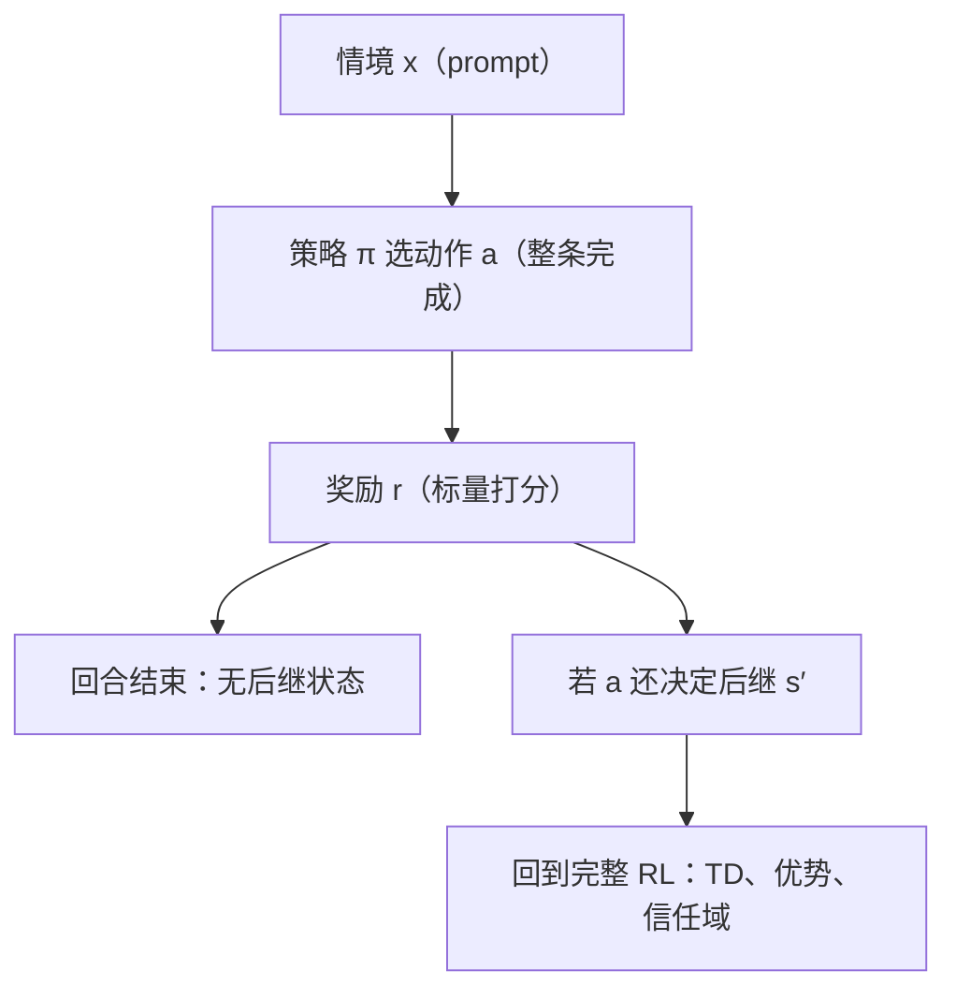

# 上下文 bandit

上下文 bandit 是把 MDP 的时间维砍掉之后剩下的东西：看一眼情境，选一次动作，拿一拍奖励，回合当场结束。

<footer>—— 据 Sutton 与 Barto, Reinforcement Learning: An Introduction, 2018 第 2 章；Auer 2002 整理</footer>

[上一课](/llm/ppo-clip-view)用信任域语言重读了 PPO 的 clip：把比率裁剪读成近似信赖域，并把 [GRPO](/llm/grpo) 放成无价值函数的折中。策略梯度这条线至此有了完整骨架，但它处处默认动作有长期后果。本课转入本单元的第一件最小案例：上下文 bandit——把时间维整个砍掉，看课程的哪些机制随之消失，哪些仍然留下。缺口不是简化，而是把「现在选什么」与「之后发生什么」分开，才能说清 LLM 后训练里哪些问题其实只有 bandit 那么大。

## 问题

从 [MDP 五元组](/llm/mdp-five-tuple)起，本课程的困难都来自一件事：现在的动作改变以后的状态。价值函数为动作记账，贝尔曼方程让跨时间的账自洽，优势函数把功劳从回报里拆回 token，自举（[TD(0) 与自举](/llm/td-zero-bootstrapping)）用下一状态的估计换方差。若动作不改变后继状态、回合在选出动作的瞬间结束，这层机制还剩多少？问题反着问更锋利：RLHF 里一次「prompt—完成—打分」到底用到了多少时间结构——如果没用上，为它付出的方差与偏差就是白付。

### 回合只有一拍

上下文 bandit 的定义三行就写完：情境 $x\sim d(x)$，动作 $a\sim\pi(\cdot\mid x)$，奖励 $r\sim R(\cdot\mid x,a)$，然后回合结束。目标 $J(\pi)=\mathbb{E}_{x,a}[r]$。它是 MDP 的特例：视界为 1，转移算子退化，折扣 $\gamma$ 无处安放。策略梯度定理在这里退化成单项式

$$\nabla_\theta J=\mathbb{E}_{x,a}\big[(r-b(x))\,\nabla_\theta\log\pi(a\mid x)\big],$$

没有对时间的求和，没有信用分配链，基线只需逐情境给 $b(x)$。动作价值 $Q(x,a)=\mathbb{E}[r\mid x,a]$ 可以直接从数据平均出来，不必自举——[致命三要素](/llm/deadly-triad)里「自举」那一角直接消失。

## 方法

与完整 RL 的对照要逐项过。消失的：转移 $P$、折扣、跨步信用分配、价值函数的自举链。留下的：探索——情境内的动作分布仍要看不见全部奖励才能学好。ε-贪婪（[探索与利用：ε-贪婪与乐观](/llm/exploration-epsilon)）与乐观面对不确定性加成，Auer 2002 对 UCB 给出对数级遗憾界：总遗憾只随回合数按对数增长，探索的代价被严格定价。上下文信息的加入不改变这个结构，只把「每个动作一个均值」换成「每个情境学一张动作—奖励表」。

Auer 2002 的 UCB1 在随机 bandit 上把期望遗憾压到对数级；温度采样不是这个意义上的探索——它不随证据更新动作分布，也不承诺任何遗憾界。

## 机制

价值函数为什么在 bandit 里可有可无，值得说透：完整 RL 里 $V$ 存在是为了在动作后果到来之前预估它；bandit 的后果当场兑现，评估与最优选择合一，回归器就是价值函数。这解释了 bandit 问题里没有 GAE、没有 TD 误差、也没有信任域焦虑——一步之内没有「走太远」的几何意义，[信任域与单调改进](/llm/trust-region-monotone)讨论的策略散度失去了载体。

LLM 的对应由此逐项落位。RLHF 的第一层天然是 bandit：prompt 是情境，整条完成是一个动作，[奖励模型](/llm/reward-model)的标量是当场兑现的奖励。序列级 REINFORCE（[REINFORCE / R3](/llm/reinforce-llm)）是有意按 bandit 办事：整段 $\log\pi_\theta(y\mid x)$ 乘同一个 $(R-b)$，放弃 token 级信用，接受随之而来的方差。Best-of-N（[Best-of-N](/llm/best-of-n)）是只利用、不学习的 bandit——每一步都从同一个策略抽 $N$ 条、按分取最大，选择不改变下一次的分布。单轮偏好标注（同 prompt 两答选一）更是一个纯 bandit 数据问题：[语言生成作为 MDP](/llm/llm-decision-view) 里的时间维在这类数据上根本没被触碰。

bandit 视角何时不够：同一回合内 token 其实有后果——开头定下的句式决定后面能不能拿到奖励，推理链的前半段决定后半段的对错。这时要把时间结构请回来。[过程奖励进训练环](/llm/prm-in-rl-loop)给长链补中间刻度，正是在 bandit 视角上重新架起信用分配；PPO/GRPO 的逐 token 比率则是承认动作不是整条完成、而是每个 token。

## 边界

把一切都叫 bandit 会错在哪。其一，遗憾界的假设会被 LLM 场景悄悄破坏：情境分布不因动作改变，而策略更新会改变下一批到达的 prompt（用户会涌向表现好的用法），非平稳性没有进 Auer 的账。其二，温度采样常被当成探索，但它是固定的抽样扰动，不随证据收敛，[探索与利用：ε-贪婪与乐观](/llm/exploration-epsilon)的账它认领不了。其三，多步任务（工具链、代码库）动作后果跨回合存在，bandit 只能当近似，硬套会把长程信用错误记到最后一拍上。

## 小结

- 上下文 bandit 是视界 1 的 MDP：情境、动作、即时奖励，无转移、无折扣、无跨步信用分配。
- 策略梯度退化为单项 $(r-b(x))\nabla\log\pi$；动作价值可直接平均，不必自举，致命三要素少一角。
- 探索问题完整保留：UCB 的对数遗憾界给探索定价；温度采样不算探索。
- RLHF 的单轮偏好、序列级 REINFORCE、Best-of-N 都是 bandit 视角的合法实例；token 有后果时要把时间维请回来。
- 出处：Sutton 与 Barto, *Reinforcement Learning: An Introduction*, 2018 第 2 章；Auer 等, Finite-time Analysis of the Multiarmed Bandit Problem, 2002。
