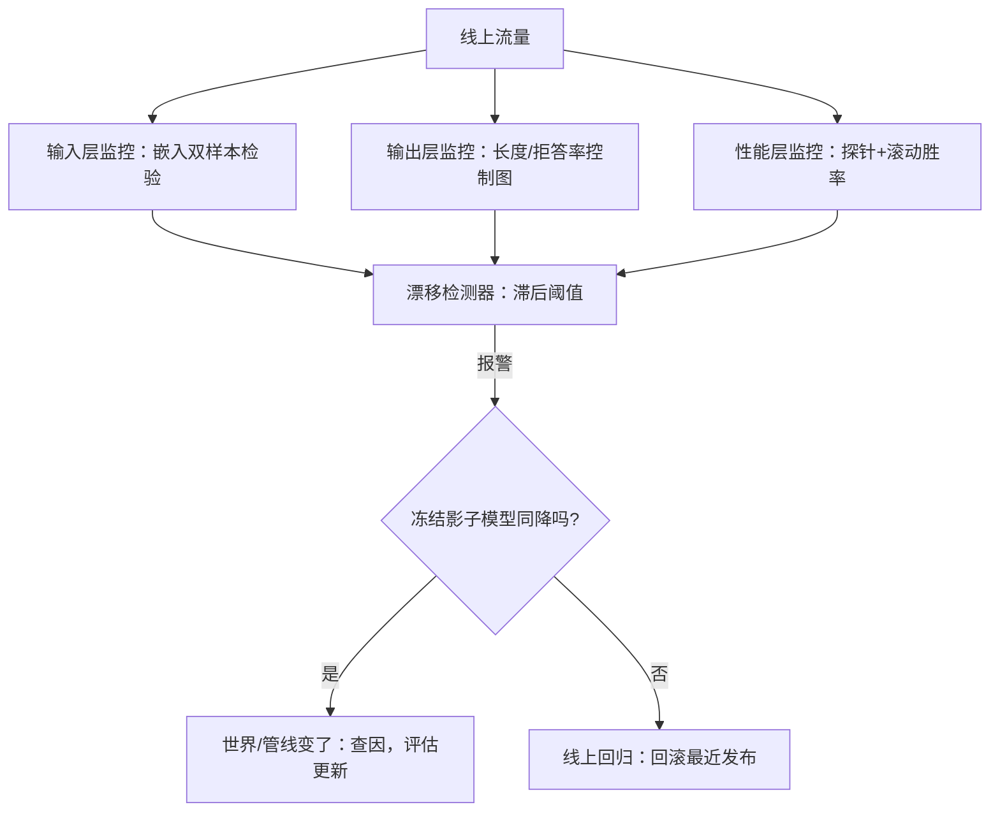
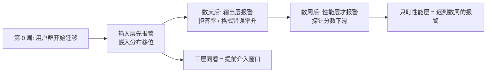

# 概念漂移的检测

持续学习系统最难的不是学，而是决定何时学；更新该由证据触发，不该由日历触发。

<footer>—— 据 Gama 等 2014（漂移综述）、Bifet 与 Gavaldà 2007（ADWIN）整理</footer>

[上一课](/llm/continual-test-time-training)把适配压进单次请求。从本课起视角反过来：生产环首先要回答的不是「怎么更新」，而是「要不要更新、现在吗」。漂移检测就是这个触发器：从流量里辨认「世界变了」的证据，把更新从排班变成响应。检测做得糙，两个极端都会出现——永不触发，模型悄悄过期；天天触发，警报成了狼来了。

## 问题

线上指标变差有三种死因，处置完全不同。世界变了（概念漂移）：用户群、语言、任务组合移动，模型没变但不再合身。模型变了（回归）：昨天的更新本身坏了。管线变了：分词、模板、上游服务的表面改动。混在一起时，「指标降了就回滚重训」会同时做错三件事：漏掉坏版本、白训一轮、真漂移淹没在噪声里。缺口是可分离的证据链。

### 漂移的三层

输入分布漂移（协变量漂移）：查询的 embedding 分布、语言构成、长度、领域占比移动。输出分布漂移：回答长度、拒答率、格式崩坏率变化，多半是输入先动了。性能漂移（概念漂移的严格义）：同样的输入，对的输出变了——用户不再接受旧答案，或新法规改判对错。三层移动有经验规律：输入先动，输出跟着，性能最后；只监控最后一层，报警时已晚了几个周期。

ADWIN（Bifet 与 Gavaldà 2007）在单流上维护变长窗口，均值差超界即报新窗口并收缩旧窗口；Page-Hinkley 更早，是累积和检验的老牌做法。两者都只处理一维流，嵌入分布要先用 MMD 一类双样本检验压成标量。

## 方法

监控按三层布点。输入层：对查询嵌入按天/周做双样本检验，对领域占比做份额监控。输出层：长度、拒答率、格式错误率做带滞后阈值的控制图——超阈值持续 $k$ 个窗口才报，单点不报。性能层：固定探针电池加滚动偏好胜率。证据链的分离装置是一个**冻结影子模型**：线上一直挂一份钉死版本的模型跑同样探针。探针成绩与影子同降，是世界或管线变了；影子稳而线上降，是最近更新回归——这一刀把最难分的两种死因切开。

直觉类比：冻结影子模型就像药物试验里的安慰剂对照组——成分（版本）完全不变，经历同样的环境（同样的探针题）。病人（线上模型）和对照组同时变差，说明是天 reason（世界变了）；只有病人变差，才是药（新版本）的副作用。没有对照组，你永远说不清该怪世界还是怪自己上周的更新。

## 机制

统计设定决定报警质量。单流标量用 ADWIN 或 Page-Hinkley，窗口长度是时延与灵敏度的交换：短窗抓得快但抖动多，长窗稳但模型多带伤跑几周。多维检验要防多重检验——同时监控几十个切片，无漂移时也总有切片显著，要有家族级校正或只在预注册切片上报。滞后阈值与双侧回滞（触发与解除分开）是把统计工具变成可运维设备的两颗螺丝。

[动态基准与题库轮换](/llm/live-benchmarks)是检测的慢变量：新题不进训练、持续滚动，成绩下滑即能力过期信号；滚动基准看周与月，探针与控制图看小时与天。别把检测器本身污染掉——监控查询若也被训练，就绕回[训练-评测污染检测](/llm/eval-contamination)的问题。

## 边界

检测不构成响应。没有预案的漂移报警只是图表：报警要绑定三选一的动作——回滚、评估更新、立案观察，并写明每档动作的负责人与时限。季节性是伪漂移的大头：工作日/周末、学期/假期、大促，都可以让输入层报警，处置不是重训而是把已知周期从报警里扣掉。慢漂移对检测器最难：单窗看不到显著差异，靠的是探针电池的趋势线而不是报警器。最后，漂移检测的结论必须可复核——把每次报警的窗口、统计量、当时的处置记进台账，否则三个月后没人说得清那次「误报」到底是什么。

## 小结

- 更新应由证据触发：漂移检测是生产环的触发器，没有它就是盲目排班或永不更新。
- 指标变差有三种死因：世界变、模型变、管线变，冻结影子模型切开前两种。
- 监控分三层：输入、输出、性能；输入先动性能后动，只看性能层必然迟到。
- 统计设定决定质量：窗口长度、滞后阈值、多重检验校正，是把检验变成设备的螺丝。
- 检测必须绑定响应预案与台账，否则只是仪表盘装饰。
- 出处：Gama 等 2014 的漂移综述；Bifet 与 Gavaldà 2007（ADWIN）；Page 1954 的连续检验谱系。
