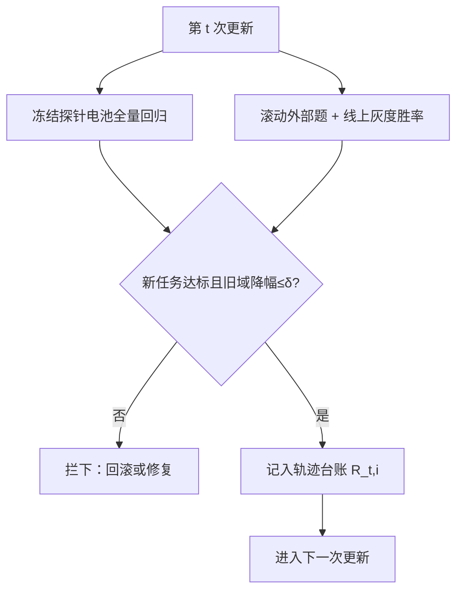
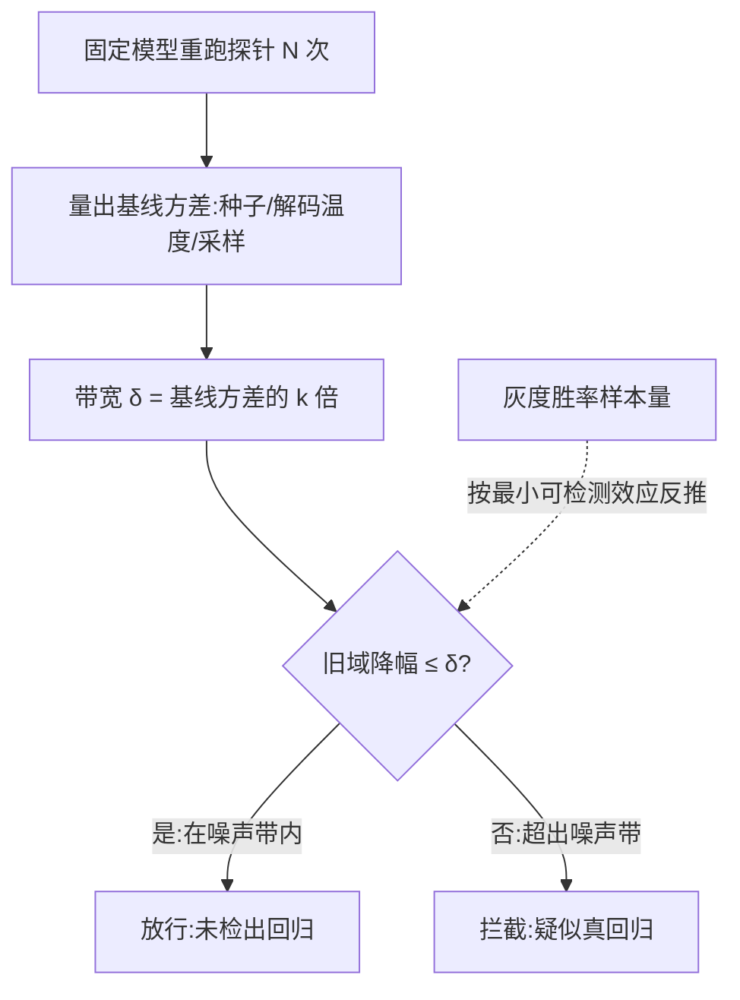

# 持续学习的评测协议

持续学习的学生不能只考期末：这门课的记分单位是整条成绩轨迹，不是最后一个点。

<footer>—— 据 López-Paz 与 Ranzato 2017、Chaudhry 等 2019 整理</footer>

[上一课](/llm/continual-feedback-privacy)把住入口，本课管出口：每次更新到底好不好、这门持续学习的课整体学得怎么样，需要一个可比、可复核、防作弊的记分协议。第一单元已把遗忘写成[度量](/llm/forgetting-metrics)，那是单条序列的读数；本课把它扩成生产环的常设制度：探针怎么冻结、门怎么设、轨迹怎么记账。

## 问题

单点评测在持续学习里有系统性盲区。只评新任务，看不见旧能力正在漏；只评旧任务，新任务可能根本没学会；只看线上均值，局部灾难被全局平均稀释。更隐蔽的是评测集自身的漂移：静态题库会被环里的模型与训练数据慢慢背下来，成绩虚涨；动态题库又引入新题方差。持续学习比批处理更怕这个，因为它的训练数据就是线上的流量——评测集与训练集天然挨得近，不设防的协议会安静地变成自我打分。

### 轨迹指标

把第 $t$ 次更新后任务 $i$ 的探针成绩记为 $R_{t,i}$，三个数概括一条轨迹。平均成绩 $\bar R=\frac{1}{T}\sum_i R_{T,i}$，期末总分。后向迁移 $B=\frac{1}{T-1}\sum_i (R_{T,i}-R_{i,i})$，负值就是「后来的学习对已有能力的税」。新任务起点成绩与它的最大值的差衡量前向迁移，反映可塑性。三个数一起看才构成稳定-可塑性的完整读数：只优化 $\bar R$ 会压抑一切更新，只盯新任务会交重遗忘税。

用数字看「后向迁移税」：设训完客服任务时成绩 80 分，三个任务全学完后客服只剩 65 分，则客服那项 $R_{T,i}-R_{i,i}=-15$。若几个旧任务都在 -15 上下，平均后向迁移 $B\approx-15$——这个负数就是后续学习对旧能力收的税，越接近零越好。

GEM 论文（López-Paz 与 Ranzato 2017）定型了后向/前向迁移的记法；Chaudhry 等 2019 把小样本回放下的同一套指标做成标准基准口径。生产里直接沿用记法即可，别再造第二套术语。

## 方法

制度四件套。**冻结探针电池**：每个能力域一组固定题，版本化、封存、永不参与任何训练，入库走与[评测去污染流水线](/llm/eval-contamination)相同的 n-gram 与嵌入查重；电池本身过时了就换版，新旧版并跑一个周期对齐读数。**发布门**：新任务达标线＋旧域回归带宽（比如任一旧域探针降幅超 $\delta$ 即拦下），带宽按域的历史方差定，不拍脑袋。**滚动外部题**：接[动态基准与题库轮换](/llm/live-benchmarks)的口径看慢变量，防止内部电池全体虚涨。**轨迹台账**：每次更新的 $R_{t,i}$ 全量入账，带数据配方、模型版本、探针版本——没有台账的协议只有当次读数，没法回答「从哪次更新开始坏的」。

## 机制

门为什么要带宽而不是单点比较：探针读数有采样与训练方差，把噪声当回归会冻死整个环，把回归当噪声会放行真事故。正确做法是先量出「无更新也这么抖」的基线方差——固定模型重跑探针的方差、种子与解码温度的贡献——带宽取方差的倍数。这在统计上就是把「检出回归的功效」当作协议参数来设计，而不是事后解释。线上侧同理：灰度胜率的样本量按最小可检测效应反推，样本不够的判定是在抛硬币。

「基线方差」就是「什么都不改时读数自己会抖多少」：同一个模型把探针重跑十遍，成绩也会因随机种子、解码温度不同而上下浮动。先量出这个天然抖动范围，再放大几倍当门带宽——低于它的下降多半是噪声，超过它的才值得报警。

[人类评测协议](/llm/human-eval-protocol)与[成对比较协议](/llm/pairwise-label-protocol)在环里的位置是仲裁与抽检：探针答不了的开放维度（语气、有用性）靠人评，人评贵所以只抽样；标注一致性要持续监控，标注员疲劳是轨迹里一种特殊的「漂移」——变的不是模型而是尺子。

## 边界

协议的失效方式要有预案。探针泄漏：环里任何组件把探针题喂进训练，读数从此虚高，抽查式插入金丝雀题可发现。探针陈化：能力域变了而电池没变，门会拦住本该放行的更新——并跑换版是唯一解。带宽过宽：等于没有门，宁可在历史事故上校准。外部基准饱和（见[基准饱和](/llm/benchmark-saturation)）让滚动题也递减信息量。最后，协议覆盖不了「该不该学」的判断：探针只能回答「这次更新有没有变好」，方向对不对是上一单元漂移检测与产品判断的事——把评测协议当决策引擎，是持续学习组织最体面的偷懒。

初学者容易把评测协议当成「考完就算」的一次性动作。持续学习里它是常设制度：探针题会被环内模型慢慢背熟，读数变成自我打分，所以电池要防污染、要定期换版并跑对齐；没有轨迹台账，出了问题连「从哪次更新开始坏的」都答不出来。

## 小结

- 记分单位是轨迹：平均成绩、后向迁移、前向迁移三个数合读，缺一个都会骗人。
- 探针电池必须冻结、版本化、防污染，换版并跑对齐读数。
- 发布门是「新任务达标＋旧域带宽」，带宽由基线方差校准，不是拍脑袋的常数。
- 外部滚动题防自我打分，人评做仲裁与抽检，标注一致性本身也要监控。
- 轨迹台账是协议的存根：无台账则无法归因「从哪次更新开始坏的」。
- 出处：López-Paz 与 Ranzato 2017（GEM 指标）；Chaudhry 等 2019（回放基准口径）；Hardt 等 2016（方差与稳定性的统计口径）。
