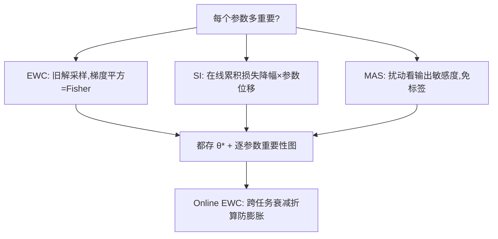
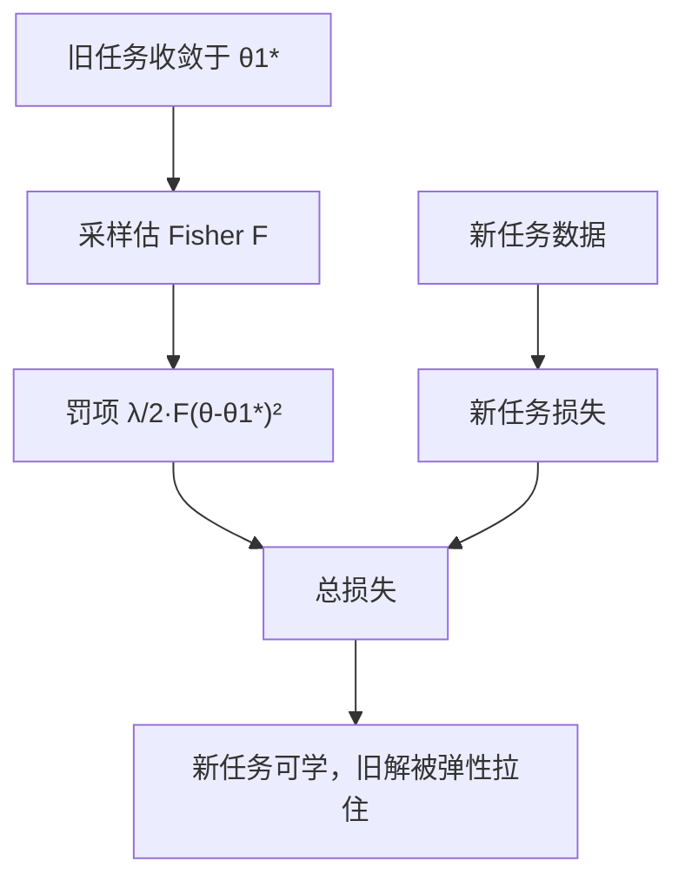

# 参数正则：EWC 一族

一个参数重不重要，不看它的绝对值，看曲率：动它一格，旧任务的损失涨多少。

<footer>—— Kirkpatrick 等，Elastic Weight Consolidation，PNAS 2017</footer>

[上一课](/llm/continual-forgetting-mechanism)把遗忘拆成方向与步长两个几何量，并按干预点分了类：约束往哪走的是正则，把旧数据混回来的是回放。本课先讲前一条：不保留任何旧数据，只在新任务的损失上加一项惩罚，把优化按在一个对旧任务仍然友好的区域里。这是 EWC（Elastic Weight Consolidation）及其后继的共同形状。

## 问题

最朴素的约束是对旧解 $\theta^\*$ 做对称的 L2 锚定：$\sum_i(\theta_i-\theta_i^\*)^2$。它对所有参数一视同仁，错在两处：对旧任务无关紧要的参数也被钉死，新任务学不动；真正要害的参数只被钉得和无关参数一样紧。旧任务的能力不均匀地分布在参数上，约束也必须不均匀。缺口因此是：在没有任何旧数据的前提下，给每个参数估一个重要性权重。

### 重要性从哪来

EWC 用 Fisher 信息：在旧解处采样，梯度平方的期望 $F_i=\mathbb{E}[(\partial L/\partial\theta_i)^2]$ 近似二阶曲率的对角项。损失变成

$$L(\theta)=L_{\text{new}}(\theta)+\frac{\lambda}{2}\sum_i F_i(\theta_i-\theta_i^\*)^2.$$

Synaptic Intelligence（Zenke 等 2017）不另采样，直接在线累积训练路径上「损失降了多少、参数走了多远」，得到逐参数贡献。MAS（Aljundi 等 2018）更省：对输出幅度做扰动敏感度，连标签都不需要，适合无监督流。Online EWC（Schwarz 等 2018）把跨任务的多个二次惩罚折成带衰减的运行重要性，防锚定项随任务数膨胀。

Fisher 信息可以翻译成「这个参数牵一发动多少」：在旧任务的数据上抖动该参数，损失抖得越厉害，说明它对旧任务越要紧，罚项拴它的绳子就勒得越紧。注意这只是对角近似——只看每个参数单独抖动，不看参数之间的联动。

Fisher 罚项存下来等于再存一份同规模矩阵：全参语言模型上这是一倍显存与一份快照。所以 EWC 一族在中小模型或适配器上常用，全参大模型上多作为辅助项。

## 方法

实现顺序：训旧任务到收敛，冻结采样一批输入估 $F_i$，存 $\theta^\*$ 与 $F$，然后带着罚项训新任务。三个工程决策决定成败。一是 $\lambda$ 的量纲：Fisher 的尺度随任务与层剧烈变化，直接给全局 $\lambda$ 会把浅层钉死、深层放空，按层归一后再定权更稳。二是估计 $F$ 的样本量：几百到几千批足够对角近似收敛，太少的重要性图噪声主导。三是多久刷新锚：任务流细碎时，每个任务都新建锚会膨胀，Online EWC 的衰减折算是默认。

「弹性」可以想象成每根参数上拴了一根橡皮筋：重要性高的参数橡皮筋粗（$F$ 大），拉远了痛感强；无关参数的橡皮筋细，随便拉。训新任务就是在拉扯与固定之间找平衡，$\lambda$ 调的是整套橡皮筋的总粗细。

## 机制

二次罚项有概率解读：把旧任务的后验用拉普拉斯近似压成以旧解为中心、精度为 Fisher 的高斯，EWC 就是在最大化新旧后验乘积。这同时暴露了它的适用域：近似只在旧解附近有效，任务链一长、参数被拉着走远，二次型对旧损失的描述就失真，遗忘重新出现——这就是任务序列上锚要更新、衰减的原理。

对角近似丢掉了参数间的耦合。真正保住旧功能有时靠两个参数的协调移动，对角 Fisher 各自都不大，罚项放行，旧功能仍然坏掉。函数空间的保护靠的是罚项在多数方向上恰好够高，这是一个经验事实而非保证，所以 EWC 的效果必须回到[上一课](/llm/continual-forgetting-mechanism)的成绩轨迹上验收，而不是看罚项是否收敛。

初学者容易以为罚项收敛、参数没怎么动，就等于旧任务安全了。罚项约束的是参数位移，不等于功能被保住：两个参数可以各自小幅移动、组合起来却让旧功能失效，而对角 Fisher 恰好看不见这种联动。验收只能靠旧任务成绩轨迹，不能只看罚项数值。

$\lambda$ 是稳定性与可塑性的预算旋钮：调太大，新任务损失压不下去，模型「学会了不学」；调太小，等于没加。它没有先验答案，必须按遗忘指标与新任务成绩的联合扫描定。

## 边界

EWC 一族不解决任务边界不清的问题：重要性是按任务估计的，流式输入里任务切不开，估计窗口就切不开。它也不解决灾难性的表示漂移：惩罚的是参数位移，不是功能位移，小位移大破坏的情形保护不住。与回放的分工要分清：[持续学习与回放](/llm/continual-replay)一课的结论是语言模型上任务间参数高度共享，「重要」几乎蔓延到整网，逐参数重要性图趋于平坦，罚项退化为温和的 L2；此时回放的数据证据更硬。工程上合理的组合是：无旧数据或数据敏感时正则独撑，有回放时正则降级为辅助。

最后是验证口径：EWC 与基线比较必须在新任务成绩与旧任务遗忘两轴同时报告，只报旧任务保持的新任务可能根本没学会——那是把可塑性赔给了稳定性，不算赢。

## 小结

- 无旧数据时，参数正则用逐参数重要性把优化锚在旧解附近，重要性来自 Fisher、路径积分或输出敏感度。
- 二次罚项是旧任务后验的拉普拉斯近似，只在旧解邻域有效，任务链长必须衰减刷新。
- 对角近似丢耦合；参数位移不等于功能保持，验收只能回到任务成绩轨迹。
- $\lambda$ 是稳定性-可塑性预算旋钮，按层归一后联合扫描，没有全局默认值。
- 语言模型上任务共享参数使重要性图趋平，正则常与回放组合使用。
- 出处：Kirkpatrick 等 2017（EWC）；Zenke 等 2017（SI）；Aljundi 等 2018（MAS）；Schwarz 等 2018（Online EWC）。
