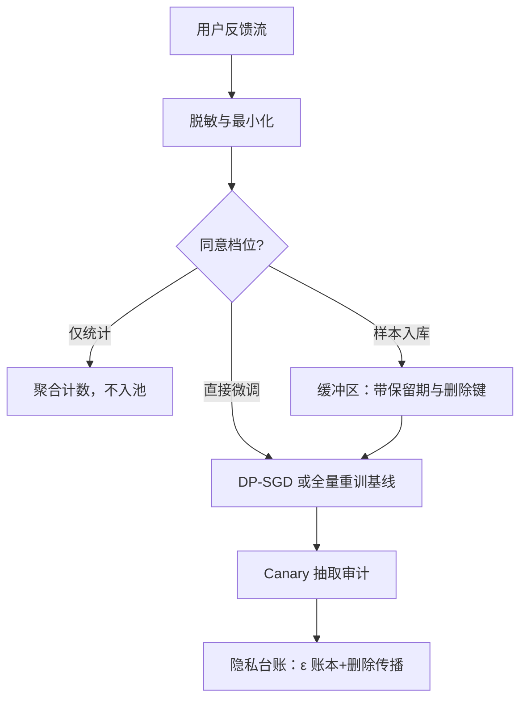
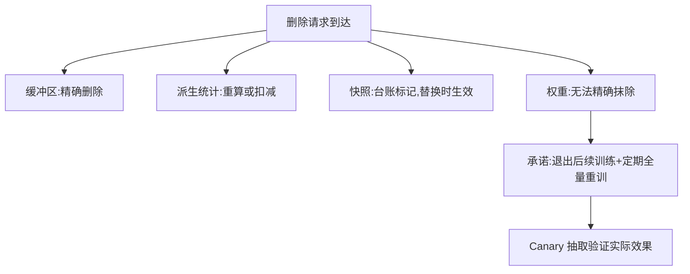

# 用户反馈的隐私与合规

反馈流是个人数据流；从里面学东西是数据处理，不是打日志，得按数据处理的规矩设计。

<footer>—— 据 Dwork 2006（差分隐私）、Carlini 等 2021 整理</footer>

[上一课](/llm/continual-drift-detection)把「何时更新」变成证据问题；本课解决「什么有资格进更新」。持续学习把用户输入与反馈变成训练材料，合规上与批处理无异，只更容易失守：流式入库没有攒批时的自然审查点，缓冲区替你把个人数据存得又久又全。本课把闸门钉清楚：什么能进、以什么形态、留多久、账怎么算。

## 问题

三个硬约束。内容：提示与回答里混着 PII、机密与他人隐私，回放缓冲原样保留，并在之后每次训练里反复喂给模型。记忆与抽取：语言模型会复述训练数据里的稀有字符串，Carlini 等 2021 证明能从公开模型输出里抽出训练样本；进了权重的个人数据没有消失，只是换了存储介质。义务：删除请求到达时，缓冲区删得掉，权重里删不掉——「忘了学」与「学了忘」是两个工程问题，混谈必出事故。

PII 即「个人可识别信息」：单看或拼起来能认出具体某人的信息，如姓名、电话、住址、身份证号，甚至设备号。模型看到的回答文本里也可能夹带用户随手粘贴的 PII，所以脱敏要在入库前完成，而不是只在提示侧做做样子。

### 同意的分级

把同意拆成三档，各自独立开关与文案：聚合统计（最弱，几乎总可拿）；样本入库（提示与反馈作为可回放样本进缓冲区）；直接微调（内容原样参与权重更新）。多数事故源于把三档折叠成一档——用户以为给的是统计，实际给的是语料。

差分隐私的预算 $\varepsilon$ 是跨更新累积的账：每次训练消耗一笔，流式环里必须有个总账本，否则「只用了很小的 $\varepsilon$」在一年后等于没说。McMahan 等 2017 的联邦平均加噪声给出的是「更新不暴露单客户端」的口径，不等于端侧数据零风险。

## 方法

入库前最小化：脱敏先于存储，结构化实体走[PII 去除](/llm/pii-redact)的识别-替换管线，密钥凭据类模式硬过滤；入库样本再过一遍「最小可用形态」审查——做统计不需要全文，做回放不需要用户名。保留期：样本带过期时间，到期未续即物理删除；删除请求要能沿缓冲区、派生统计、快照、日志四级传播，权重一级单独披露处理方式。

训练侧的账：参与微调的批次按敏感度选保护档——聚合级用差分隐私 SGD，给梯度加噪并记账；样本级保护是开放难题，诚实的基线仍是「该样本退出后续训练＋定期全量重训」，与[训练重放与可复现](/llm/training-replay)的账本对接删除台账。审计侧用[Canary 字符串](/llm/canary-strings)：定期插入人造稀有串，训完做抽取测试，量出实际泄漏面。

把 $\varepsilon$ 想成「隐私支出预算」：实践中常以 $\varepsilon\lt 10$ 量级为可辩护的档位，每次 DP 训练都花掉一笔且只增不减。预算烧完后，要么停止用这批数据训练，要么公开已花总量——不能每一轮都假装从零开始记账。

## 机制

「进了权重」为什么麻烦：训练把样本压进参数的共性里，删除单样本的影响被摊薄到不可观测，这是机器遗忘的理论难处。诚实的工程立场是分层承诺：缓冲区与统计可精确删除；权重不可精确删除，承诺只能是退出后续训练加重训计划加泄漏审计，更强的口头承诺都是在存事故。差分隐私值钱在于保证与具体样本无关——预算内任何单条记录的去留都改变不了多少输出分布——代价是效用损失与 $\varepsilon$ 记账纪律。

初学者容易以为「从训练集里删掉样本」等于「模型忘了它」。实际上权重在训练时已把样本影响摊进几十亿个参数里，删数据文件不会改变已训出的权重；所以诚实的产品文案承诺的是「不再用它训练」加「定期重训」，而不是「从模型里抹除」。

联邦学习把梯度而非数据传出端侧，适合输入不能集中的场景；但梯度可被反演逼近原始数据，联邦与 DP 通常配对，单独上联邦不加噪是把风险换了个运输方式。

## 边界

效用与保护的交换要明码标价：DP 噪声对小模型影响显著，大模型微调相对耐受，但逐域不同，必须在探针上量。第三方标注是常见旁路：数据出域，保留期与用途写进处理协议，跨境另有约束。聚合统计也非零风险——足够细的切片可做差分攻击反推个体，切片粒度要有下限。合规不由本课独立完成：法务口径与所在法域定底线，工程提供可核查的技术事实——什么进了训练、留了多久、账目在哪。没有台账的承诺不可审计，不可审计即不存在。

## 小结

- 反馈流是个人数据处理：入库、训练、保留、删除，每一环都要有闸门与账本。
- 同意分三档：聚合统计、样本入库、直接微调，独立开关，不得折叠。
- 缓冲区可精确删除；权重层只承诺退出后续训练加重训计划，不承诺记忆抹除。
- DP 用 $\varepsilon$ 账本给与样本无关的保证，预算跨更新累积；联邦常与 DP 配对。
- Canary 抽取审计量出实际泄漏面；无台账的隐私承诺不可审计。
- 出处：Dwork 2006（差分隐私）；McMahan 等 2017（联邦加噪）；Carlini 等 2019、2021（记忆与抽取）。
