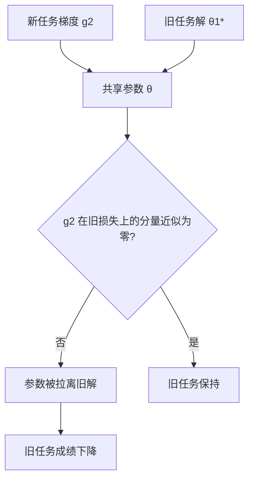

# 灾难性遗忘的机制

遗忘不是记忆被擦掉，而是新梯度在共享参数上覆盖了旧任务的解；它发生在优化的几何里，不在存储的寿命里。

<footer>—— 据 McCloskey 与 Cohen 1989、Kirkpatrick 等 2017 整理</footer>

[上一课](/llm/synthetic-engineering-map)把合成数据工程收束成一张地图：谱系、过滤、域合成到配比与验证，回答的是「一份静态数据配方怎么造出来」。部署之后配方不再静止：新任务与新行为会不断送来要学的东西。本课先钉住这件事为什么难：在一份权重上按顺序学习，新任务的梯度会破坏旧任务的能力，即灾难性遗忘。后课的正则、回放、适配器与合并，都默认你接受「干扰发生在参数空间」这个前提。

## 问题

干净的做法是联合训练所有任务的数据，但持续学习的约束是任务按时间到达：$T_1$ 训完，$T_2$ 的数据才来，且 $T_1$ 的数据可能因存储、隐私或成本不再可得。优化问题退化成序列：先把 $\theta$ 推到 $T_1$ 的解附近，再用 $T_2$ 的梯度继续推。语言模型的各任务共享几乎全部参数，$T_2$ 的下降方向在 $T_1$ 的损失上不为零，往往显著为正——客服风格训完再训代码，客服能力掉了。

[遗忘的度量](/llm/forgetting-metrics)已把「掉了多少」写成指标：任务 $i$ 刚学完时的成绩 $R_{i,i}$ 与整条序列学完后的 $R_{T,i}$ 之差。本课不重推公式，只回答机制：落差从哪来，为什么有时巨大、有时接近零。

### 干扰的三条通路

参数通路：$\theta_1^\*$ 是 $T_1$ 损失面的极小点，新梯度把它拉走，旧损失回升。表示通路：前几层被新数据挪动后，旧任务依赖的特征组合整体移位，下游接不上。输出通路：权重变化很小，但格式偏好、拒答边界、模板习惯被新任务改写，旧评测照掉——这一条常被误报成遗忘。

Hardt 等 2016 的稳定性分析给了个对照：学习率越小、步数越节制，两次训练得到的模型越接近。同一支杠杆也控制遗忘——激进的大学习率既伤泛化也伤旧任务。

## 方法

机制要落到可操作的观察协议。序列训练下，每学完一个任务就在冻结数据上跑一遍所有已见任务的评测，记录成绩轨迹 $R_{t,i}$。它的价值是把遗忘从「用户投诉」变成曲线：哪一步掉、掉多少、能否被后课的干预救回，都由曲线说话。

其次做消融定位通路：只改学习率与步数，看遗忘如何随梯度强度变化；只训部分层或低秩增量，看干扰如何随参数范围收缩。语言模型上反复出现的经验是：全参大学习率最烈，低秩小学习率温和得多，[遗忘与原能力保持](/llm/sft-forgetting)已给出这条谱系，本课负责解释为什么。

## 机制

参数视角下，遗忘规模由两个几何量决定：新梯度方向落在旧损失在 $\theta_1^\*$ 处陡峭方向上的分量有多少，以及沿它走了多少步。把「方向」与「步长」分开，后课的干预点就有了分类：EWC 一族约束方向，回放重混数据。

表示视角解释遗忘的非线性：小位移可以大破坏，只要挪动了旧任务依赖的关键方向；很多参数各动一点，功能却几乎不变。所以按参数距离度量遗忘会误判，必须按任务成绩度量。

输出视角解释一部分假遗忘：只是习惯被改写的情形，提示修复往往比重训便宜，先排除再动参数。

## 边界

灾难性遗忘不等于一切能力变化。有些变化是正迁移的代价：删掉过时的接口习惯，本身是收益；把所有变化都当损失，持续学习会退化成拒绝学习。

只要旧数据还能回收，重训总是兜底方案；持续学习研究的真正前提是旧数据不可得或太贵，前提不成立的系统，先修[训练重放与可复现](/llm/training-replay)的重训管线可能更便宜。规模也改变问题：模型越大、新任务越浅，遗忘越轻——不是机制消失，而是任务只扰动了浅层。最后，真实流里「任务」常无清晰边界，下一课的机制在任务定义模糊时会进一步打折。

## 小结

- 持续学习的难点是序列约束：旧数据不可得，联合训练不可行，梯度在共享参数上互相覆盖。
- 干扰有三条通路：参数位移、表示漂移、输出习惯偏移；只有任务成绩轨迹能可靠度量。
- 遗忘规模由新梯度在旧损失陡峭方向的分量与步数共同决定，由此给后课的干预点分类。
- 参数距离会误判：小位移可以大破坏，大位移可以无损伤。
- 先排除输出习惯被改写的假遗忘，再谈参数级干预。
- 出处：McCloskey 与 Cohen 1989 的干扰实验；Kirkpatrick 等 2017 的 EWC 框架；Hardt 等 2016 的稳定性分析。
