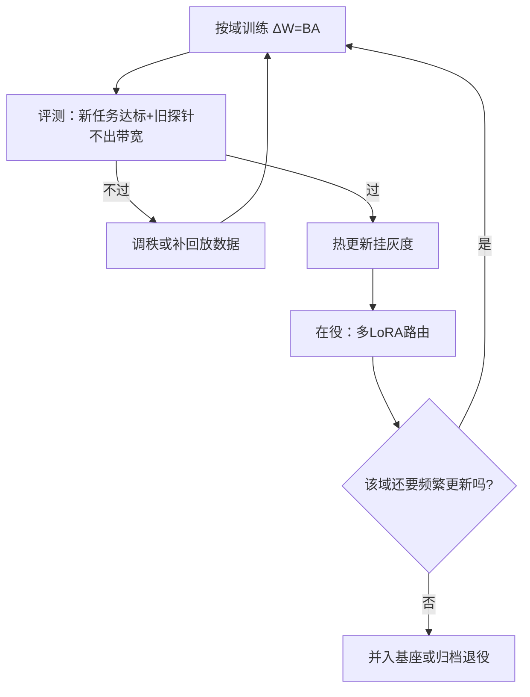
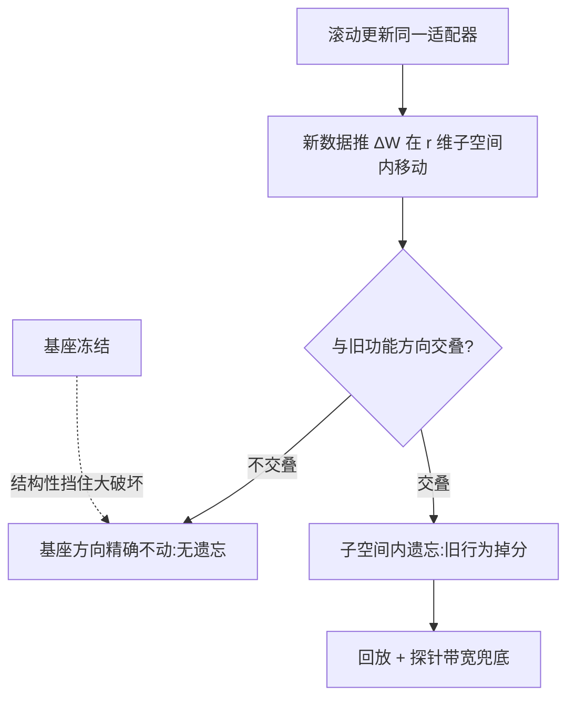

# LoRA 生命周期管理

冻结基座等于宣布：旧能力不需要保护，因为它从未被触碰；持续学习从改写权重变成管理模块的版本。

<footer>—— 据 Hu 等 2021（LoRA）与 Biderman 等 2024 整理</footer>

[上一课](/llm/continual-replay-buffer)把旧梯度混回批次，保护发生在数据侧； LoRA 把保护移进结构侧：基座全程冻结，只训低秩增量 $\Delta W=BA$。主干[LoRA](/llm/lora)一课讲过它的参数效率，[多 LoRA 服务](/llm/multi-lora-serving)讲过部署形态；本课把它当持续学习的载体，写一个适配器从候选到退役的完整生命周期，以及生命周期里每个门该拦什么。

## 问题

生产环要的是「经常更新、不翻车」。全参微调每次更新都重写所有权重，[第一课](/llm/continual-forgetting-mechanism)的三条通路全开；LoRA 把扰动限制在每层 $r$ 维子空间里，基座函数被结构性地保持——适配器一摘，模型精确回到原样。新的问题随之而来：适配器越攒越多，何时合进基座、何时下线；滚动更新同一个适配器时，遗忘没有消失，只是搬进了增量子空间内部。

「绑死基座版本」指适配器必须记下自己是在哪个基座快照上训的：增量 $\Delta W=BA$ 只有加回那个原权重，形状与含义才成立。基座一升级，增量等于失去了「被减数」，必须重验甚至重训——这是适配器版本管理里最容易翻车的细节。

### 生命周期的状态机

候选态：训练完成、绑死基座版本与训练配方，未评测不进流量。灰度态：经[适配器热更新](/llm/adapter-hot-swap)挂小流量，按任务成绩与延迟门限观察。在役态：全量路由，路由错误率是健康指标。退役态：合并、归档或删除，归档必须带数据配方，否则只剩一个不能再生的二进制。每次迁移都要有判据，判据来自[遗忘的度量](/llm/forgetting-metrics)同款协议：新任务达标，旧能力探针不出带宽。

Biderman 等 2024 的结论是双向的：相同步数与数据下，LoRA 比全参微调学得少，也忘得少。选型因此不是「LoRA 是否更优」，而是当前任务需要多少可塑性——重行为的任务适配器够用，重要识或风格重写往往推不动。

## 方法

更新策略先于训练细节。按域分片：每个业务域一个适配器，互相隔离，遗忘被限制在域内；代价是路由复杂，跨域请求要决定挂几个。滚动更新：整个流共用一个适配器，周期性重训，操作最简单，遗忘风险全在增量内部，必须配上[上一课](/llm/continual-replay-buffer)的回放——基座冻结挡大破坏，回放挡增量内部的小漂移。

合入是生命周期里最重的一道门：把在役适配器并进基座，省掉路由开销，但这版基座从此承载该域的行为，回滚粒度变粗。[LoRA 合并与冲突](/llm/lora-merge-conflict)的判据——秩冲突与方向干涉——就是这道门的验收项。动基座之前先问：这个域未来一个月还会频繁更新吗。

用数字感受 $r$ 的省参程度：一个 $4096\times4096$ 的权重矩阵约有 1677 万个参数；取 $r=8$ 时，LoRA 只训 $4096\times8+8\times4096\approx6.5$ 万个，不到原矩阵的 0.4%。代价是更新被限制在 8 维子空间里，能装下的行为变化相应变少。

## 机制

低秩约束为什么抗遗忘：$\Delta W$ 的秩不超过 $r$，参数移动被压进子空间，基座函数在其余方向精确不动；遗忘只能通过子空间与旧功能方向的交叠发生。$r$ 因此是可塑性旋钮：太小学不动，太大逼近全参、把遗忘请回来，[AdaLoRA](/llm/adalora)式的按重要性分配秩是这条轴上的自动化尝试。

隔离为什么便宜：多个适配器并存时，各域行为物理上不共享权重，串扰只可能发生在路由层——没挂上的域连被破坏的通道都没有。代价是复杂度挪到服务侧：适配器与基座的版本配对必须显式管理，基座一升级，所有适配器重验兼容，这是最易省略也最常出事故的一步。

初学者容易把「基座冻结」当成「不会遗忘」的保证。它挡住的只是适配器之外的权重变化；同一个适配器滚动更新时，新旧 $\Delta W$ 在同一个子空间里互相覆盖，遗忘照常发生——只是范围变小，不是消失，探针与回放一样不能省。

## 边界

适配器方案的两个上限要说清。一是可塑性上限：重要识、大规模风格或知识注入，低秩增量常常装不下，Biderman 等的「学得少」就是这半句；硬塞的结果是探针通过但任务质量平庸。二是基座上限：适配器不会让基座变聪明，世界知识过期时，该动的是基座与预训练配比，不是再加一层增量。另外，隔离不是免费的遗忘豁免——滚动更新同一适配器时，子空间内部的漂移照旧发生，回放与探针一个都不能省。

最后，别把生命周期管理做成纸面流程：每个状态迁移的判据要能自动执行，灰度要能自动回滚。流程写在文档里而判据不在流水线里，等于没有流程。

## 小结

- 冻结基座把遗忘问题转化为模块管理问题：旧能力结构性保持，摘下适配器即精确还原。
- 生命周期是状态机：候选、灰度、在役、退役，每次迁移挂着自动执行的判据。
- 更新策略二选一：按域分片换隔离，滚动更新省事但必须配回放。
- $r$ 是可塑性旋钮；LoRA 学得少也忘得少，按任务需要的可塑性选型。
- 合并是单向门：并入基座前用秩冲突与方向干涉验收，并考虑该域的更新频率。
- 出处：Hu 等 2021（LoRA）；Biderman 等 2024（LoRA Learns Less and Forgets Less）；Rebuffi 等 2017 的多任务适配谱系。
